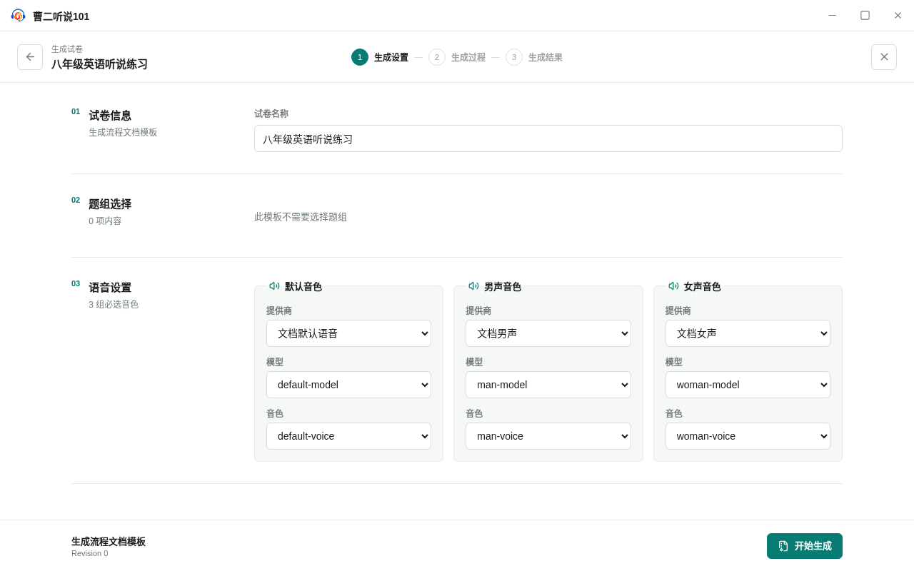
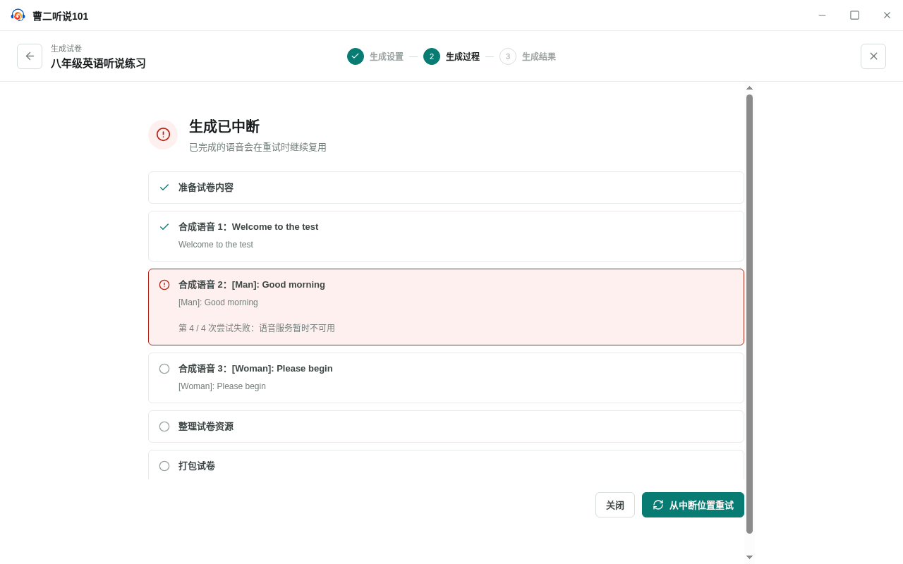

<!-- 此文件由产品操作测试自动生成，请勿手工编辑。 -->

# 从试卷模板生成并保存可运行试卷

**所属内容：** 试卷模板生成试卷 / 试卷生成

## 什么时候使用

模板内容准备完成后，通过生成设置和生成过程得到可运行试卷，再把结果加入试卷库或导出为文件。

## 前置条件

- 已有一份包含三条语音的试卷模板，并配置三个可独立选择的语音提供商。

## 操作步骤

1. 从“试卷模板”打开要使用的模板，再选择“生成试卷”。

   完成后：应用进入独立的生成流程，并首先显示生成设置。

2. 填写试卷名称，并为默认、男声和女声音色分别选择提供商、模型和音色。

   完成后：页面保留全部生成设置，可以开始生成。

   

   _作出选择时：生成前分别确认试卷名称和三种音色配置_

3. 选择“开始生成”；生成进行中尝试关闭流程，再选择“取消”。

   完成后：应用提示关闭会取消正在进行的任务；取消关闭后仍保留在当前生成流程。

4. 等待语音服务连续失败并达到重试上限。

   完成后：生成流程暂停并显示失败项，同时保留每项任务的完成状态。

   

   _遇到问题时：语音达到重试上限后中断，并保留逐项任务状态_

5. 选择“从中断位置重试”。

   完成后：应用从失败项继续，保留已经完成的语音，并最终完成试卷生成。

6. 在尚未保存生成结果时尝试关闭结果。

   完成后：应用提示关闭将丢失尚未保存的试卷；取消后结果仍然保留。

7. 分别选择“加入试卷库”和“导出文件”。

   完成后：两种保存方式独立完成，结果页面保持打开，仍可再次导出文件。

   

   _完成后：生成结果已加入试卷库且仍可再次导出文件_

8. 关闭生成结果，返回模板列表，再进入“试卷库”。

   完成后：试卷库中可以找到刚刚生成并加入的试卷。

## 完成后

- 生成设置、生成过程和生成结果在独立全屏流程中依次呈现。
- 语音失败会在有限重试后中断，并可从中断位置继续。
- 加入试卷库和导出文件互相独立，未保存结果受到离开保护。
