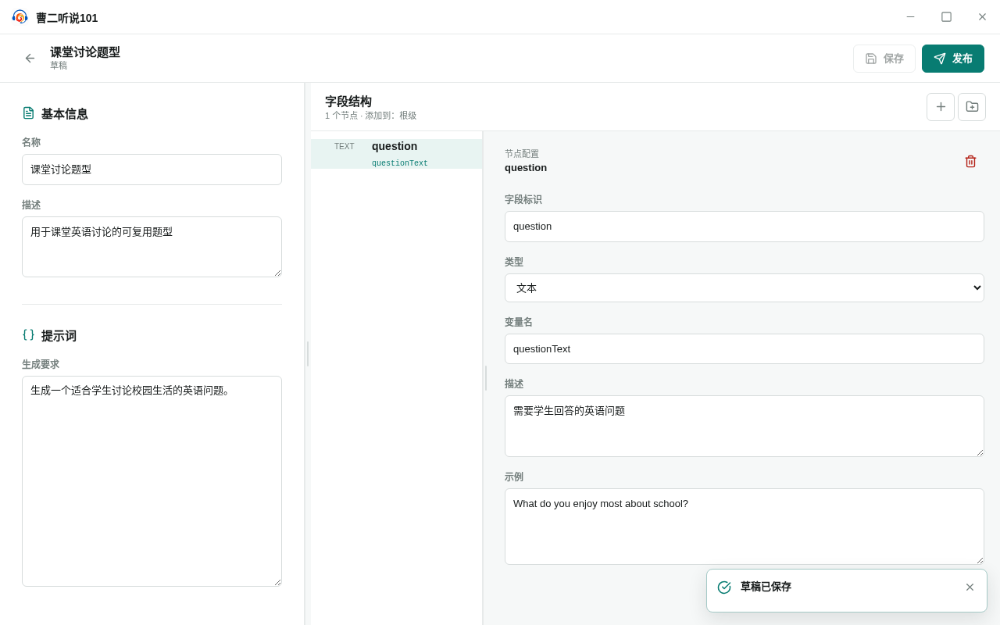
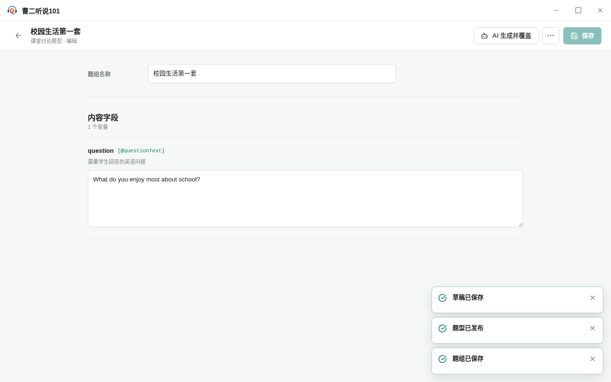

<!-- 此文件由产品操作测试自动生成，请勿手工编辑。 -->

# 从题型草稿发布稳定题型并创建可复用题组

**所属内容：** 从零准备题型内容 / 题型内容准备

## 任务目标

从全新的应用数据目录开始，通过界面定义并发布题型，再用刚发布的题型创建、保存和重新打开一套具体题组。

## 前置条件

- 没有预先创建的用户题型、题型草稿或题组。

## 操作步骤

1. 进入“题型库”的“草稿”视图，选择“新建题型”。

   完成后：应用打开一个未命名题型草稿。

2. 填写题型名称、说明和生成要求，添加字段并保存草稿。

   完成后：页面提示草稿已经保存，题型内容和字段契约可以继续编辑。

   

   _完成后：题型说明、生成要求和字段契约已经保存为草稿_

3. 选择“发布”，阅读发布说明后确认“发布题型”。

   完成后：应用打开刚发布的稳定题型，并默认进入空的题组工作区。

   

   _作出选择时：发布前确认稳定题型与原草稿的关系_

4. 选择“新建题组”，填写题组名称并选择“手工填写”。

   完成后：应用创建题组并打开内容编辑页面。

5. 填写题组内容并保存，然后返回题型详情并重新打开该题组。

   完成后：重新打开后仍能看到已保存的内容，保存按钮保持不可用。

   

   _完成后：刚发布的题型保存了一套可重新打开的具体题组_

6. 返回题型库，再切换到“草稿”视图。

   完成后：已经发布的稳定题型和原题型草稿都可以分别找到。

## 完成后

- 题型草稿、稳定题型和题组都由同一条用户界面路径依次产生。
- 刚发布的题型可以立即用于创建具体题组。
- 题组内容保存后可以重新进入，发布题型后原草稿仍然保留。
