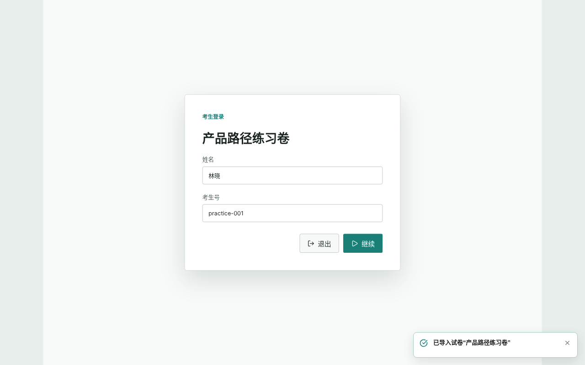
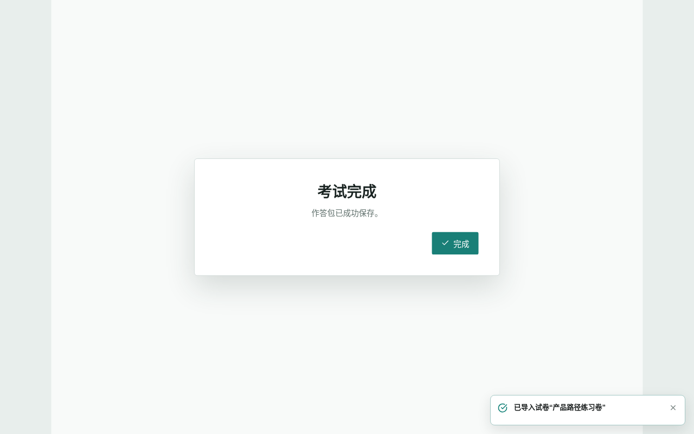
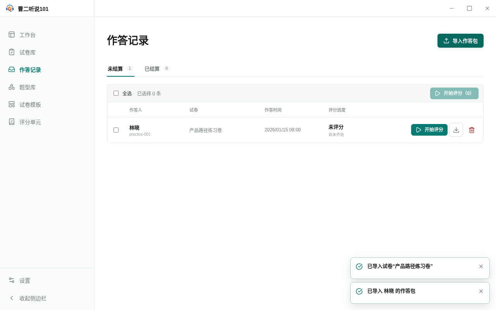

<!-- 此文件由产品操作测试自动生成，请勿手工编辑。 -->

# 运行一份试卷并把作答交给评分环节

**所属内容：** 运行考试并移交作答 / 考试运行与作答移交

## 任务目标

已有可运行试卷时，从试卷库启动考试、登记作答人并保存作答包，再把本次产生的作答导入作答记录。

## 前置条件

- 本地有一份无需录音检查的可运行试卷包。

## 操作步骤

1. 进入“试卷库”，选择“导入试卷包”，再选择要运行的试卷文件。

   完成后：导入的试卷出现在试卷库中。

2. 选择“开始考试”，填写作答人姓名和考生号。

   完成后：开始作答前，页面显示本次试卷并保留作答人身份信息。

   

   _作出选择时：开始作答前登记姓名和考生号_

3. 选择“继续”进入播放器，并完成试卷。

   完成后：完成页确认作答包已经保存，并提供结束考试的“完成”按钮。

   

   _完成后：完成页确认作答包已经保存_

4. 在完成页选择“完成”。

   完成后：播放器关闭并返回试卷库，原试卷仍可再次使用。

5. 进入“作答记录”，选择“导入作答包”，再选择本次考试刚刚保存的文件。

   完成后：作答出现在“未结算”列表中，并显示刚才登记的姓名和试卷名称。

   

   _完成后：本次考试保存的作答已经进入作答记录_

## 完成后

- 开始考试前必须填写姓名和考生号。
- 作答完成后必须成功保存作答包才能结束考试。
- 本次考试产生的作答包可以立即导入作答记录，并保留试卷和作答人信息。
