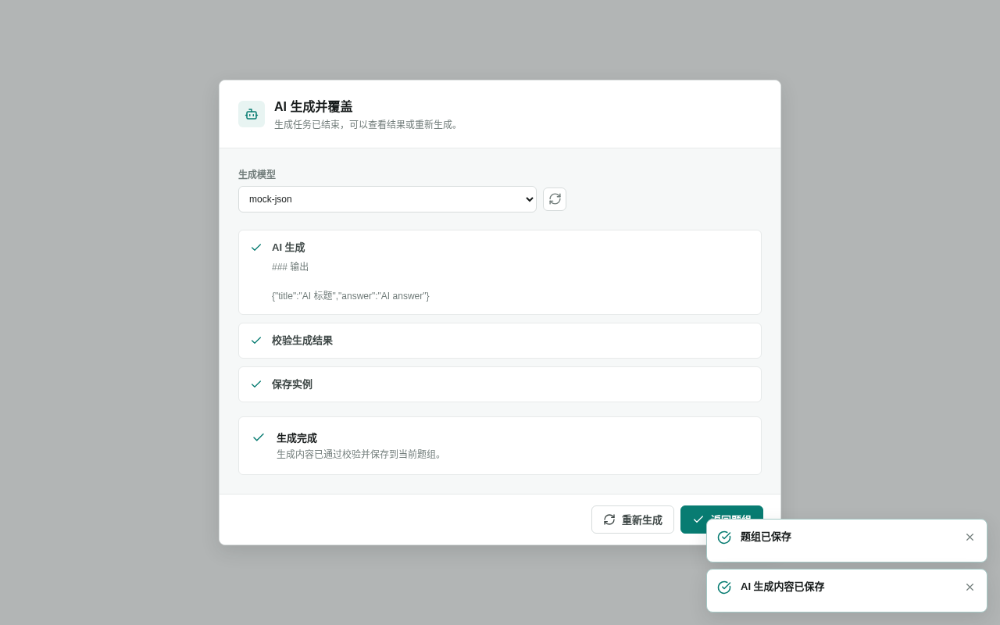

<!-- 此文件由产品操作测试自动生成，请勿手工编辑。 -->

# 使用 AI 生成并覆盖题组内容

**所属内容：** 题型库 / AI 生成题组

## 什么时候使用

需要使用 AI 一次生成整组内容，并用生成结果替换当前题组时使用。

## 前置条件

- 题组已有手工保存的内容，并配置了可用的 AI 文本模型。

## 操作步骤

1. 在已有内容的题组中选择“AI 生成并覆盖”，再选择生成模型。

   完成后：页面显示本次 AI 生成任务的设置。

2. 选择“生成并覆盖”，阅读覆盖说明后再次确认。

   完成后：应用明确说明现有内容将被全部替换，并在成功后立即保存。

   

   _作出选择时：AI 生成前确认将覆盖当前题组并立即保存_

3. 等待 AI 生成完成。

   完成后：页面显示生成的新内容和保存成功提示，不需要再次手工保存。

   

   _完成后：AI 结果通过校验并保存到当前题组_

## 完成后

- 已有内容时，生成前明确确认覆盖范围和立即保存语义。
- 生成成功后，新内容会替换当前题组并立即保存。
