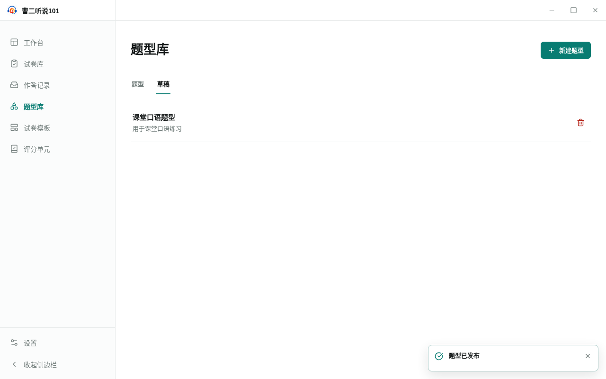

<!-- 此文件由产品操作测试自动生成，请勿手工编辑。 -->

# 从草稿发布稳定题型并保留草稿

**所属内容：** 题型库 / 题型发布

## 什么时候使用

题型草稿可以不完整地保存；发布前说明稳定契约，发布成功后已发布题型和原草稿同时保留。

## 前置条件

- 用户从题型库的“草稿”视图开始创建题型。

## 操作步骤

1. 进入“题型库”的“草稿”视图，选择“新建题型”。

   完成后：应用打开一个未命名题型草稿。

2. 填写题型基本信息、生成要求和字段契约。

   完成后：题型草稿具备发布所需的名称、说明、生成要求和内容字段。

3. 选择“发布”，阅读说明后确认发布题型。

   完成后：应用说明将创建不可直接修改的稳定题型，同时保留当前草稿。

   

   _作出选择时：发布前说明稳定题型与原草稿的关系_

4. 返回题型库，分别查看已发布题型和“草稿”视图。

   完成后：稳定题型和原草稿都可以找到。

   

   _完成后：发布后原题型草稿仍保留在草稿视图_

## 完成后

- 发布前明确说明将创建稳定题型，并保留当前草稿。
- 发布成功后，稳定题型和原草稿可以分别找到。
