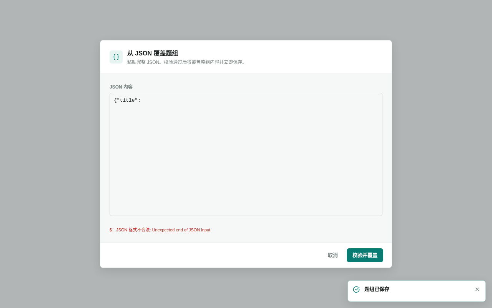
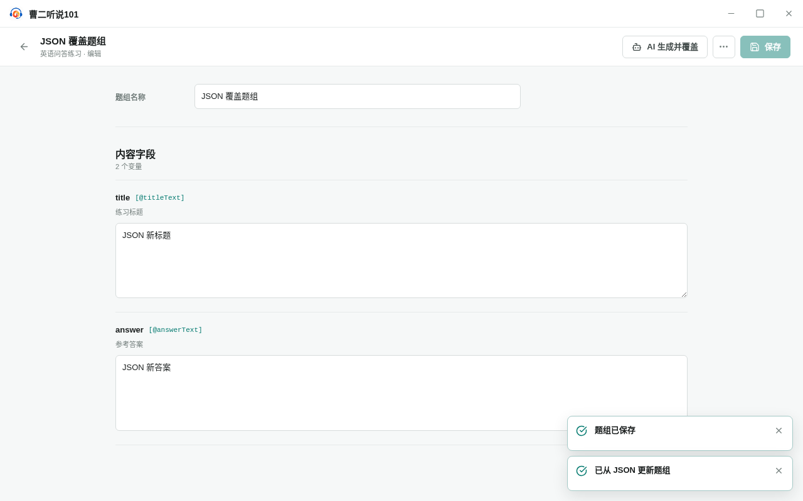

<!-- 此文件由产品操作测试自动生成，请勿手工编辑。 -->

# 从 JSON 导入并替换题组内容

**所属内容：** 题型库 / 题组导入

## 什么时候使用

已经准备好符合题型字段要求的 JSON 内容时，可以一次替换当前题组；校验失败不会改变原内容。

## 前置条件

- 题组已有手工保存的内容。

## 操作步骤

1. 在题组中打开“从 JSON 覆盖题组”。

   完成后：对话框说明校验通过后会覆盖整组内容并立即保存。

2. 输入格式错误的 JSON，选择“校验并覆盖”并确认。

   完成后：对话框保留输入并显示格式错误，原题组内容保持不变。

   

   _遇到问题时：非法 JSON 保留在导入对话框中，原题组内容不变_

3. 取消导入，然后重新打开 JSON 导入对话框。

   完成后：上次临时输入和错误已经清空。

4. 输入符合字段要求的 JSON，选择“校验并覆盖”并确认。

   完成后：对话框关闭，新内容替换当前题组并已经保存。

   

   _完成后：JSON 内容已替换当前题组并完成保存_

## 完成后

- 校验失败时保留临时输入和错误，原题组保持不变。
- 取消导入会清空临时状态。
- 合法 JSON 经确认后替换并保存题组，然后关闭对话框。
