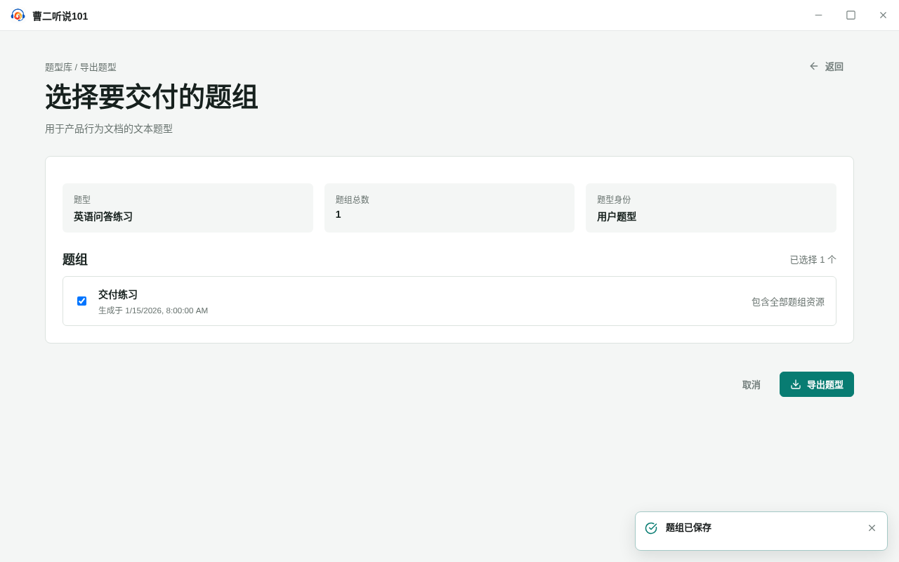
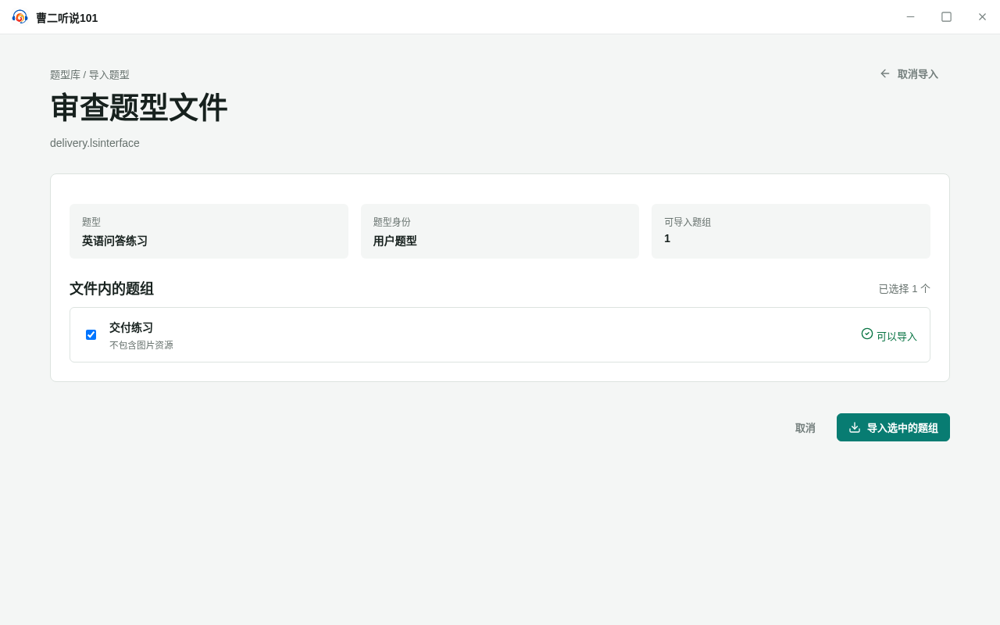

<!-- 此文件由产品操作测试自动生成，请勿手工编辑。 -->

# 在全屏工作页选择题组并导入到另一套 LS101

**所属内容：** 题型库 / 题型文件交换

## 什么时候使用

把题型和用户选择的题组作为一个文件交付，在另一套 LS101 中审查后继续使用。

## 前置条件

- 题型库中已有“英语问答练习”题型。

## 操作步骤

1. 打开“英语问答练习”，新建题组“交付练习”，填写内容并保存。

   完成后：题组出现在题型详情中，并可以进入导出工作页。

2. 在导出题型工作页查看题型身份，只勾选“交付练习”，然后选择“导出题型”。

   完成后：页面显示已选择一个题组；确认后题型文件保存成功。

   

   _作出选择时：导出前只选择需要交付的题组_

3. 在接收方题型库选择“导入题型”，打开刚才的题型文件。

   完成后：全屏审查页列出题型和文件内题组，并将可导入题组默认选中。

   

   _完成后：导入前全屏列出题型和可导入题组_

4. 确认导入选中的题组，再打开导入的题型和“交付练习”。

   完成后：题型和题组进入接收方题型库，已经保存的内容保持不变。

## 完成后

- 导出前可以查看题型身份并选择需要交付的题组。
- 导入前可以查看文件内题型和题组状态，确认后题组及其内容可以继续使用。
