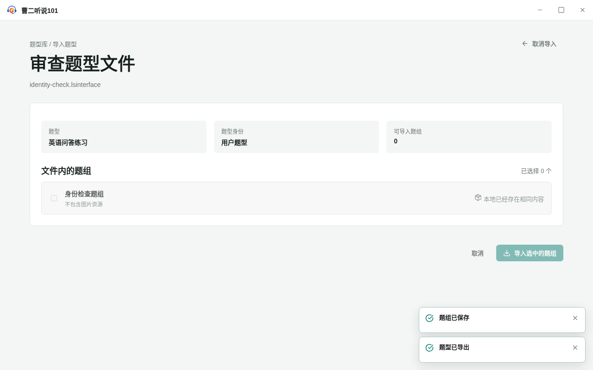
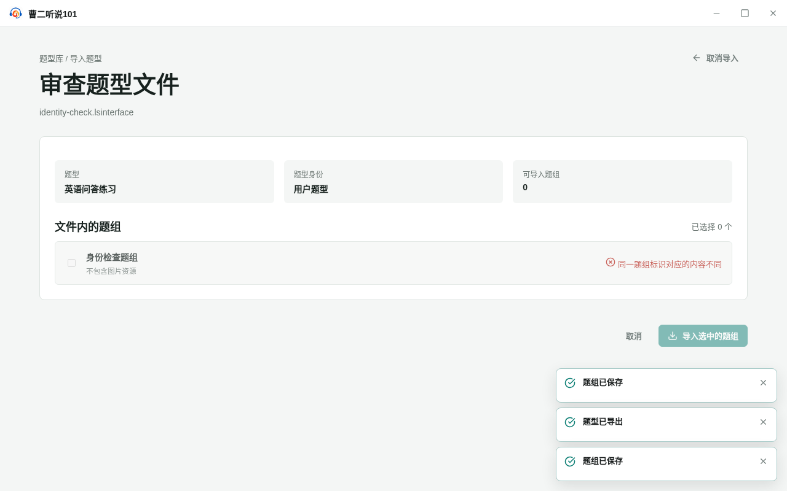

<!-- 此文件由产品操作测试自动生成，请勿手工编辑。 -->

# 识别已经存在和发生分叉的题组

**所属内容：** 题型库 / 题型文件交换

## 什么时候使用

重复导入题型文件时，区分完全相同的题组和同一身份下内容不同的题组。

## 前置条件

- 题型库中已有“英语问答练习”题型和一个保存完成的题组。

## 操作步骤

1. 保存题组“身份检查题组”，从导出工作页把它保存为题型文件。

   完成后：题型文件保留题组当前的身份和内容。

2. 不修改本地题组，立即导入刚导出的题型文件。

   完成后：审查页把该题组标记为本地已经存在相同内容，不能重复勾选。

   

   _完成后：完全相同的题组显示为本地已经存在_

3. 取消导入，修改并保存本地“身份检查题组”的内容。

   完成后：本地题组保留原 UUID，但内容已经与题型文件中的版本不同。

4. 再次导入原来的题型文件。

   完成后：审查页显示同一题组标识对应的内容不同，题组不可勾选，也不能覆盖本地内容。

   

   _遇到问题时：同一 UUID 内容不同的题组不可导入或覆盖_

## 完成后

- 同一 UUID 且内容完全相同的题组显示为已经存在，不重复写入。
- 同一 UUID 但内容不同的题组显示身份冲突，不允许勾选或覆盖本地内容。
