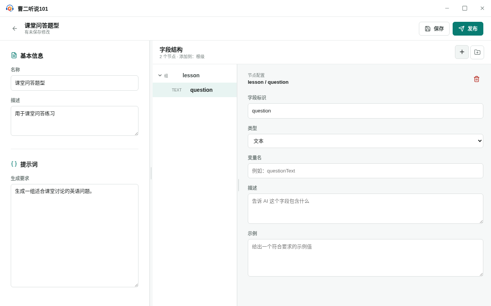
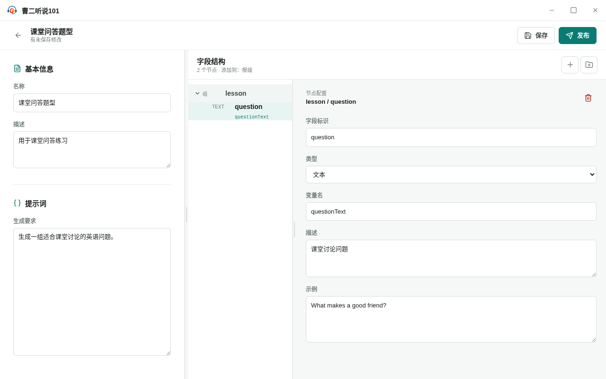

<!-- 此文件由产品操作测试自动生成，请勿手工编辑。 -->

# 在草稿编辑器维护字段结构和属性

**所属内容：** 题型库 / 题型草稿编辑

## 什么时候使用

题型草稿需要在一个可检查的编辑器中同时维护基本信息、生成要求和字段契约。

## 前置条件

- 题型库中没有需要继续编辑的本地草稿。

## 操作步骤

1. 进入题型库的“草稿”视图并选择“新建题型”。

   完成后：应用打开未命名题型草稿，并同时显示题型内容区和字段结构区。

2. 填写题型名称、说明和生成要求，添加字段组“lesson”，再在组内添加字段“question”。

   完成后：字段树明确显示字段组和字段的层级，属性面板显示当前选中节点。

   

   _作出选择时：字段组和字段在草稿结构树中形成明确层级_

3. 把“question”设置为文本字段，填写变量名、字段描述和示例，然后折叠并重新展开“lesson”。

   完成后：字段属性和层级关系保持不变，折叠不会删除字段。

   

   _完成后：字段属性保存于可折叠的字段结构中_

4. 保存草稿，返回草稿列表后重新打开“课堂问答题型”。

   完成后：题型基本信息、字段组和字段属性都按上次保存的内容重新显示。

## 完成后

- 字段组和字段的层级关系在字段树中保持可见。
- 字段属性修改保存后，重新打开草稿仍然保持。
- 折叠字段组只影响浏览，不会删除其中的字段。
