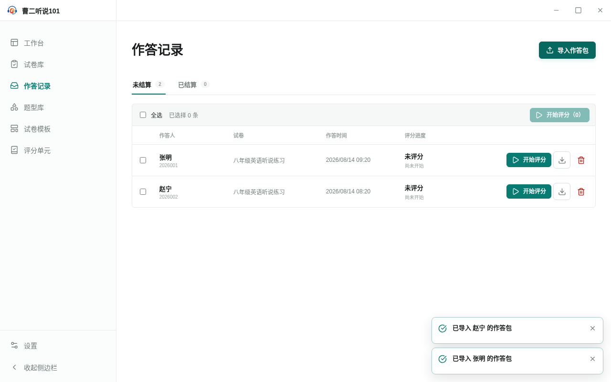
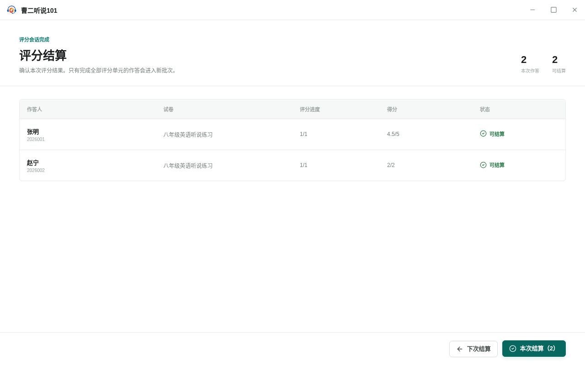
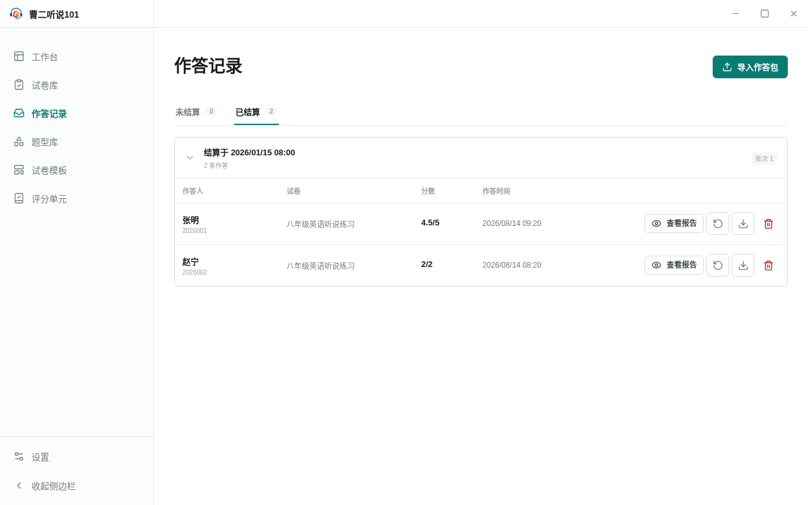

<!-- 此文件由产品操作测试自动生成，请勿手工编辑。 -->

# 批量评分作答并在确认后结算为一个批次

**所属内容：** 作答记录 / 评分结算

## 什么时候使用

作答记录分为未结算和已结算。用户可以批量评分、暂缓结算并保留进度，也可以把全部完成评分的作答确认为一个结算批次。

## 前置条件

- 本地有一份客观题作答包和一份需要人工评分的朗读作答包。

## 操作步骤

1. 进入“作答记录”，连续导入需要处理的两份作答包。

   完成后：两份作答都出现在“未结算”列表中。

   

   _完成后：导入后的作答统一进入未结算列表_

2. 全选两份作答并选择“开始评分”，为需要人工判断的题目填写分数和评语。

   完成后：应用按顺序处理所选作答，并在提交最后一道题后进入结算。

3. 在“评分结算”页面检查本次评分结果。

   完成后：页面列出本次会话中全部可结算作答，并显示本次结算数量。

   

   _作出选择时：结算页列出本次会话中可以结算的全部作答_

4. 选择“下次结算”。

   完成后：应用返回未结算列表，两份作答保留评分并显示为可结算。

5. 再次选择两份作答进入评分，并在结算页选择“本次结算”。

   完成后：应用切换到“已结算”视图，两份作答归入同一个结算批次。

   

   _完成后：两份作答作为同一个批次进入已结算视图_

6. 在已结算记录中选择一份作答的“重新评分”，再确认删除原评分。

   完成后：目标作答回到未结算列表并显示为未评分，其他作答不受影响。

## 完成后

- 批量评分按照一次会话推进，并在结束后进入独立结算页。
- 选择下次结算会保留评分进度，选择本次结算会创建一个批次。
- 重新评分只重置目标作答，不改写原始作答内容。
