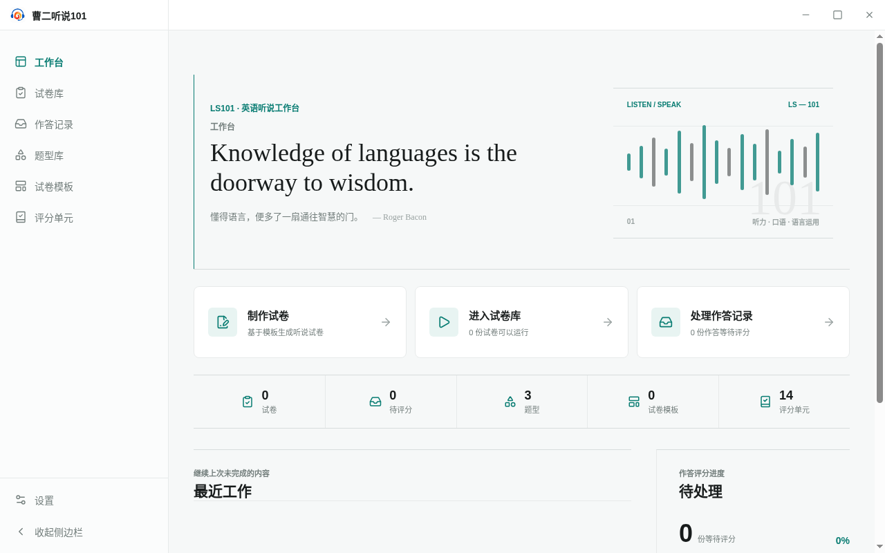

<!-- 此文件由产品操作测试自动生成，请勿手工编辑。 -->

# 从工作台了解当前状态并进入下一项工作

**所属内容：** 工作台与导航 / 工作台概览

## 什么时候使用

工作台是应用首页和产品封面，汇总当前工作状态并提供快捷入口，但不承载其他模块的独占业务能力。

## 前置条件

- 使用全新的应用数据目录启动 LS101。

## 操作步骤

1. 启动 LS101。

   完成后：应用首先打开工作台，并显示英语摘句。

2. 查看“当前状态”。

   完成后：工作台汇总试卷、待评分、题型、试卷模板和评分单元的当前数量。

3. 查看工作台上的快捷入口。

   完成后：可以直接选择制作试卷、进入试卷库或处理作答记录。

4. 继续查看工作台下方的信息。

   完成后：页面提供“最近工作”和“待处理”区域，便于继续后续任务。

   

   _完成后：工作台首页同时呈现状态、快捷入口和后续工作区域_

## 完成后

- 启动应用后首先进入工作台。
- 工作台同时呈现产品状态、快捷入口、最近工作和待处理区域。
