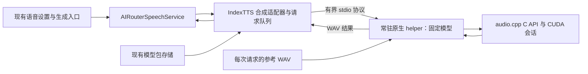

**IndexTTS 2.5 重写方案（实现完成，平台验收待办，2026-10-09）**

起点是清理提交 `d5dafde2`。方案依据清理后的 Qwen TTS 架构、现有应用接口及本次重新取得的上游资料制定。原生 helper、主进程适配、模型包、设置页和构建链路已实现；Linux CPU 真实推理、分片重组和大包导入通过，完整 Electron 回归 85 项通过、2 项按条件跳过。CUDA、Windows、离线及音质仍待验收。当前命令、资产与验证记录见 [IndexTTS runtime 文档](index-tts.md)。

按用户补充，IndexTTS 的 helper 固定模型，声线作为每次请求的参数。本轮先实现和验证 IndexTTS；Qwen 继续使用现有实现，之后再将经过验证的模式应用到 Qwen。

**交付范围与 Qwen 对齐项**

首版目标为 Windows x64、Linux x64 的 NVIDIA CUDA 本地推理。运行时随应用发布，模型包单独生成和离线导入。用户通过现有 AI Router 流程完成导入、提供方配置、模型和声线选择、试听、生成、角色路由及取消。

| 环节     | 沿用 Qwen 的方案                                       | IndexTTS 调整                                |
| -------- | ------------------------------------------------------ | -------------------------------------------- |
| 应用接入 | `AIRouterLocalSpeechSynthesizer`、现有语音服务及 IPC   | 增加 IndexTTS 引擎和适配器                   |
| 推理进程 | 主进程管理常驻原生 helper，以有界 stdio 协议通信       | 单个 helper 固定模型，每次请求传入参考 WAV   |
| 推理后端 | 固定版本的原生推理库                                   | 首版使用 CUDA；现有 Qwen 产品使用 CPU        |
| 模型包   | `ls101.tts-model-package` v1、现有导入器和内容寻址存储 | GGUF 与参考 WAV，声线资产替代 Qwen 的 `.spk` |
| 资产管理 | 一份固定清单、摘要校验、独立运行时与模型发布           | 新增 IndexTTS 清单和各自发布版本             |
| 构建流程 | setup 准备资产、原生构建、应用打包、另行生成模型 ZIP   | 包含 IndexTTS 所需原生库和 CUDA 用户态依赖   |
| 验证流程 | 协议、适配器、脚本测试及打包后 Electron 集成           | 增加真实 GPU、声线切换和显存占用验收         |

首轮音质验收覆盖中文、英文及参考音频克隆。日语、西班牙语、阿拉伯语需要显式语言选择和各自的音质验收；情绪控制及语速调节在基本链路稳定后接入。支持声明与实测结果分别记录。

默认男女声线对应应用已有的 `man`、`woman` 角色。参考 WAV 须有明确的来源和授权，来源、许可及摘要随包保存。可核查现有 Qwen 参考音频及其来源记录，或新制作素材；发布前完成授权及 IndexTTS 音质验证。

**运行时架构**

新增小型 C++ helper，直接链接固定版本 `audio.cpp` 的 C API。上游提供模型注册、加载、会话复用、逐请求参考音频及 PCM 输出；helper 负责协议、WAV 解码与编码、参数校验和句柄生命周期。

上游已提供 `AUDIOCPP_BUILD_C_API=ON` 与 `audiocpp` 共享库目标，C API 支持 `audiocpp_request_set_voice_audio`。IndexTTS 会话在每次 `run` 时解析参考音频，声线不需要在模型加载时固定。Linux CPU 真实构建及 A→B→A 推理已验证，CUDA 和长时间资源行为尚待验收。

原生候选路线先完成最小 helper 的真实推理验证。官方 Python API 用于音质对照；如果原生方案存在基本能力缺口，记录实测原因后再评估实现路线。

**单模型常驻、逐请求声线**

1. 同一 IndexTTS 合成适配器统一管理全部提供方请求，首版最多一个存活的 helper、一个加载的模型会话、一个活动推理请求；其余请求进入有界串行队列。
2. helper 启动参数只包含模型、CUDA 设备及固定加载参数。复用标识依据实际模型资产及加载配置，不包含提供方 ID、声线 ID 或参考 WAV 路径。同一模型的不同声线共享进程及权重。
3. 每次请求独立携带文本、语言、参考 WAV 的绝对路径及允许的推理参数。主进程从安装资产中解析路径并冻结请求配置；helper 为该请求创建新的请求句柄，解码参考音频，通过 `audiocpp_request_set_voice_audio` 设置声线，完成后释放请求和结果句柄。
4. 连续 A→B→A 声线切换不重启 helper、不重载模型。声线特征缓存与模型生命周期分开；首版显式将上游 speaker、emotion 及 emotion-text 缓存各限制为一个槽位，按音频内容身份复用。声线数量不会增加常驻模型数或无限积累特征。
5. 不同模型或固定加载参数的请求按队列顺序处理。先结束当前请求并确认旧进程退出，再加载下一模型；切换期间仍遵守单进程、单模型限制。
6. 排队请求取消时仅移除该请求。加载中或推理中的活动请求取消、执行超时，结束本应用拥有的 helper 并等待退出；下一请求重新加载模型。启动、加载、推理和退出等待均有上限。
7. 崩溃、协议损坏及输出不完整使当前进程失效，清理后由后续请求重新启动。进程代次与请求 ID 共同确定归属，旧进程的迟到事件不能完成新请求。
8. 模型包删除、应用退出及空闲回收协调活动请求与文件释放。`dispose` 可以重复调用，完成后拒绝新请求；清理须移除计时器、监听器并结束拥有的进程。空闲回收计时仅在活动请求与队列均为空时开始。

声线切换产生的参考特征计算开销可单独记录和优化，保持模型权重复用。缓存容量调整须经过内存和显存实测。

**协议与代码职责**

协议沿用 Qwen 的版本握手、请求 ID、长度前缀和二进制 WAV 结果形式。IndexTTS 的请求负载使用 UTF-8 JSON，容纳文本、字符串语言代码、参考 WAV 路径和允许的参数；正常请求不经过 shell。

- 就绪：`READY 1\n`，表示模型加载和会话初始化已完成。
- 请求：`SYNTHESIZE <requestId> <payloadBytes>\n`，后接指定长度的 JSON。
- 结果：`RESULT <requestId> <sampleRate> <payloadBytes>\n`，后接 WAV。
- 错误：`ERROR <requestId> <payloadBytes>\n`，后接 UTF-8 错误描述。

stdout 只承载协议，诊断写入 stderr；Windows 使用二进制 stdio。解析器处理分片、合并帧、截断、超长负载、错误版本和不匹配的请求 ID。沿用 Qwen 的初始边界：头部 4 KiB、文本 64 KiB、结果 100 MiB、日志缓冲 16 KiB；另设 JSON、参考 WAV 解码后尺寸与时长、队列及推理时长限制。

新增文件的职责：

| 位置                                               | 职责                                                  |
| -------------------------------------------------- | ----------------------------------------------------- |
| `native/index-tts/`                                | C++ helper、CMake、必要的可审查上游补丁及声线来源记录 |
| `packages/airouter/src/main/index-tts.ts`          | 合成适配、单进程生命周期、串行队列、取消和资源释放    |
| `packages/airouter/src/main/index-tts-protocol.ts` | 帧编码与有界解析                                      |
| `scripts/index-tts/`                               | 资产清单、运行时构建、下载与校验、模型包生成与准备    |
| `.github/workflows/index-tts.yml`                  | 独立 runtime/model 发布、平台构建和产物摘要           |

模型包契约接入现有类型和校验模块；主进程注册新适配器，并在退出时释放它。设置页增加引擎选择，生成、试听、格式转换和取消沿用现有入口。复用已有下载与完整性校验工具。本轮保持独立的 IndexTTS 实现，Qwen 迁移前不新建跨引擎通用运行时框架。

**模型包、资产与构建流程**

`scripts/index-tts/assets.json` 作为单一来源，固定上游源码与依赖版本、模型 revision、文件名、大小、SHA-256、量化及声线资料。运行时发布版本、模型发布版本及本地模型包版本分别维护。正式清单在真实推理试验通过后锁定；发布产物不得覆盖已有标签。

沿用 Qwen 的发布与准备链路：原生运行时发布平台 helper 和依赖；模型发布将 GGUF 切成低于 GitHub 单文件限制的有序分片；setup 校验固定清单、支持断点续传及缓存复用，按当前平台暂存运行时，并在本地流式重组完整 GGUF；模型 GGUF 与受版本管理的参考 WAV 在本地组合为模型 ZIP。普通 setup 不查询上游元数据，显式 `--verify` 完整校验摘要，`--verify-upstream` 才核对发布元数据。

资产目录采用 `externals/ai/index-tts/{downloads,models,runtime,runtime-cpu}/`。CUDA helper 位于 `runtime/<platform>-<arch>/`，CPU 开发产物独立位于 `runtime-cpu/<platform>-<arch>/`；打包后通过 `process.resourcesPath/index-tts/<platform>-<arch>/` 解析 CUDA 运行库。构建脚本、setup、package.json 命令和 electron-builder 资源清单按 Qwen 的模式接入；运行库发布启用后，完整构建生成独立模型 ZIP，测试构建跳过模型包产出。目前仍可显式准备 ZIP。

模型包沿用 `ls101.tts-model-package` v1，保存 GGUF、参考 WAV、许可及来源记录，资产大小和 SHA-256 在生成及导入时校验。执行文件及动态库只来自应用运行时资源。

首版候选为 Q8_0 GGUF，3,502,955,328 字节。GitHub Release 使用四个低于 2 GiB 的有序分片，下载时逐片校验并流式重组；本地模型 ZIP 仍保存一份完整 GGUF。打包沿用 Qwen 的流式 ZIP 方法，生成前检查每个资产及总归档尺寸低于 4 GiB。F16 文件为 4,547,355,072 字节，仅作质量对照；如果后续交付 F16 或其他超过限制的包，再引入流式 ZIP64 写入并验收超过 4 GiB 的真实归档。现有导入器已支持 ZIP64。大权重的下载、摘要校验、打包及导入按流处理。

原生构建固定 audio.cpp、GGML 和 CUDA CI 版本，记录实际 CMake、C++17 编译器与 CUDA Toolkit 版本，关闭本机构建 CPU 指令优化，只选择 IndexTTS 模型家族及必要依赖。构建选项为 `AUDIOCPP_DEPLOYMENT_BUILD=ON`、`AUDIOCPP_BUILD_C_API=ON`、`AUDIOCPP_MODEL_SET=custom`、`AUDIOCPP_MODELS=index_tts2`、CUDA 构建的 `ENGINE_ENABLE_CUDA=ON`、`ENGINE_ENABLE_NATIVE_CPU=OFF`；OpenMP 和其他 GPU 后端关闭。

helper 链接上游 `audiocpp` 目标，共享库及实际需要的 CUDA 依赖随平台运行时一起暂存和发布。Windows、Linux 各自在原生环境中构建并检查动态依赖；Linux 使用与 helper 相邻的库搜索路径，Windows 验证 DLL 装载及 Unicode 路径。运行时不自动下载模型或运行环境；CUDA 不可用时报告实际错误。模型文件大小不能用作最低显存要求。

每份运行时记录上游提交、工具链、构建选项、文件摘要、依赖及许可。首阶段核实 GGUF 和编译内置模型规格是否包含全部必要资源；断网、空缓存环境下的首次推理用于验收离线完整性。

**实施顺序与完成条件**

| 阶段                  | 工作                                                                                   | 完成条件                                                                                                                         |
| --------------------- | -------------------------------------------------------------------------------------- | -------------------------------------------------------------------------------------------------------------------------------- |
| 1. 原生 helper 验证   | 固定候选源码，直接链接 C API，加载一次模型并逐请求传 WAV；准备授权声线并与官方结果比较 | 中文、英文有效音频；A→B→A 保持同一进程和模型，声线正确；多声线反复切换的内存与显存保持有界；记录冷启动、切换、推理耗时及峰值显存 |
| 2. 运行时与模型包交付 | 固定资产清单、下载与构建脚本、独立发布及本地 ZIP                                       | 摘要校验、流式打包、尺寸限制通过；两个平台的干净环境能启动；断网、空缓存首次推理成功                                             |
| 3. 主进程适配         | 单 helper、队列和 stdio 协议，接入已有合成契约                                         | 连续请求复用；排队与活动取消、加载取消、超时、崩溃、切换模型、空闲及退出清理通过                                                 |
| 4. 应用接入           | 引擎类型、包校验、提供方设置、试听及角色路由                                           | 经现有 UI 和 IPC 完成全过程；男女角色共享模型进程、使用各自声线；格式转换和错误展示正确                                          |
| 5. 最终验收           | 代码检查、打包后 Electron 回归、两平台真实 GPU 和音质验收                              | 自动化检查通过，平台、离线、资源与音质记录完整，未验证项明确标注                                                                 |

自动化测试分别覆盖协议边界、包契约、单模型多声线请求、取消和清理竞态、下载完整性与流式包生成。测试替身验证应用控制逻辑；真实 GPU 验收使用真实 helper、GGUF 和参考 WAV。

多声线验收包括：连续 A→B→A；不同提供方与男女角色共享同一模型；切换较多声线触发缓存替换；一个声线请求取消后用另一个声线继续；无效参考音频后正常请求恢复；路径含空格和中文。核对进程数、模型加载次数、结果归属、声线听测和内存/显存趋势，不能仅凭进程 ID 相同判定复用与音质正确。

中文、英文听测包含数字、日期、符号及读音标记。上游已记录原生文本规范化与官方差异，日语分词和西班牙语规范化还有缺口；验收用例据此选择。

每次 main、preload 或 renderer 改动后运行仓库要求的 `xvfb-run -a yarn test:smoke`，按行为补充 Electron 语音集成用例；最终执行完整集成套件。类型检查、lint、相关 Vitest 与脚本测试同时纳入验证。`yarn dev:docker` 仅用于布局、操作系统对话框或自动化无法断言的行为。

Linux CPU 产物已使用 `g++` 12.2.0、CMake 3.25.1 和 Ninja 完成原生构建与 CTest，并通过真实 Q8_0 短句推理和模型 ZIP 验证。容器重启后，源码、模型和 CPU 运行库保留，已重新生成试听结果；重新编译需恢复 CMake 与 Ninja。缺少 `nvcc` 和可访问的 NVIDIA GPU；真实 CUDA 验收需要对应工具链和 GPU，Windows 另需原生构建与运行环境。运行库发布清单保持未发布状态，待实际平台产物验证后填写摘要。

**后续 Qwen 迁移**

IndexTTS 通过上述验收后，再让 Qwen helper 固定 talker/tokenizer 模型，每次请求读取对应 `.spk`；将声线移出 Qwen 的进程复用标识。保持 Qwen 的 CPU 产品策略和现有用户流程，单独更新运行时版本与协议，并回归真实 Qwen 推理、声线切换、角色路由、取消及资源释放。

**依据与候选版本**

- [现有 Qwen 架构与交付流程](qwen-tts.md)。
- [官方 IndexTTS 源码与 API](https://github.com/index-tts/index-tts/tree/d9e41aac89fd00b3d71497fddb287b7f24613712)，提交 `d9e41aac89fd00b3d71497fddb287b7f24613712`；官方模型 `IndexTeam/IndexTTS-2.5` 的候选 revision 为 `c39ce5ba981572cb187443877ff559dfb246ce63`。
- [audio.cpp C API](https://github.com/0xShug0/audio.cpp/blob/c7f5743f037d588049c63aa75e9b4fdb279cfe01/docs/c_api.md)、[构建目标](https://github.com/0xShug0/audio.cpp/blob/c7f5743f037d588049c63aa75e9b4fdb279cfe01/CMakeLists.txt)及[IndexTTS 文档](https://github.com/0xShug0/audio.cpp/blob/c7f5743f037d588049c63aa75e9b4fdb279cfe01/docs/models/index_tts.md)，候选提交 `c7f5743f037d588049c63aa75e9b4fdb279cfe01`。
- [逐请求声线与有界特征缓存](https://github.com/0xShug0/audio.cpp/blob/c7f5743f037d588049c63aa75e9b4fdb279cfe01/src/models/index_tts2/session.cpp)。
- [GGUF 模型来源](https://huggingface.co/audio-cpp/audio.cpp-gguf/tree/9c78726d0d2cf7ee8511e68ef003490c1251062f/IndexTTS2.5-GGUF)，候选 revision `9c78726d0d2cf7ee8511e68ef003490c1251062f`。
- Q8_0：`index-tts2_5-q8_0.gguf`，3,502,955,328 字节，SHA-256 `5e827b2072042e4a1b21ccf24a5cb4f71cb1011403067a0a9b039311d8b38628`。
- F16：`index-tts2_5-f16.gguf`，4,547,355,072 字节，SHA-256 `87bed9b82fc8f22119a1a1042332091016c28e37f29b0e93343ccdbfa76ef66a`。
