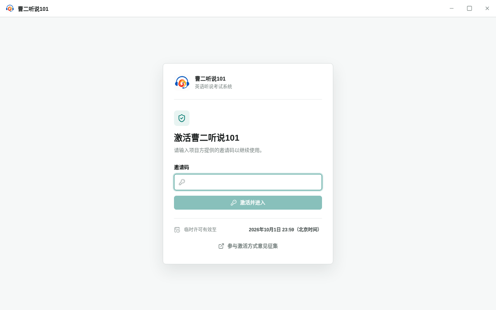
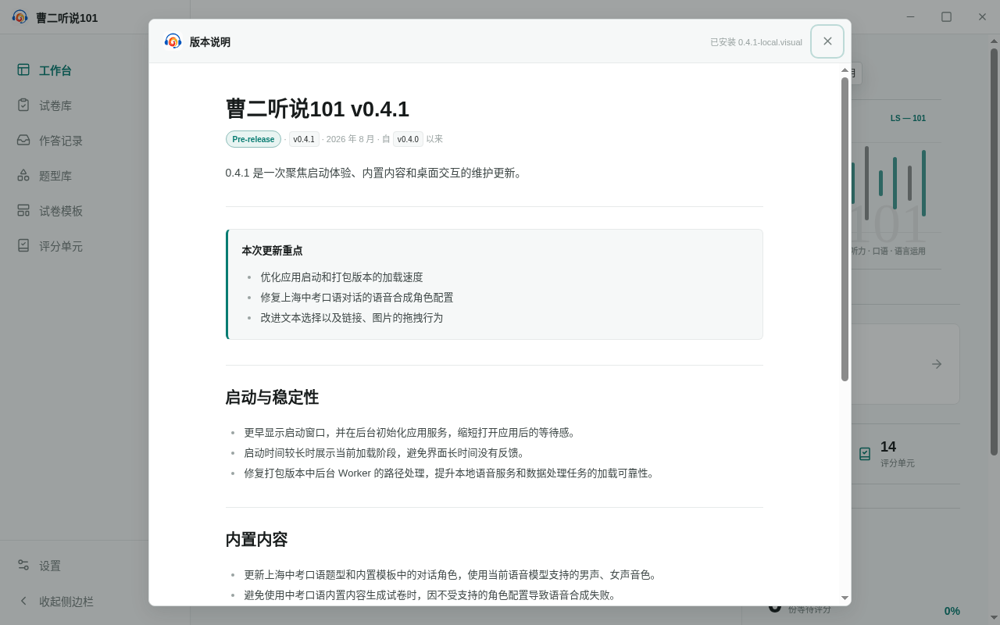
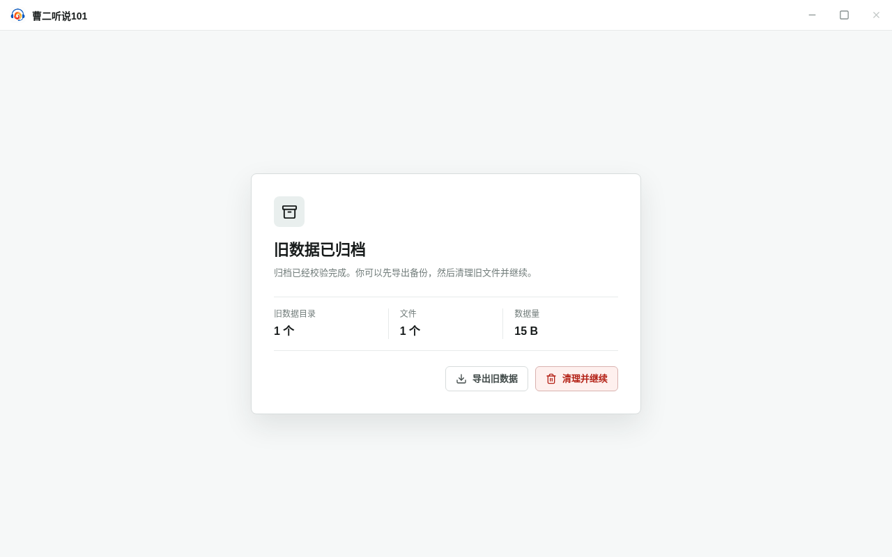

<!--
status: implemented
product-version: 0.4.1
audience: user
owner: docs
-->

# 曹二听说101 使用说明书

曹二听说101 是一套在电脑上组织英语听说考试的软件。一次考试要做的事它都覆盖：编写评分标准、准备题目、组卷、组织学生上机考试、评分，最后按批次结算出成绩。软件的数据都保存在本机，不需要服务器，除 AI 功能外也不需要联网。

本说明书对应 V0.4.1 版本，按实际使用的顺序说明各项功能。

| 文档版本 | 日期    | 修订内容                   | 修订人 |
| -------- | ------- | -------------------------- | ------ |
| V1.0     | 2026-09 | 依据 V0.4.1 界面与功能编写 | 应昊廷 |

## 名词说明

说明书和界面里会用到下面几个词：

| 名词     | 含义                                           |
| -------- | ---------------------------------------------- |
| 评分单元 | 一套评分标准，规定考什么、每项多少分、怎么给分 |
| 题型     | 一类题目的模板，例如「朗读句子」               |
| 题组     | 题型下的具体题目，一个题组是一套完整题目       |
| 试卷模板 | 组卷规则，可以反复使用                         |
| 试卷     | 由试卷模板生成的成品卷，生成后不能再修改       |
| 作答包   | 一次考试结束时导出的作答数据                   |
| 作答记录 | 作答包导入软件后形成的记录                     |
| 结算批次 | 一次结算的归组单位，成绩按批次导出             |

## 一、运行环境

软件运行在 Windows 10 或 Windows 11（64 位）上。它是桌面程序，安装包已经带全运行所需的组件，不用另外安装浏览器、数据库之类的东西。

| 项目       | 最低配置      | 建议配置           |
| ---------- | ------------- | ------------------ |
| 处理器     | 64 位双核     | 64 位四核及以上    |
| 内存       | 4 GB          | 8 GB 及以上        |
| 硬盘空间   | 5 GB 可用空间 | 10 GB 以上可用空间 |
| 屏幕分辨率 | 1280 × 720    | 1440 × 900 及以上  |

〔待确认：表中数值需按实机测量后确认〕

软件的语音合成和语音识别都在本机运行，模型文件约占 4 GB 硬盘空间。再加上试卷、作答录音和评分结果，硬盘占用会持续增长，安装前和正式考试前都要留出余量。

考试需要两种音频设备：耳机或音箱用来播放听力，考场里建议让考生使用耳机，避免相互干扰；麦克风用来录制口语作答，正式考试前用软件提供的麦克风检测功能试一遍，确认能录能放。

出题、组卷、考试和评分都不需要联网，只有两件事要联网：一是用 AI 生成内容或 AI 评分，需要先在「设置 → AI 引擎」中配置服务商；二是打开「激活方式意见征集」页面。

## 二、安装与启动

### 安装

1. 双击安装程序，打开安装向导。
2. 按提示选择安装位置。默认装在系统程序目录，也可以改；建议装在本地硬盘，不要装到网络驱动器或移动存储设备上。
3. 按提示决定是否创建桌面快捷方式。
4. 安装完成后，向导提供运行选项，可以直接启动软件。

安装过程不需要联网。覆盖安装新版本前先备份数据，方法见下面「数据存储位置」。

### 首次启动与激活

1. 启动软件，第一次打开时界面显示「激活曹二听说101」。
2. 在「邀请码」输入框中输入邀请码，单击「激活并进入」。

   

3. 邀请码不正确时，界面提示「邀请码不正确，请检查后重试。」，重新输入即可。
4. 激活成功后进入工作台。激活信息保存在本机，以后打开不用再输入。

激活界面下方显示许可的有效期。许可到期后启动软件，界面显示「使用权限已到期」，此时需要获取新的邀请码。

如需在本机清除激活信息，打开「设置 → 许可」，单击「取消激活」并确认。软件会删除本机的激活信息并重新启动，试卷、题型、作答记录等业务数据不受影响。

### 启动过程与版本说明

软件启动后先显示启动窗口，同时在后台加载数据。加载时间较长时，窗口里会显示当前进行到哪一步；加载完成后进入工作台。

第一次打开或者更新版本后，界面会弹出「版本说明」，列出这一版改了什么。



「版本说明」只能用「关闭版本说明」按钮关闭，按 Esc 键或单击对话框外部都不会关闭。

### 旧版本数据

在装过旧版本的电脑上启动软件时，软件会先把旧数据打包归档，并显示「旧数据已归档」，同时列出归档的目录数、文件数和数据量。



- 需要保留时，单击「导出旧数据」，把归档文件保存到指定位置。
- 暂时不处理时，关闭提示即可，不影响使用。
- 确认不再需要时，单击「清理并继续」，软件删除已归档的旧数据目录，然后继续启动。

归档文件保存在软件的数据目录中，不会跟着旧数据一起删除。没有单击「清理并继续」之前，旧数据不会被删除。

### 数据存储位置

软件数据默认保存在：

```text
%APPDATA%\cyez-ls101\data
```

其中 `%APPDATA%` 一般为 `C:\Users\<用户名>\AppData\Roaming`。实际位置和占用大小可在「设置 → 存储」中查看，该页面提供三项操作：

- 「更改位置」：把数据复制到一个空目录，或者改用另一个已有的数据目录。
- 「恢复默认位置」：改回默认目录。
- 「删除旧数据」：删除更换位置后留下的旧目录。

复制完成之前不会切换目录，原数据也不会删除。迁移完成后，原目录保留为「旧数据目录」，确认不再需要时再删除。旧数据目录尚未删除，或者旧版本数据的归档尚未清理时，都不能更改数据位置。

### 卸载

1. 打开 Windows 的「设置 → 应用 → 已安装的应用」（Windows 10 为「控制面板 → 程序和功能」）。
2. 找到「曹二听说101」，选择卸载。
3. 按提示完成卸载。

卸载只删除程序文件，不删除数据目录。如需一并清理，先按上面「数据存储位置」找到数据目录，自行备份或删除。已经导出的试卷包、作答包和成绩文件不受影响。

## 三、界面与基本操作

主界面分成三部分。


- **标题栏**：窗口最上面一条，右侧是最小化、最大化、关闭三个按钮。
- **导航栏**：窗口左侧一列，按顺序列出各个功能，下面是「设置」和「收起侧边栏」。
- **内容区**：窗口右侧，显示当前页面。页面顶部是标题和一句话说明，标题右侧是这个页面能做的操作。

单击「收起侧边栏」，导航栏收成只显示图标的窄栏，按钮变成「展开侧边栏」，内容区随之变宽。


导航栏各项对应的功能：

| 导航项   | 功能                                       |
| -------- | ------------------------------------------ |
| 工作台   | 软件首页，显示当前工作状态和常用入口       |
| 试卷库   | 管理可运行的试卷，考试从该模块启动         |
| 作答记录 | 管理导入的作答记录，评分和结算在该模块进行 |
| 题型库   | 编辑题型与题组                             |
| 试卷模板 | 编辑试卷模板与函数库，生成试卷             |
| 评分单元 | 编辑评分标准                               |
| 设置     | 存储位置、外观、许可、关于与 AI 引擎设置   |

考试运行、评分工作台和评分结算不显示导航栏，整屏显示内容，避免考试过程中误操作，退出时使用页面里的返回或退出按钮。

界面上还有一些共通的提示方式：

| 情况         | 界面表现                                                   |
| ------------ | ---------------------------------------------------------- |
| 数据加载中   | 列表和统计显示「正在加载…」，加载完成后显示实际内容        |
| 列表为空     | 显示空状态说明和后续操作建议                               |
| 操作完成     | 界面显示操作结果提示                                       |
| 不可逆操作   | 删除、覆盖、结算等操作先显示确认对话框，确认后执行         |
| 未保存即离开 | 编辑界面有未保存的修改时，提示保存或放弃                   |
| 按钮不可用   | 按钮为禁用状态时，鼠标悬停显示原因，例如需先删除旧数据目录 |

## 四、工作台

工作台是软件启动后的第一个页面，汇总当前的工作状态并提供常用入口。它不修改数据。


页面从上到下分四块。

**产品信息**显示软件名称和一条英语格言及其中文译文。

**快捷操作**提供三个入口，单击后进入对应模块：

| 卡片         | 进入     |
| ------------ | -------- |
| 制作试卷     | 试卷模板 |
| 进入试卷库   | 试卷库   |
| 处理作答记录 | 作答记录 |

卡片上会显示当前数量，例如「3 份试卷可以运行」「5 份作答等待评分」。

**当前状态**显示试卷、待评分、题型、试卷模板、评分单元五项的数量。

**工作区**分左右两栏。「最近工作」列出最近处理过的试卷、作答记录和试卷模板，最多 4 条，单击即可打开；还没有记录时显示「还没有最近工作」，并提供「前往试卷模板」按钮。「待处理」显示评分进度，包括待评分数量、作答总数和完成百分比，下面是「未完成题型」清单；单击「查看作答记录」进入作答记录页面。

日常使用时：继续上次的工作，在「最近工作」中单击对应条目；查看评分进度，看「待处理」中的百分比，它按「已结算数 ÷（待评分 + 已结算）」计算，到 100% 表示全部评完；判断下一步做什么，按「出题 → 组卷 → 考试 → 评分」的顺序对照「当前状态」，哪一项是 0 就先补哪一项。

数据读取失败时，「最近工作」的副标题会变成「部分状态暂不可用」，数字停在 0。工作台没有页内刷新入口，离开这个页面再重新进入即可重新读取。
