<!--
status: implemented
product-version: 0.4.1
audience: user
owner: docs
-->

# 曹二听说101 使用说明书

曹二听说101 是一套英语听说模拟考试软件，用来完成出卷、考试、批改三件事。软件装在本机，数据保存在本机，除 AI 功能外不需要联网。

本说明书对应 V0.4.1 版本，按实际使用的先后顺序编写。

| 文档版本 | 日期    | 修订内容                   |
| -------- | ------- | -------------------------- |
| V1.0     | 2026-09 | 依据 V0.4.1 界面与功能编写 |

## 1. 运行环境与安装

### 1.1 运行环境

软件运行在 Windows 10 或 Windows 11（64 位）上，安装包已包含运行所需的全部组件。

语音合成和语音识别在本机运行，模型文件约占 4 GB 硬盘空间；加上试卷、作答录音和评分结果，硬盘占用会持续增长，安装前和考试前都要留出余量。

考试需要耳机或音箱播放听力、麦克风录制口语。考场建议让考生使用耳机，避免相互干扰；正式考试前用软件提供的麦克风检测功能试录一次，确认能录能放。

出题、组卷、考试和评分都能离线完成，需要联网的只有两处：使用 AI 生成内容或 AI 评分时访问「设置 → AI 引擎」中配置的服务商，以及打开「激活方式意见征集」页面。

### 1.2 安装

1. 双击安装程序，打开安装向导。
2. 按提示选择安装位置。默认装在系统程序目录，也可以改；建议装在本地硬盘，不要装到网络驱动器或移动存储设备上。
3. 按提示决定是否创建桌面快捷方式。
4. 安装完成后，向导提供运行选项，可以直接启动软件。

覆盖安装新版本前先备份数据，方法见 1.5 节。

### 1.3 首次启动与激活

1. 启动软件，第一次打开时界面显示「激活曹二听说101」。
2. 在「邀请码」输入框中输入邀请码，单击「激活并进入」。

   

3. 邀请码不正确时，界面提示「邀请码不正确，请检查后重试。」，重新输入即可。
4. 激活成功后进入工作台。激活信息保存在本机，以后打开不用再输入。

激活界面下方显示许可的有效期。许可到期后启动软件，界面显示「使用权限已到期」，此时需要获取新的邀请码。

如需在本机清除激活信息，打开「设置 → 许可」，单击「取消激活」并确认。软件会删除本机的激活信息并重新启动，试卷、题型、作答记录等业务数据不受影响。

### 1.4 启动过程与旧版本数据

软件启动后先显示启动窗口，同时在后台加载数据；加载时间较长时，窗口里会显示当前进行到哪一步。第一次打开或者更新版本后，界面会弹出「版本说明」，列出这一版改了什么。


「版本说明」只能用「关闭版本说明」按钮关闭，按 Esc 键或单击对话框外部都不会关闭。

在装过旧版本的电脑上启动时，软件会先把旧数据打包归档，并显示「旧数据已归档」，列出归档的目录数、文件数和数据量。


需要保留时单击「导出旧数据」把归档文件保存到指定位置；暂时不处理可以关闭提示；确认不再需要时单击「清理并继续」，软件删除已归档的旧数据目录后继续启动。归档文件保存在软件数据目录中，不会跟着旧数据一起删除，没有确认清理之前旧数据不会被删除。

### 1.5 数据存储位置

软件数据默认保存在：

```text
%APPDATA%\cyez-ls101\data
```

其中 `%APPDATA%` 一般为 `C:\Users\<用户名>\AppData\Roaming`。实际位置和占用大小可在「设置 → 存储」中查看，该页面提供三项操作：

- 「更改位置」：把数据复制到一个空目录，或者改用另一个已有的数据目录。
- 「恢复默认位置」：改回默认目录。
- 「删除旧数据」：删除更换位置后留下的旧目录。

复制完成之前不会切换目录，原数据也不会删除。迁移完成后，原目录保留为「旧数据目录」，确认不再需要时再删除。旧数据目录尚未删除，或者旧版本数据的归档尚未清理时，都不能更改数据位置。

### 1.6 卸载

打开 Windows 的「设置 → 应用 → 已安装的应用」（Windows 10 为「控制面板 → 程序和功能」），找到「曹二听说101」并卸载。卸载只删除程序文件，不删除数据目录；如需一并清理，先按 1.5 节找到数据目录自行备份或删除。已经导出的试卷包、作答包和成绩文件不受影响。

## 2. 界面与基本操作

### 2.1 主界面

主界面分成三部分。


- **标题栏**：窗口最上面一条，右侧是最小化、最大化、关闭三个按钮。
- **导航栏**：窗口左侧一列功能入口，下面是「设置」和「收起侧边栏」。
- **内容区**：窗口右侧显示当前页面。页面顶部是标题和一句话说明，标题右侧是这个页面能做的操作。

单击「收起侧边栏」，导航栏收成只显示图标的窄栏，按钮变成「展开侧边栏」，内容区随之变宽。


### 2.2 导航栏各项

导航栏按出卷、考试、批改的顺序组织，本说明书也从第 4 章起按同一顺序逐项说明。

| 导航项   | 在流程中的位置                           |
| -------- | ---------------------------------------- |
| 工作台   | 首页，汇总当前进度并提供入口             |
| 评分单元 | 出卷：先定评分标准                       |
| 题型库   | 出卷：准备题目内容                       |
| 试卷模板 | 出卷：把题目排成试卷，并生成可运行的试卷 |
| 试卷库   | 考试：存放生成好的试卷，考试从试卷库启动 |
| 作答记录 | 批改：导入作答、评分、结算出成绩         |
| 设置     | 通用：服务商、存储位置、许可、外观       |

### 2.3 全屏界面

考试运行、评分工作台和评分结算不显示导航栏，整屏显示内容，避免考试过程中误操作，退出时使用页面里的返回或退出按钮。

### 2.4 通用提示方式

| 情况         | 界面表现                                           |
| ------------ | -------------------------------------------------- |
| 数据加载中   | 列表和统计显示加载提示，加载完成后显示实际内容     |
| 列表为空     | 显示空状态说明和后续操作建议                       |
| 操作完成     | 界面显示操作结果提示                               |
| 不可逆操作   | 删除、覆盖、结算等操作先显示确认对话框，确认后执行 |
| 未保存即离开 | 编辑界面有未保存的修改时，提示保存或放弃           |
| 按钮不可用   | 按钮为禁用状态时，鼠标悬停显示原因                 |

## 3. 工作台

工作台是软件启动后的第一个页面，汇总当前的工作状态并提供常用入口，本身不修改数据。


### 3.1 页面组成

**产品信息**显示软件名称和一条英语格言及其中文译文。

**快捷操作**提供三个入口，单击后进入对应模块：

| 卡片         | 进入     |
| ------------ | -------- |
| 制作试卷     | 试卷模板 |
| 进入试卷库   | 试卷库   |
| 处理作答记录 | 作答记录 |

**当前状态**显示试卷、待评分、题型、试卷模板、评分单元五项的数量。

**工作区**分左右两栏。「最近工作」列出最近处理过的试卷、作答记录和试卷模板，最多 4 条，单击即可打开；还没有记录时显示「还没有最近工作」。「待处理」显示评分进度，包括待评分数量、作答总数和完成百分比，下面是「未完成题型」清单。

### 3.2 状态说明

数据读取失败时，「最近工作」的副标题会变成「部分状态暂不可用」，数字停在 0。工作台没有页内刷新入口，离开这个页面再重新进入即可重新读取。

## 4. 评分单元

### 4.1 评分单元是什么

评分单元是一道题的判分依据，同时规定三件事：这道题怎么作答、答案怎么采集、分数怎么给。考试时学生看到什么、评分时阅卷人看到什么、报告里展示什么，都由评分单元决定。

评分标准、题目内容、卷面编排在软件里分开维护。试卷模板只引用评分单元，并把评分单元绑定到具体题目；生成试卷时，评分单元的定义会完整写进试卷，成为这份试卷自带的判分依据。因此同一套标准可以用在多份试卷上，一份试卷也可以换一套标准重新评分，而评分单元后来怎么改，都不会动摇已经生成的试卷和已经完成的评分。

一份评分单元从建立到使用的完整去向：

1. 建立：新建或从内置评分单元复制，填好内容后保存。
2. 引用：在试卷模板中绑定到某道题或多个题目。
3. 固化：生成试卷时，评分单元的定义随试卷一起保存。
4. 采集：考试时按评分管道与答案槽位决定学生怎么答、录几段音。
5. 判分：评分时，评分材料、满分上限与评分标准出现在评分界面。
6. 归档：结算后，分数与评分标准一起进入评分报告。

### 4.2 一项评分单元要定下来的事

新建或复制评分单元时，页面左侧编辑内容，右侧实时显示评分结构摘要；要定下来的内容分四组，依次是作答方式、答案槽位、模板输入和评分依据。

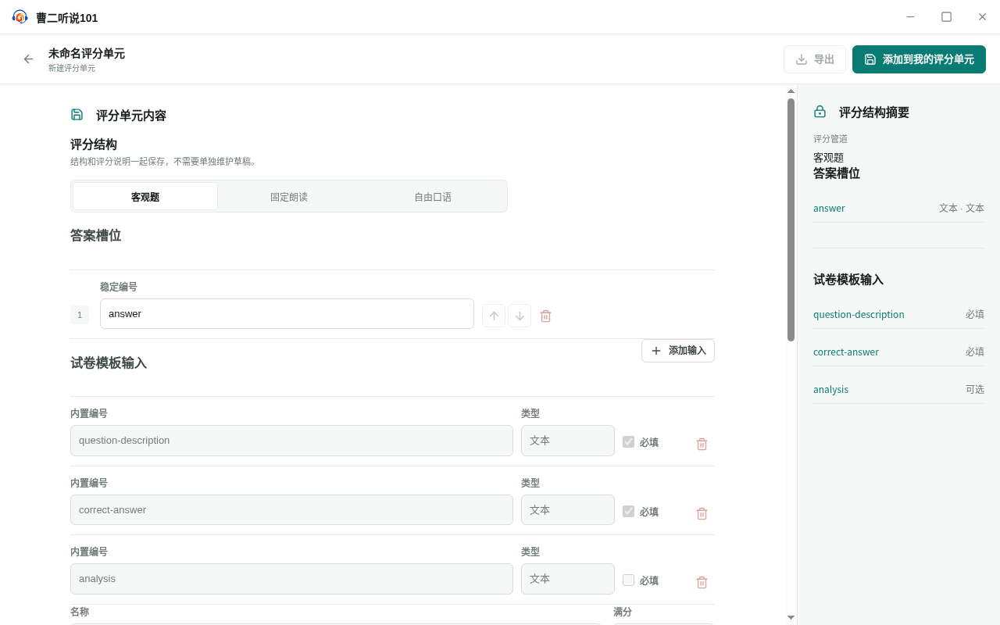

**这道题怎么作答——评分管道**

评分管道在三者中选一，决定学生怎么答、答案怎么采、由谁判分：

| 评分管道 | 学生怎么答     | 答案形态       | 谁来判分                           |
| -------- | -------------- | -------------- | ---------------------------------- |
| 客观题   | 在页面上选择   | 一段文本       | 系统自动判定，不需要人工或 AI 评分 |
| 固定朗读 | 按给定文本朗读 | 一条或多条录音 | 人工评分或 AI 评分                 |
| 自由口语 | 自由作答       | 一条或多条录音 | 人工评分或 AI 评分                 |

客观题在评分会话开始时由系统判完，计入总评分单元数，但不出现在人工或 AI 的待评列表里。切换评分管道会重置答案槽位的类型，需要重新添加槽位。

**答案怎么采——答案槽位**

一个答案槽位就是一份要采集的答案。客观题固定一个文本槽位；固定朗读和自由口语可以添加多个语音槽位，例如短文分句朗读、一问一答各一条，槽位顺序可以调整。

每个槽位有稳定编号和说明。编号用于记录与引用，说明会显示在评分界面上，告诉阅卷人这段文本或录音是什么。评分时，文本答案直接显示内容，没有作答时显示「未作答」；录音答案显示时长，可以回放确认。

**模板里能填什么——试卷模板输入**

试卷模板输入是留给试卷模板填写的文字项，例如朗读原文、参考文本、题目描述。每项有编号、类型（目前是文本）和是否必填；标为必填的输入，生成试卷时不能为空。

评分时，这些输入按名称逐个显示在评分界面的「评分材料」一侧，和题目一起构成判分依据。

**怎么给分——满分、评分标准与 AI 补充提示词**

- **满分**：评分界面的分数上限，填写分数时必须在 0 到满分之间；结算时按满分汇总总分，报告里同时给出总分与满分。
- **评分标准**：分档说明，用 Markdown 编写。人工评分时显示在「评分材料」里，AI 评分时作为判分依据；结算后随评分报告一起归档，便于复核。
- **AI 补充提示词**：可选，只在 AI 评分时生效，用来补充机器不容易从评分标准里读出的要求。

**名称、描述与版本**

名称在列表、模板绑定处和评分界面上显示；描述用一句话说明这道题考什么。每次保存递增一个版本号，界面显示为「版本 N」。

### 4.3 做一个评分单元


1. 进入「评分单元」。软件自带 14 项内置评分单元（上海高考的朗读句子、情景提问、看图说话等），先在内置列表里找最接近的一项，单击「复制并修改」，软件会带着原结构生成一份可编辑的副本。
2. 填写名称和描述。
3. 选择评分管道。改管道会重置答案槽位类型，需要重新添加槽位。
4. 按题目需要增减答案槽位，填写每个槽位的稳定编号和说明；朗读、口语题可以为一题添加多个槽位并调整顺序。
5. 如果模板要往这套标准里填文字（例如朗读原文），添加试卷模板输入，写明编号和是否必填。
6. 填写满分和评分标准，需要时补上 AI 补充提示词。
7. 单击「添加到我的评分单元」。软件先校验结构再校验数据，不通过时在页面上逐条列出要修正的内容，已经填好的内容不会丢失。
8. 保存后停留在编辑态，可以继续修改数据并保存，每次保存产生一个新版本。

### 4.4 使用与维护

- **结构在第一次保存后固定**：评分管道、答案槽位及其顺序、试卷模板输入都不能再改，之后只能修改名称、满分、说明、评分标准和 AI 补充提示词。需要改结构时，重新从内置评分单元复制，或者新建一个。已经生成的试卷因此始终对得上当初的判分依据。
- **内置评分单元只读**：内置项不能编辑和删除，需要调整时复制成「我的评分单元」再改。
- **导出**：已保存且没有未保存修改时，「导出」把当前定义写成 `.lsschema` 文件，用于备份或复制到其他电脑；有未保存修改时导出不可用。
- **删除**：需要二次确认，确认框会说明删除后引用该评分单元的模板将无法通过校验。已经生成的试卷和已经完成的评分不受影响。
- **在模板中引用**：模板只保存引用和题目输入，实际判分规则以生成试卷时读取的正式版本为准；同一个评分单元可以在模板中被多个题目引用。

## 5. 题型库

### 5.1 题型与题组

**题型**规定一类题目由哪些字段组成以及 AI 应当按什么要求生成内容。例如「朗读句子」需要一段原文文本、一张提示图片和一条参考音频，这些就是题型的字段结构。

**题组**是按题型的字段填好的一套具体内容。一个题组就是一套完整的题，可以在生成多份试卷时反复选用。

试卷模板只引用题型的字段结构，生成试卷时才选定用哪个题组。因此同一批题目可以供不同试卷使用，调整卷面编排也不必改动题目定义。已发布的题型不能直接修改，需要调整时从复制新草稿开始，修改和重新发布不会影响已经生成的试卷。

### 5.2 题型库与题型详情

导航栏进入「题型库」，页面分「题型」和「草稿」两个视图：题型视图列出已经发布的题型，显示名称、题组数量和描述；草稿视图存放还没发布或者还在继续修改的草稿，新建草稿的入口也在草稿视图。


打开一个题型进入详情页，详情页分「题组」和「题型定义」两个视图：「题组」是默认视图，用于新建、进入和删除该题型下的题组；「题型定义」查看描述、生成要求和字段结构，也是复制为新草稿、复制提示词和复制结构化输出的地方。导出题型固定在详情页，单击后先进入全屏选择页，勾选要交付的题组后再导出。


### 5.3 题型由哪些内容组成

| 内容     | 说明                                                                                                                                                                         |
| -------- | ---------------------------------------------------------------------------------------------------------------------------------------------------------------------------- |
| 名称     | 题型的名字，在列表、模板绑定和题组页面显示                                                                                                                                   |
| 描述     | 一句话说明这类题目考什么                                                                                                                                                     |
| 生成要求 | 写给 AI 的提示词，说明这类内容应当怎么生成                                                                                                                                   |
| 字段结构 | 题型需要哪些内容。字段可以分组；每个字段包含字段标识（同层唯一的名字）、类型（文本或图片）、变量名（供试卷模板引用）、描述（告诉 AI 这个字段是什么）、示例（给 AI 的示例值） |
| 内置来源 | 显示题型是否随软件提供                                                                                                                                                       |
| 题组     | 该题型下的具体题目，每套题组有名称和生成时间                                                                                                                                 |

文本字段在试卷模板中以 `[@变量名]` 引用；图片字段分两份资源，图片提示词为 `[@变量名.inst]`，图片本身为 `[@变量名.img]`，模板里可以分别使用。

### 5.4 草稿与发布

题型有两个状态，对应题型库页面的两个视图：

- **草稿**：编制中的题型。允许保存不完整的内容，可以分次填写。
- **已发布题型**：发布后的稳定题型，字段结构不再变化，供试卷模板引用。

发布时集中校验名称、生成要求、字段结构（至少一个字段、字段组不能为空、变量名不能重复等），校验结果可以定位到具体字段。发布成功后草稿仍然保留，可以继续修改并再次发布，也可以删除；删除草稿不影响已经发布的题型。

### 5.5 编一个题型

1. 进入「题型库」，切到「草稿」视图，新建题型草稿。
2. 在「基本信息」里填写名称和描述，在「提示词」里填写生成要求。
3. 在「字段结构」中添加字段组和字段：文本字段用于文字内容，图片字段用于配图。
4. 逐个字段填写变量名、描述和示例。变量名会出现在试卷模板里，描述和示例会随生成要求一起交给 AI。

   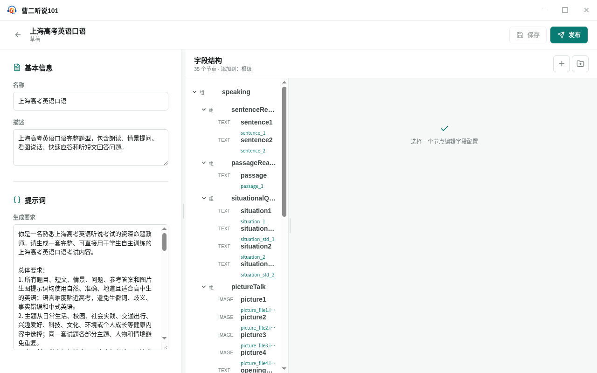

5. 保存草稿。字段标识不合法或同层重名时会就地提示，不会自动改名。
6. 单击「发布」，在确认框中确认。发布生成稳定题型并进入题型详情。

### 5.6 做一套题组

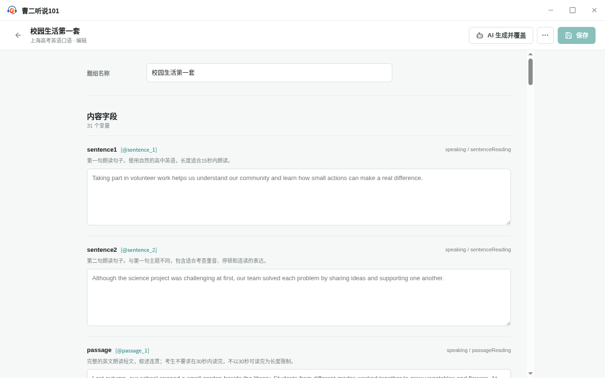

在题型详情的「题组」视图中单击「新建题组」：

1. 填写题组名称，例如「校园生活第一套」，然后选择进入方式。
2. **手工填写**进入空白表单，按题型字段逐个填写；**AI 生成**进入编辑器后打开整组生成任务，但不会自动发起请求，需要确认后才开始。
3. 表单里的文本字段直接填写；图片字段必须同时有图片提示词和图片，才能保存。
4. 保存时整组一起提交，不提供单字段保存。

题组内容的三种生产方式：

- **整组 AI 生成**：按题型的生成要求一次性生成全部字段。成功时整组内容被原子替换并立即保存；如果题组里已有内容，开始前会说明覆盖范围并再次确认，生成失败或取消时原内容不变。
- **JSON 覆盖**：把外部整理好的内容一次性写入题组，规则与整组生成相同；AI 返回内容不合法时，可以转到 JSON 对话框检查原始结果。
- **图片生成**：单个图片字段可以选取本地文件、读取剪贴板，或调用图像生成服务；批量生图按字段顺序逐个进行，要求所有图片字段都已填写提示词，全部成功后一次保存。

删除题组会连同内容和图片资源一起删除，不可恢复。

### 5.7 交换题型文件

题型文件用于在两台电脑之间传递题目。在题型详情中单击「导出题型」，进入全屏选择页逐项勾选要交付的题组，再导出为 `.lsinterface` 文件；每个题组的全部资源随题组一起交付。

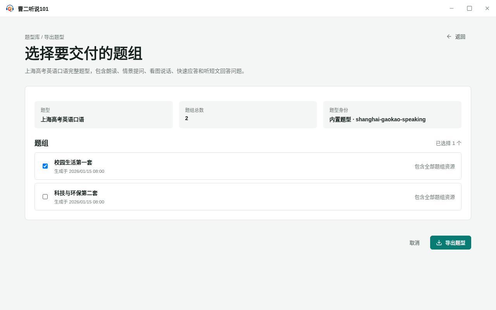

导入时先选择文件，再在全屏审查页看到三类题组：

- **可导入**：本机没有的题组，默认勾选。
- **已存在**：本机已有完全相同的题组，显示完成状态，不能重复勾选。
- **冲突**：标识相同但内容不同的题组，不能勾选，页面会说明原因。这种情况不能用文件直接覆盖，需要人工确认后另行处理。

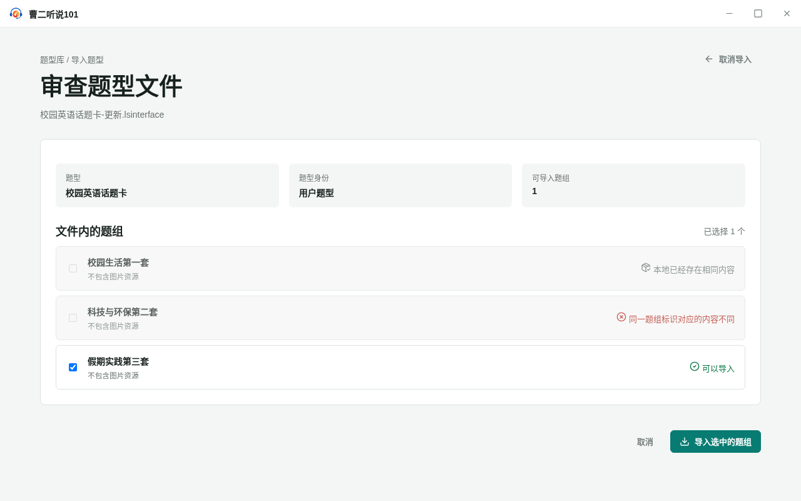

取消导入不会写入任何内容。

### 5.8 内置题型

内置题型随软件提供，当前版本包含上海高考英语听力、上海高考英语口语和上海中考英语口语，不能直接修改。

内置版本升级时按变化程度分别处理：兼容性更新自动应用；字段结构有变化时，由使用者选择迁移现有题组还是保留旧版；如果变量契约不兼容，则不会自动更新，当前版本继续保留并明确提示。

## 6. 试卷模板

### 6.1 模板、函数库与试卷

**试卷模板**是可编辑的制卷规则，把页面、内容、题型题组、评分单元和资源组织成一份完整的考试结构。**试卷**是模板生成出来的自包含快照：生成之后再修改甚至删除模板，都不会改变已经生成的试卷。考过的卷子必须固定、可复查，因此软件把「规则」和「成品」分成两个对象。

**函数库**存放模板可以复用的函数，例如按规则计算分值或拼接文本。本地函数库独立维护；函数插入模板后成为模板内部的一份副本，源函数库之后的变化不再影响这份模板。

### 6.2 模板由哪些内容组成

| 内容         | 说明                                                                     |
| ------------ | ------------------------------------------------------------------------ |
| 结构         | 页面与框架的层级，决定整份试卷的页面顺序                                 |
| 页面内容     | 页面上显示的内容块，包括文本、图片与选择题视图                           |
| 时间线       | 每个页面上按时间播放或采集的步骤，决定先播什么、播放几遍、留多少作答时间 |
| 题型与题组   | 模板声明需要哪些题型；生成试卷时从题型的题组中选择具体内容               |
| 评分单元绑定 | 把题目的答案与评分标准对应起来                                           |
| 资源         | 试卷使用的图片、音频等文件                                               |
| 函数         | 模板内可复用的计算与文本处理                                             |
| 版本         | 每次成功保存递增，用于判定新旧                                           |

模板不区分草稿和发布：保存只是记录工作进度，不做严格校验；预览和生成试卷时才要求内容完整合法。模板只允许引用可用且结构匹配的题型与评分单元；生成只能依据最后一次成功保存的内容，从编辑器进入生成前会先保存当前修改。

### 6.3 模板库

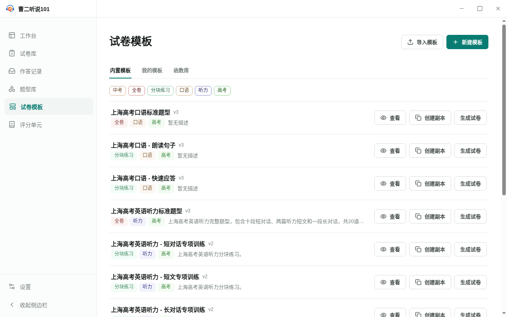

导航栏进入「试卷模板」，页面分「内置模板」「我的模板」「函数库」三个视图，内置模板默认显示，两类模板都可以按标签筛选。每条内置模板显示版本号。

- **内置模板**：随软件提供，包含上海高考口语标准题型、上海高考英语听力标准题型，以及朗读句子、快速应答、短对话、短文、长对话专项训练等。内置模板只读，可以查看、创建副本或直接生成试卷；缺少依赖题型的模板会标记为不可用，不能生成。
- **我的模板**：提供编辑、生成试卷、导出和删除。导入模板时如果遇到同标识但内容不同的模板，可以选择覆盖本地、以新标识导入为副本，或者取消。
- **函数库**：见 6.12 节。

### 6.4 模板编辑器

在「我的模板」中单击「编辑」或行标题进入模板编辑器。编辑器是专注式全屏工作区，不显示一级导航，所有退出路径都在工具栏上。

编辑器分三栏：

- 左栏是**函数库**（副标题「组件素材」），按「内置」「导入」「本地」分组列出可以插入的框架、页面、选择题、变量与函数。插入位置是当前选中节点之后。
- 中栏是编辑视图，分「结构」「页面」「预览」三个标签页：结构视图用节点树展示整份试卷，页面视图在设计面上排布单个页面，预览视图按编译结果逐画面检查。
- 右栏是属性面板，随选中对象切换：全局属性、题型配置、评分单元、节点属性、内容块与可用变量。

工具栏左侧是返回按钮与模板身份：名称与当前版本号，有未保存修改时追加「未保存」。右侧依次是撤销、重做、保存、导出模板，最右固定「生成试卷」。模板不区分草稿与发布，保存只记录工作进度，不做严格校验，因此工具栏上没有发布动作；预览与生成试卷时才要求内容完整合法。

三个视图共用同一份文档，切换视图不改变内容。内置模板与本地模板使用同一个编辑器，只读查看时所有写操作被禁用，工具栏只保留「创建副本」与「生成试卷」。

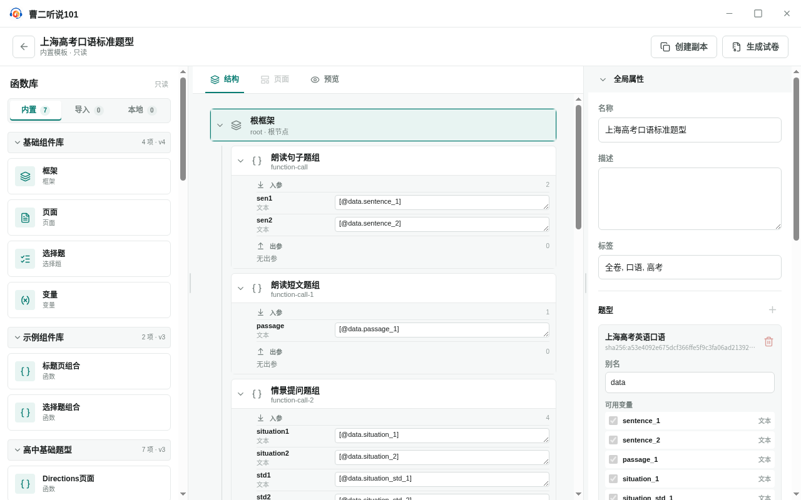

### 6.5 结构视图

结构视图是一棵节点树，根节点固定标记为「根节点」。节点分五种，各自代表试卷的一个组成部分：

| 节点     | 作用                                                     |
| -------- | -------------------------------------------------------- |
| 框架     | 一组子节点的容器，用于给试卷分段，本身不产生画面         |
| 页面     | 学生实际看到的一屏，由页面内容与时间线两部分组成         |
| 选择题   | 为试卷采集选择题作答，声明题干、选项与输出变量           |
| 变量     | 定义一个模板内部使用的值                                 |
| 函数调用 | 调用函数库中的函数，填写输入并接收输出                   |

节点树自上而下就是试卷的展开顺序。框架节点展开为子节点，页面节点在行内展开时间线，选择题节点展开题干与选项，函数调用节点展开入参与出参；这些行内摘要与右栏属性面板编辑的是同一份内容，改哪一处都等价。

选中节点后可以在右栏「节点属性」中改名并设置该类型专属的属性。选中非根节点时，节点行上出现上移、下移、复制与删除：上移下移只调整同级顺序，复制会在该节点之后插入一份副本，删除会连同全部子节点一起删除，因此删除前需要确认。

左栏的函数卡片决定能插入什么：框架、页面、选择题与变量来自基础组件库，成组的函数来自各题型函数库。函数插入后成为模板内部的函数调用节点，它的输入就是函数签名里的输入。

### 6.6 时间线

每个页面挂着一条时间线，按顺序描述这一页上发生的事：

- **TTS 播放**：朗读指定文本。文本可以拼接常量与变量引用。
- **倒计时**：等待指定的秒数，用于留出准备或作答时间。
- **录音**：采集指定时长的一段音频，并以「输出名称」暴露给后续表达式。

三类项目按顺序执行：播放等朗读结束，倒计时等够秒数，录音采集满时长后进入下一项。时间线的顺序就是学生实际经历的顺序，调整顺序即调整考试流程。录音的输出名会进入变量补全列表，可以交给评分单元或函数继续处理。

### 6.7 页面视图

选中页面节点后，「页面」标签页可用；页面节点行内的「编辑内容」也直接进入这个视图。

页面视图是一张设计画布：中间按纸张比例显示当前页面，上方工具条提供「添加内容块」「复制内容块」「删除内容块」，以及缩小、缩放滑块、放大与「适合窗口」。页面缩放只影响编辑时的显示，不写入文档。

内容块分三类：文本、图片与选择题视图。单击「添加内容块」后从菜单里选择类型；拖动块可以移动，拖动右下角手柄可以调整大小，选中后也可以按 Delete 或 Backspace 删除。块的几何与内容都在右栏「内容块」中以数值形式编辑：编号、X、Y、宽度，图片块与选择题视图另有高度，文本块另有字号、粗体与对齐。

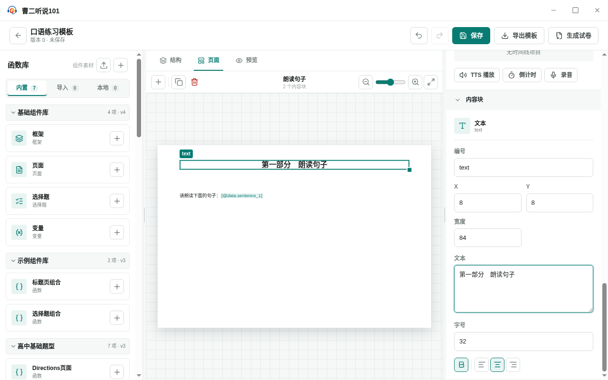

页面与内容一一对应：页面决定学生看到什么，时间线决定这一页怎么播放与采集，两者都在同一个页面节点上，因此不需要另外指定某段内容属于哪一页。

### 6.8 变量与自动补全

模板中的可编辑表达式字段共用一个变量输入器：既能写常量文本，也能引用变量。在字段中输入 `@` 即展开候选列表。

候选项有三个来源：**局部变量**来自当前模板，包括函数调用输出、录音输出、选择题输出与变量节点；**题型**来自「题型配置」中勾选的变量，写作 `题型别名.变量名`；**当前评分单元附件**只在评分单元的文本字段中出现。列表会按字段可接受的类型过滤：文本字段列文本变量，图片字段列图片变量，数字字段列数字变量。

不能拼接的单值字段（倒计时秒数、录音时长、数字入参、图片与文件）只能是一个常量或一个变量：字段非空时输入 `@` 不会写入字段，列表只显示「请先清空输入框」，清空后恢复补全。选择候选项后，触发位置起的 `@` 与查询前缀被替换为变量引用，其余文本保持不变；`↑`、`↓` 切换高亮，`Enter` 或 `Tab` 确认，`Esc` 关闭列表且不改写输入。

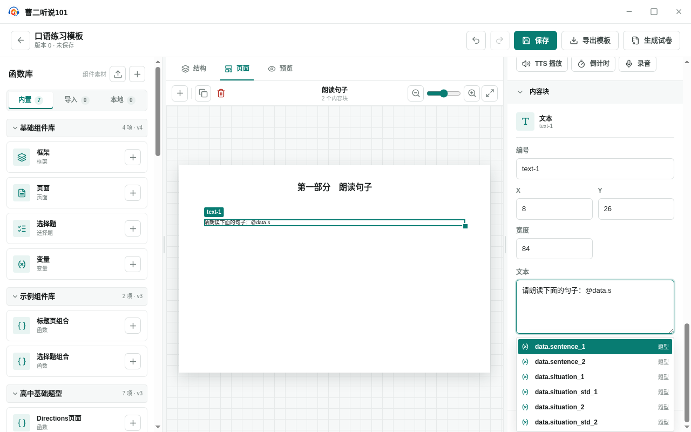

模板里保存的始终是引用，变量在生成试卷时才由题组内容替换。同一份模板选不同的题组就能生成不同的试卷，题目内容因此不必写死在模板里。

### 6.9 属性面板

右栏自上而下是若干个可折叠小节：全局属性、题型配置、评分单元、节点属性、内容块与可用变量。前两节决定模板的整体信息与题型要求。

**全局属性**保存模板自身的名称、描述与标签。标签用逗号分隔，失焦或回车提交，模板库按标签筛选。

**题型配置**声明这份模板需要哪些题型。单击「添加题型」后选择题型、填写别名并勾选这份模板要使用的变量；已配置的题型可以改别名、增删变量或整个移除。别名是变量引用的前缀，同一份模板中不能重复；在同一个题型下换别名会改变引用写法。取消勾选某个变量后，它不再出现在补全列表中，但模板里已经写好的引用不会被删除。

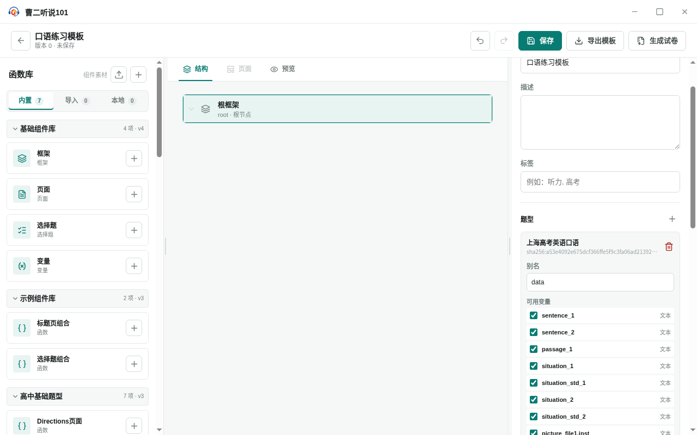

其余小节随选中对象出现：「评分单元」用于查看或修改当前节点绑定的评分单元，「节点属性」显示选中节点的名称与专属属性，「内容块」对应页面视图中选中的内容块，「可用变量」列出当前作用域下可以引用的变量。

### 6.10 预览视图

选中节点后切到「预览」，编辑器会用当前内容编译一份预览：左栏变成「预览序列」胶片条，按页面分组列出每个画面；中栏显示选中画面的实际排版；右栏「预览配置」显示预览范围（节点与画面序号）、刷新预览按钮，以及按题型别名列出的题组下拉。

预览需要题组。模板声明了题型却没有选择题组时，画面区提示「请选择题组」，先在下拉中选择一套题组再刷新即可。编译不通过时画面区显示「模板未通过校验」并列出每条错误的说明与路径，单击错误可以定位到对应节点。预览按编译后的完整展开顺序生成，画面数通常远多于页面数：一页时间线上的每一步都会成为一个画面。

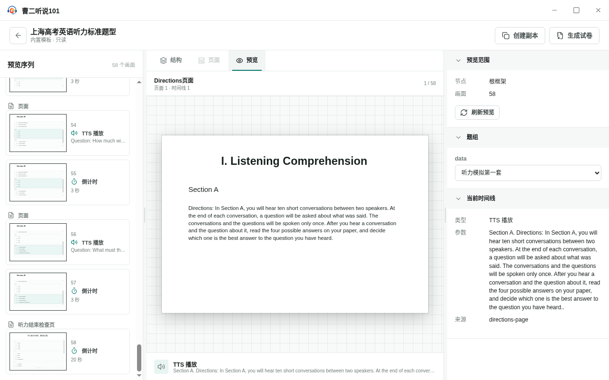

预览用于检查学生实际看到的顺序与选择题交互，切换画面或重新进入预览会清空答案，不写入任何数据。

### 6.11 保存、版本与导出

编辑以整份文档为单位维护撤销与重做，历史上限 200 步。保存把当前内容写入模板，成功后版本号递增，该状态成为新的干净基线，撤销与重做的可用范围随之更新。保存期间可以继续编辑，不会被保存动作覆盖；有未保存修改时离开页面会先确认。

保存失败的说明显示在「全局属性」中。如果提示数据已在其他窗口更新，说明本地内容已经落后于磁盘，此时需要刷新后重试。

「导出模板」会先保存未保存的修改，再写出 `<名称>-r<修订号>.lstemplate`。导出的文件与「生成试卷」都以最后一次成功保存的内容为准：模板本身可以随时继续修改，已经导出的文件与已经生成的试卷不会随之变化。

### 6.12 函数库与函数编辑器

函数库存放可以复用的计算与文本处理。左栏按来源分三组：

- **内置**：随软件提供的组件与函数，例如框架、页面、选择题和各类题型组合，只读，可直接插入。
- **导入**：从其他电脑导入的函数库，按版本保留，可以删除某个版本。
- **本地**：本机编辑的函数库，是一份带版本号的独立文档，可以新建、重命名、导出与删除，也可以在其中新建函数。

打开本地函数即进入函数编辑器。函数编辑器与模板编辑器同构：左栏是素材面板，中栏同样是「结构」「页面」「预览」三个视图，右栏换成函数签名。

- **函数名称**：插入模板后显示的调用名。
- **输入**：每项有名称与类型，类型可选文本、数字、文件、录音、选择题组与选择题答案；题组类型的输入还要选择形状与每页题数。
- **输出**：每项有名称、类型与表达式，表达式同样支持变量补全。

函数体就是结构视图中的节点树，可以像模板一样插入组件、页面与函数调用。

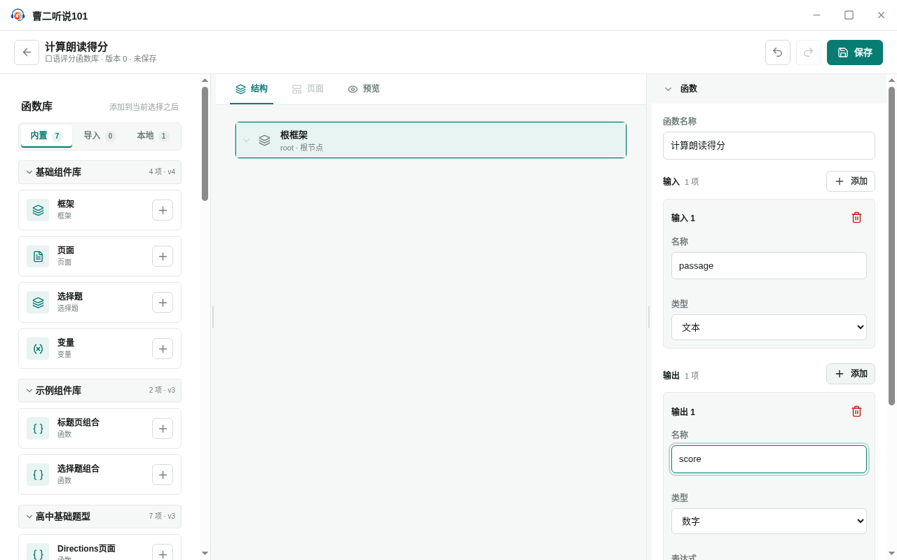

保存会把函数写回本地函数库并使函数库版本递增，同库中的其他函数不受影响。从内置、导入或本地函数库插入函数时，软件在保存模板的同一次操作中复制该函数的完整依赖，成为模板内部的一份副本；此后源函数库的修改、删除或停用都不影响已经插入的模板，已经嵌入模板的副本也不会随源函数更新。

### 6.13 生成试卷

在模板编辑器或内置模板上单击「生成试卷」，页面依次经过三个阶段。

**生成设置**：

1. 填写试卷名称，该名称同时用于试卷库条目和导出文件名。
2. 为模板中声明的每个题型选择题组。此段只在模板声明了题型要求时出现。
3. 如果模板含语音播放，为默认音色、男声、女声分别选择服务商、模型和音色；不含语音的模板显示「此模板无需合成语音」。

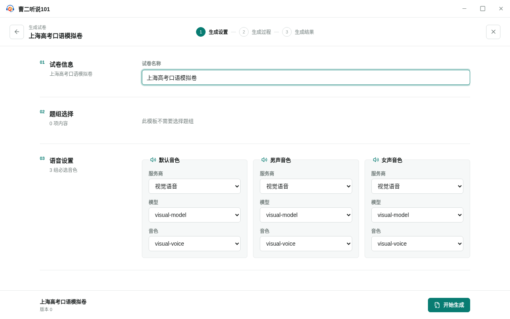

**生成过程**：单击「开始生成」后，任务按列表顺序执行：准备试卷内容、逐条合成语音、整理资源、打包试卷。中途失败会显示「生成已中断」，可以从中断位置重试，已完成的语音继续复用。

**生成结果**：完成后显示页面数、资源数和试卷包大小，并提供两种互相不能替代的保存方式：

- **加入试卷库**：试卷直接进入本机试卷库，可以开始考试。
- **导出文件**：导出为 `.lsexam` 试卷包，用于复制到其他电脑。

两种方式至少要完成一种才能直接离开；都没有保存就离开时，软件会提示本次生成结果将丢失。

## 7. 试卷库

### 7.1 试卷与试卷库

试卷库保存可以直接运行的试卷，内容是试卷模板生成的快照。库里的试卷不能编辑：需要修改内容时，回到对应的试卷模板调整后重新生成。这样库中的卷子与实际考过的卷子始终一致。

导出一份试卷有两种途径：在模板的生成流程中导出 `.lsexam` 文件，或者把已经生成的试卷加入试卷库供本机使用。试卷库内不提供导出。

### 7.2 一条试卷记录包含哪些信息

| 信息       | 说明                                   |
| ---------- | -------------------------------------- |
| 标题       | 生成时填写的试卷名称                   |
| 试卷包编号 | 试卷的标识，导入时用于判断是否重复     |
| 导入时间   | 进入试卷库的时间，列表按这一项倒序排列 |
| 页数       | 试卷包含的页面数量                     |
| 资源数量   | 试卷包中的图片、音频等资源个数         |
| 包大小     | 试卷包文件的大小                       |

导入时软件校验试卷包清单和声明的全部资源：包编号与内容都与库中已有试卷一致时判为重复，不新增记录；包编号相同但内容不同时报冲突，不会覆盖已有试卷；校验失败不产生记录。

### 7.3 管理试卷

- **导入**：选择 `.lsexam` 试卷包，导入后出现在列表顶部。
- **开始考试**：每份试卷的主入口，见 7.4 节。
- **删除**：需要二次确认，只移除试卷库中的这份试卷和本地试卷包，不影响由这份试卷产生的作答记录。

库中没有任何试卷时显示空状态。

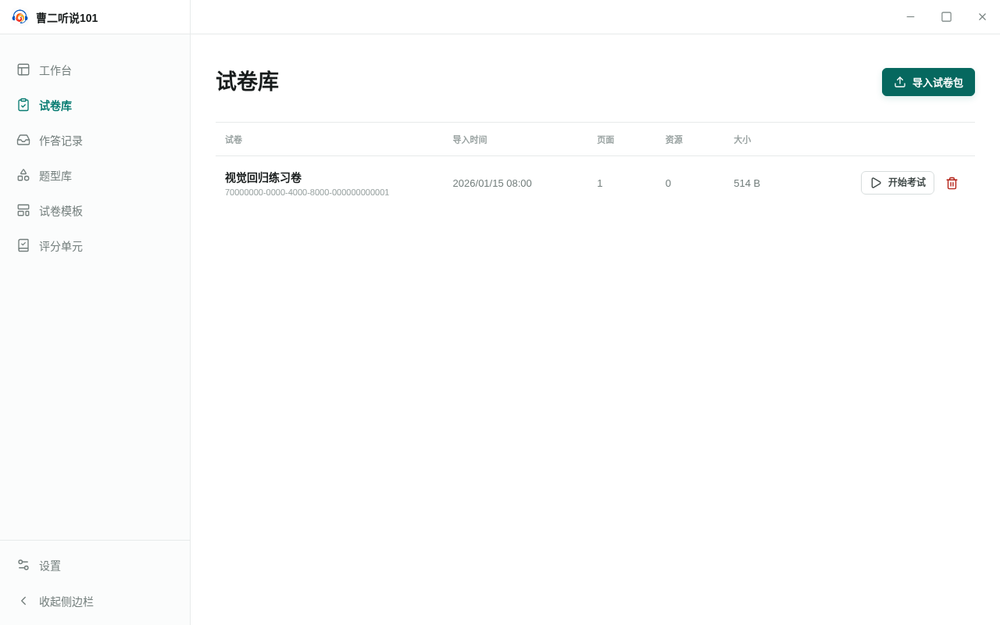

### 7.4 考试运行

在试卷库中单击某份试卷的「开始考试」进入考试。软件先校验试卷资源，然后依次进行：

1. **考生登录**：填写姓名和考生号，两者都是必填项。
2. **麦克风测试**：含录音作答的试卷会先进行设备检查，步骤为选择录音设备、完成试录、回放确认；确认声音正常后才开始考试。
3. **作答**：试卷页面按时间线依次播放，页面下方状态条显示当前页码、状态和剩余时间。学生按页面内容听题、录音或作答。
4. **生成作答包**：考试结束后，软件把本次作答打包保存。作答包需要交给阅卷的老师，由作答记录模块导入。

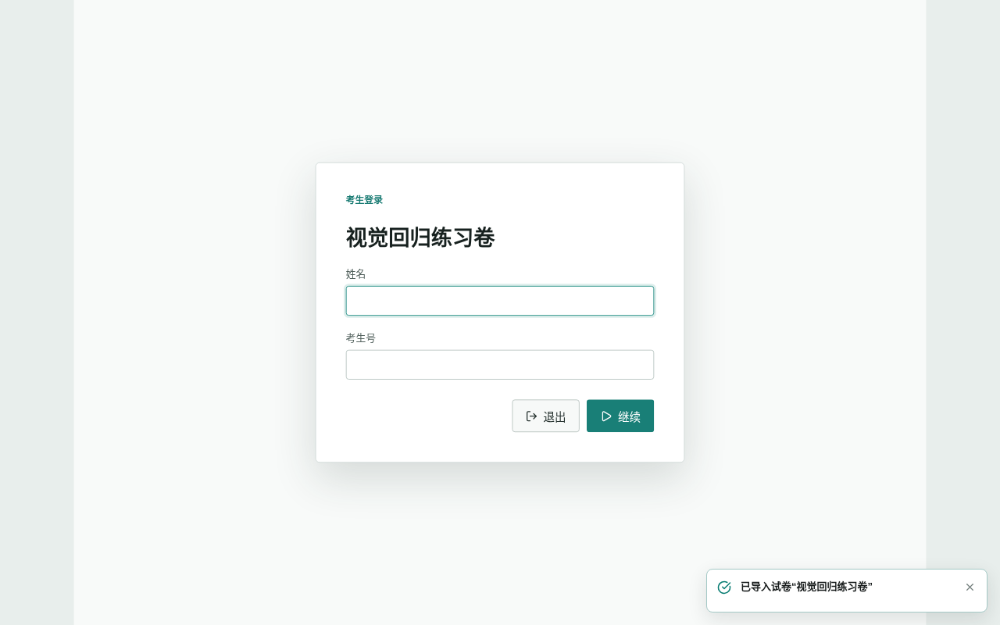

考试过程中可以退出，界面会先确认，退出不会生成作答包。资源缺失、播放或录音失败时考试会暂停并说明原因，可以重试当前步骤或重新生成作答包。

## 8. 作答记录

### 8.1 一条作答记录包含哪些信息

| 信息     | 说明                                         | 是否可修改 |
| -------- | -------------------------------------------- | ---------- |
| 姓名     | 考试时登记的考生姓名                         | 不可修改   |
| 考生号   | 考试时登记的考生号                           | 不可修改   |
| 原始答案 | 选择题选项、录音以及其他原始作答内容         | 不可修改   |
| 评分结果 | 每个评分单元的分数与评语，与原始作答分开保存 | 可重新评分 |
| 结算归属 | 记录所属的结算批次、批次总分与结算时间       | 见 8.4 节  |

原始作答不可修改、评分只产生独立结果，这样重新评分只需要放弃旧的评分结果，学生原始作答不会丢失。

### 8.2 导入与管理

导航栏进入「作答记录」，页面分「未结算」和「已结算」两个标签，未结算是默认视图，已结算按结算批次组织。

- **导入**：选择 `.lssubmission` 作答包，导入后形成作答记录。
- **导出**：把作答记录再导出为作答包文件，用于转交或备份。
- **删除**：不可逆。未结算记录删除后连同原始作答包与暂存评分一起移除；已结算记录删除后，结算归属和报告数据一并移除。

未结算记录有三种进度：未评分、评分中、可结算（全部评分单元都已完成）。


### 8.3 评分

可以单条开始评分，也可以按列表顺序批量逐条推进；继续评分时从第一个未评分的单元开始，已提交的评分保留。一次评分会话开始时在两种方式中二选一：

- **人工评分**：逐题填写分数与评语。
- **AI 评分**：先选择语音识别模型和文本评分模型，软件再依次处理本场所有未评分的评分单元。

客观题不需要人工介入，在准备评分时由系统自动判定。一次会话只使用一种方式；已经提交的评分单元不能修改。

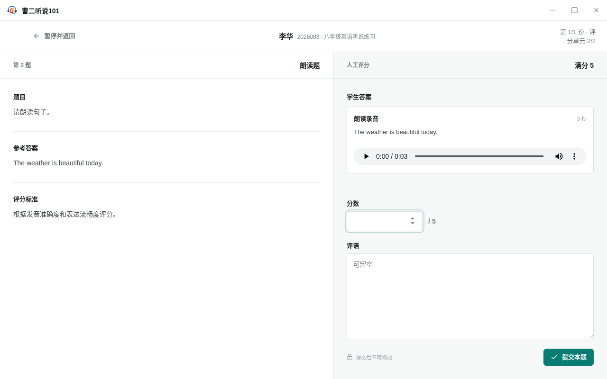

AI 评分的处理规则：

- 单题失败不会中断其他题目，失败的题目单独列出并可重试；全部成功后才能完成本次评分或进入审查。
- 软件会保留所选模型、录音转写、评分提示词和模型原始响应；中途暂停后重新进入，已成功且模型选择相同的题目不会重复生成。
- AI 返回的分数必须在 0 到满分之间、最多三位小数，不符合要求的题目按失败处理。

全部题目成功后，可以选择直接采用全部结果、逐题审查，或者按规则抽查：可以填写整场抽查总题数，也可以按评分单元分别指定抽查题数。审查时修改过的结果仍然算作 AI 评分结果。

### 8.4 结算与评分报告

一条记录的全部评分单元完成后即为可结算。进入结算页后：

- **本次结算**把本场全部评分完成的记录结算为一个批次，计算总分并记录结算时间；没有可结算记录时该操作不可用。
- **下次结算**保留当前进度并返回未结算列表，已经完成的评分继续保留。


结算整体成功或失败，不会产生只结算了一部分的批次。结算后的记录进入「已结算」标签，按批次展开；只有已结算的记录可以查看评分报告。报告包含总分与满分、逐题分数与评语、题目、评分标准和学生答案，客观题另含正误与解析。

发现评分有误时，可以对已结算记录重新评分：软件删除该记录的评分、结算结果和报告，保留原始作答，记录回到未结算列表；如果原批次因此为空，空批次会被删除。

## 9. 设置

### 9.1 AI 引擎

AI 引擎管理软件用到的外部模型与本地模型：题组内容由文本模型生成，图片字段由图像服务生成，试卷里的听力由语音合成产出，AI 评分需要语音识别把录音转成文本，朗读题的发音评测由扩展包提供。这些配置集中在「设置 → AI 引擎」，按用途分成五个分类标签。

#### 9.1.1 五个分类

| 分类        | 管什么                                     | 用在哪里                     |
| ----------- | ------------------------------------------ | ---------------------------- |
| 文本生成    | 在线文本模型的地址、密钥与模型             | 题组的整组 AI 生成、内容补全 |
| 图像生成    | 在线图像服务，或手动导入图片的手动生成     | 题组中图片字段的配图         |
| 语音合成    | 在线语音服务，或本地模型包的离线语音运行时 | 生成试卷时合成听力音频       |
| 语音识别    | 在线转写服务，或本地模型包的离线识别运行时 | AI 评分时把录音转写成文本    |
| AI 语音评测 | 由应用声明的扩展包提供，不支持切换后端     | 固定朗读题的发音评测         |

五个分类里，只有已启用的模型会出现在考试和批改的配置步骤中。


#### 9.1.2 配置一个服务商

文本生成、图像生成、语音合成、语音识别四个分类的服务商配置步骤一致，以文本生成为例：

1. 在列表右上角单击「添加服务商」，打开服务商编辑器。
2. **基础配置**：填写配置名称；选择服务商，会带出兼容协议、Base URL 与内置模型目录；按需修改 Base URL；填写 API 密钥。密钥使用系统加密存储，保存后输入框显示「已安全保存」，单击眼睛图标可以查看。
3. **模型编号**：单击「获取模型列表」从服务拉取模型，也可以手动输入模型编号后添加。新发现的模型默认未启用，需要逐个勾选启用，不需要的可以移除；每个模型还可以设置最大输出，以及推理模式（服务商默认、开启、关闭、按强度或按 token 预算）。
4. **连接测试**：选择一个已启用模型，发送固定的短请求，成功后显示模型回复，用来确认密钥、地址、模型与生成权限都正确。
5. 单击「保存服务商」。没有改动时保存按钮不可用。

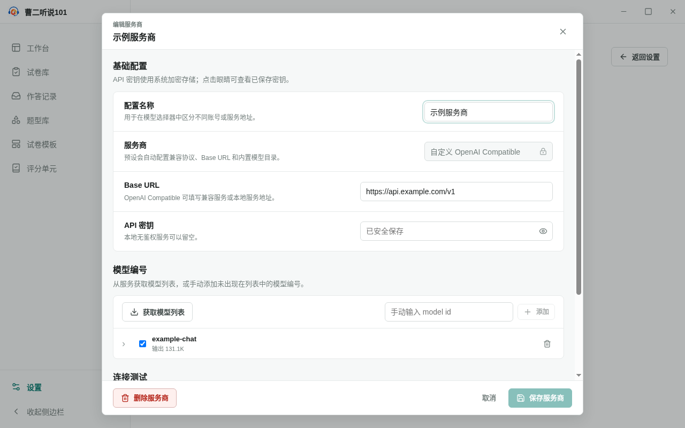

已保存的服务商可以再次打开编辑，但服务商类型不可修改。删除服务商会同时删除它的加密密钥，确认框会写明这一点；已经保存的题组、试卷和作答记录不受影响。

关闭编辑器或切换分类标签会直接丢弃未保存的草稿，当前版本没有未保存提示；连接测试失败、获取模型失败都不会写入配置，草稿保留，可以改完重试。

#### 9.1.3 图像生成

图像服务商与文本服务商分开管理，不复用，调用时单独选择。服务商类型有两种：

- **OpenAI Compatible**：填写地址与独立保存的 API 密钥，模型编号的维护方式与文本生成相同。连接测试会实际生成一张测试图片，可能产生服务商费用。
- **手动生成**：不使用外部服务。用「测试生成」打开手动导入窗口导入一张测试图片，确认流程可用；实际出图时由使用者在弹窗中导入图片。

#### 9.1.4 语音合成

语音合成有两种运行方式，创建时选定，保存后不可更改：

- **在线服务商**：类型为「OpenAI Compatible」，维护模型编号与音色编号；连接测试会合成一段测试语音，结果可以直接播放。
- **本地服务商**：类型为「Pocket TTS (WASM)」或「Qwen3-TTS 0.6B」，需要先导入对应的 TTS 模型包。导入后选择模型包，再从包内启用模型与音色；模型包中的音色适用于包内全部模型。导入时相同资源按哈希复用，被服务商引用的模型包不能删除。


生成试卷时，语音设置会列出默认音色、男声和女声三组，每组分别选择服务商、模型和音色；只有这里启用的模型与音色会出现在生成设置中。

#### 9.1.5 语音识别

语音识别同样分在线与本地两种运行方式：在线服务商的类型为「OpenAI Compatible」，维护模型编号；本地服务商的类型为「Qwen3 ASR (CPU)」，需要先导入 ASR 模型包并从包内启用模型。只有已启用的模型会出现在考试和批改的配置中。

#### 9.1.6 AI 语音评测

AI 语音评测由随应用声明的扩展包提供，不支持切换后端。导入与应用要求版本匹配的扩展包后，固定朗读题的发音评测才可用；未导入时该区域只显示导入入口。

#### 9.1.7 在任务里怎么用

- **题组的整组 AI 生成**使用文本生成中已启用的模型；题组包含图片字段时，同时需要选择图像服务商。
- **生成试卷**的语音设置使用语音合成中已启用的服务商、模型与音色，生成过程按所选配置逐条合成。
- **AI 评分**在会话开始时确定所用的语音识别模型与文本评分模型，会话进行中不会因为这里的改动而变化。
- 删除服务商或模型包不会改写已经保存的题组、试卷和评分结果。

### 9.2 存储

存储设置显示数据目录的当前位置与占用大小，并提供三个操作：更改位置、恢复默认位置、删除旧数据目录。位置未更改时，位置行标为默认位置；更改过的目录标为自定义位置。


迁移、切换与删除的完整说明和注意事项见 1.5 节。

### 9.3 外观

外观设置分两组：主题用于选择界面主题（浅色、深色或跟随操作系统），交互用于开关减少动态效果。修改后立即生效并保存；保存失败时回滚到上一次的取值，也可以恢复默认设置。


下图是同一个工作台在两种主题下的对照，左半为浅色，右半为深色。


### 9.4 许可

许可页显示当前激活状态。「参与意见征集」打开激活方式意见征集页面，了解并反馈其他激活方式；「取消激活」删除本机激活信息并重启软件，再次使用时需要重新输入邀请码，试卷、题型、作答记录等业务数据不受影响。


### 9.5 关于

关于页显示软件名称、副标题与当前版本，下面是版本说明入口，以及项目发起人、开发者和版权与许可信息。「版本说明」打开本版本的更新内容与升级注意事项。


