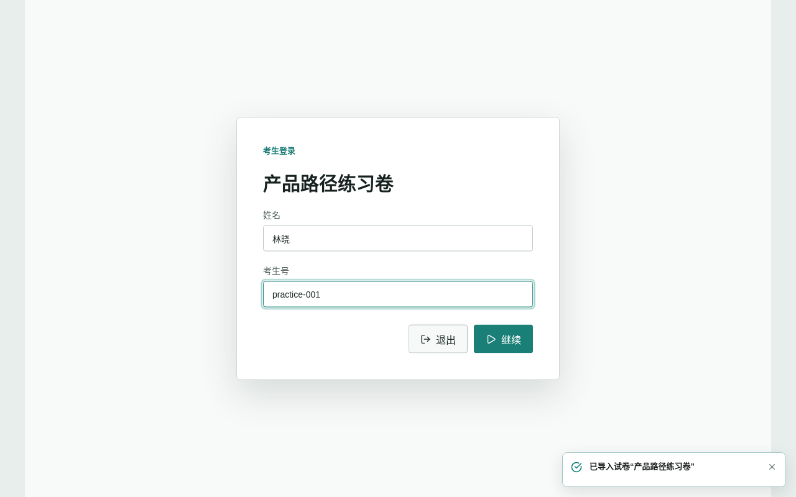
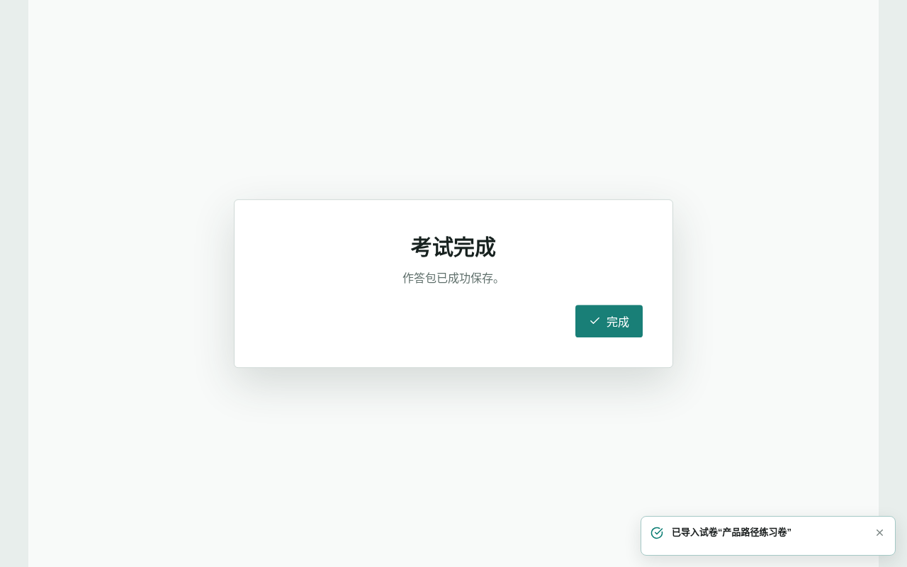

<!-- 此文件由 Playwright 产品文档测试自动生成，请勿手工编辑。 -->

# EX-01 从试卷库登记作答人并保存完成后的作答包

**归属：** 运行试卷并保存作答包 / 考试运行

## 行为意图

试卷库中的试卷通过沉浸式播放器运行；完成后将自包含作答包保存到本地，之后才能在作答记录中导入并评分。

## 前置条件

- 试卷库中已有一份无需录音检查的可运行试卷。

## 用户路径

1. 把可运行试卷导入试卷库
2. 从试卷库开始考试并填写作答人姓名

   

   _决策证据：开始作答前登记姓名和考生号_

3. 继续进入播放器并完成无录音试卷

   

   _结果证据：完成页确认作答包已经保存_

4. 关闭完成页后回到试卷库

## 行为保证

- 开始考试前必须填写姓名和考生号。
- 作答完成后必须成功保存作答包才能结束考试。
- 关闭播放器后返回试卷库，作答包文件可以独立导入作答记录。

## 可执行规格

源测试：[run.spec.ts](../../../../../tests/product-docs/flows/take-exam/run.spec.ts)。
