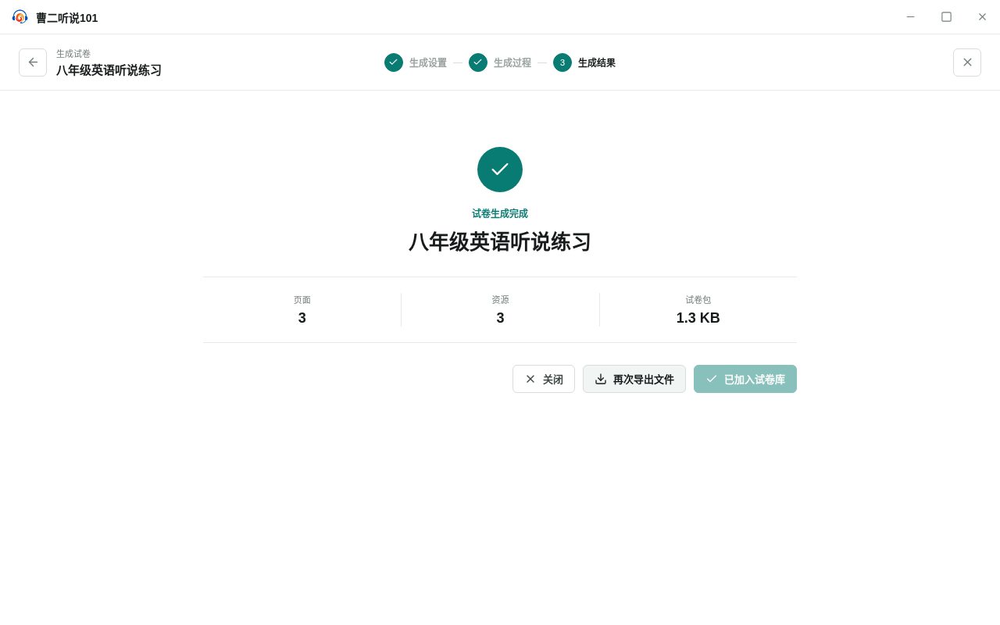

<!-- 此文件由 Playwright 产品文档测试自动生成，请勿手工编辑。 -->

# TG-01 从试卷模板生成试卷并决定如何保存结果

**归属：** 试卷模板生成试卷 / 试卷生成

## 行为意图

生成试卷使用独立的全屏三阶段流程。语音逐条执行并自动重试，生成完成后由用户选择加入试卷库或导出文件。

## 前置条件

- 已有一份包含三条语音的试卷模板，并配置三个可独立选择的语音提供商。

## 用户路径

1. 从试卷模板编辑器进入不带一级导航的生成设置页
2. 填写试卷名称并为三种音色分别选择提供商、模型和音色

   

   _决策证据：生成前分别确认试卷名称和三种音色配置_

3. 生成进行中离开页面需要确认，继续生成会保留当前任务
4. 单条语音自动尝试四次仍失败时立即中断

   

   _异常证据：语音达到重试上限后中断，并保留逐项任务状态_

5. 从失败语音继续生成，不重新合成已完成任务
6. 未保存结果时关闭会提示丢失风险
7. 加入试卷库和导出文件是独立操作，完成后页面仍保持打开

   

   _结果证据：生成结果已加入试卷库且仍可再次导出文件_

8. 主动关闭流程后可以在试卷库找到生成结果

## 行为保证

- 生成设置、生成过程和生成结果在独立全屏流程中依次呈现。
- 语音失败会在有限重试后中断，并可从中断位置继续。
- 加入试卷库和导出文件互相独立，未保存结果受到离开保护。

## 可执行规格

源测试：[generation.spec.ts](../../../../../tests/product-docs/flows/template-exam-generation/generation.spec.ts)。
