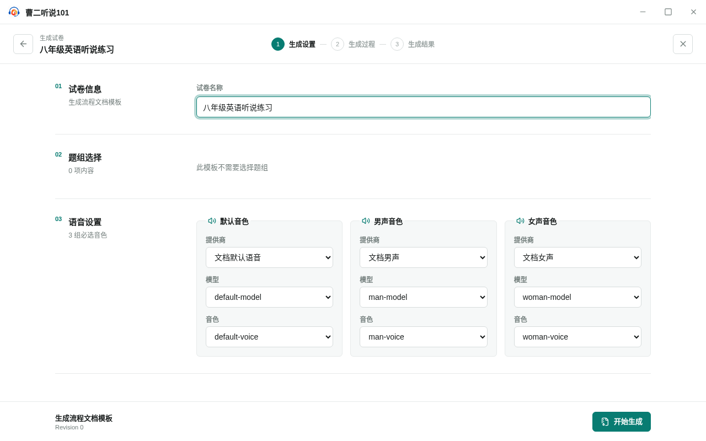
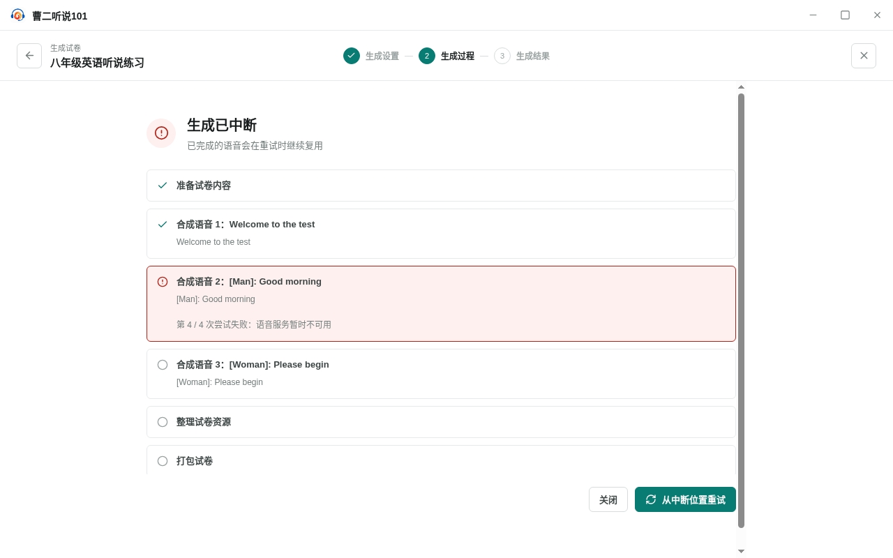
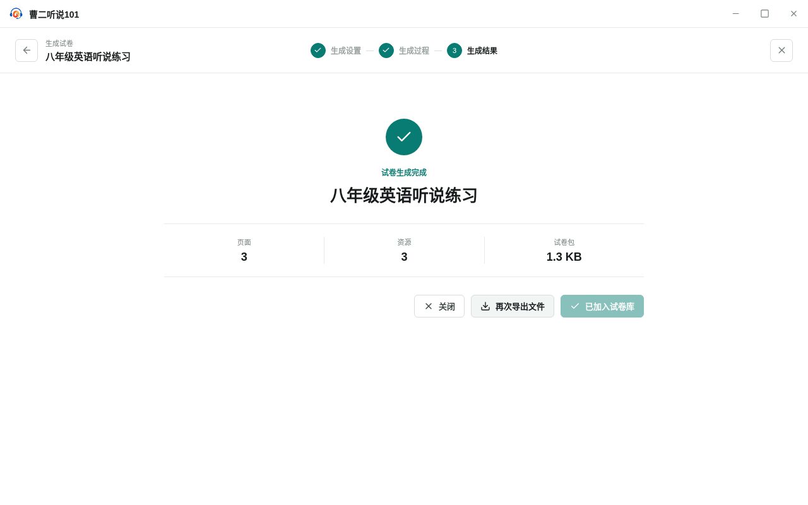

<!-- 此文件由 Playwright 产品文档测试自动生成，请勿手工编辑。 -->

# 产品行为文档

> 生成命令：`yarn test:product-docs`。只有整套产品文档测试全部通过时才会更新本文档。

## TG-01 从试卷模板生成试卷并决定如何保存结果

**功能区域：** 试卷模板 / 生成试卷

生成试卷使用独立的全屏三阶段流程。语音逐条执行并自动重试，生成完成后由用户选择加入试卷库或导出文件。

**前置条件：**

- 已有一份包含三条语音的试卷模板，并配置三个可独立选择的语音提供商。

**用户路径：**

1. 从试卷模板编辑器进入不带一级导航的生成设置页
2. 填写试卷名称并为三种音色分别选择提供商、模型和音色
3. 生成进行中离开页面需要确认，继续生成会保留当前任务
4. 单条语音自动尝试四次仍失败时立即中断
5. 从失败语音继续生成，不重新合成已完成任务
6. 未保存结果时关闭会提示丢失风险
7. 加入试卷库和导出文件是独立操作，完成后页面仍保持打开
8. 主动关闭流程后可以在试卷库找到生成结果

## WB-01 工作台呈现产品封面、当前状态和快捷入口

**功能区域：** 工作台

工作台是应用首页和产品封面，汇总当前工作状态并提供快捷入口，但不承载其他模块的独占业务能力。

**前置条件：**

- 使用全新的应用数据目录启动 LS101。

**用户路径：**

1. 启动应用后首先看到曹二听说 101 工作台封面
2. 工作台展示试卷、待评分、题型、模板和评分单元状态
3. 工作台提供制卷、运行和处理作答记录的快捷入口
4. 工作台预留最近工作和待处理状态区域

## WB-02 每个一级模块都能脱离工作台独立进入

**功能区域：** 应用导航

工作台只提供汇总和快捷访问；试卷库、作答记录、题型库、试卷模板、评分单元和设置均拥有独立入口。

**前置条件：**

- 应用位于工作台，侧边栏保持展开。

**用户路径：**

1. 从一级导航独立进入试卷库
2. 从一级导航独立进入作答记录
3. 从一级导航独立进入题型库
4. 从一级导航独立进入试卷模板
5. 从一级导航独立进入评分单元
6. 从一级导航独立进入设置

