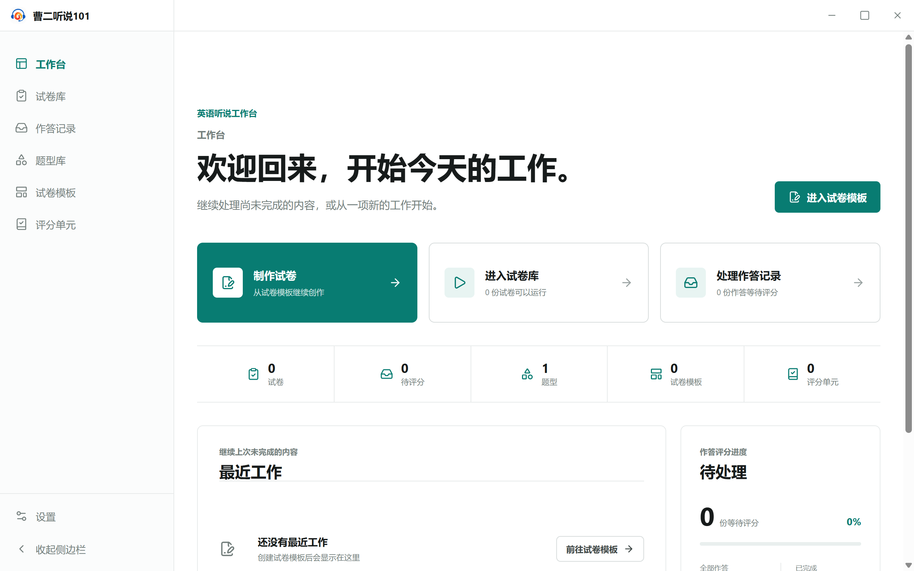

<!-- 此文件由 Playwright 产品文档测试自动生成，请勿手工编辑。 -->

# 产品行为文档

> 生成命令：`yarn test:product-docs`。只有整套产品文档测试全部通过时才会更新本文档。

## WB-01 工作台呈现产品封面、当前状态和快捷入口

**功能区域：** 工作台

工作台是应用首页和产品封面，汇总当前工作状态并提供快捷入口，但不承载其他模块的独占业务能力。

**前置条件：**

- 使用全新的应用数据目录启动 LS101。

**用户路径：**

1. 启动应用后首先看到曹二听说 101 工作台封面
2. 工作台展示试卷、待评分、题型、模板和评分单元状态
3. 工作台提供制卷、运行和处理作答记录的快捷入口
4. 工作台预留最近工作和待处理状态区域

## WB-02 每个一级模块都能脱离工作台独立进入

**功能区域：** 应用导航

工作台只提供汇总和快捷访问；试卷库、作答记录、题型库、试卷模板、评分单元和设置均拥有独立入口。

**前置条件：**

- 应用位于工作台，侧边栏保持展开。

**用户路径：**

1. 从一级导航独立进入试卷库
2. 从一级导航独立进入作答记录
3. 从一级导航独立进入题型库
4. 从一级导航独立进入试卷模板
5. 从一级导航独立进入评分单元
6. 从一级导航独立进入设置

