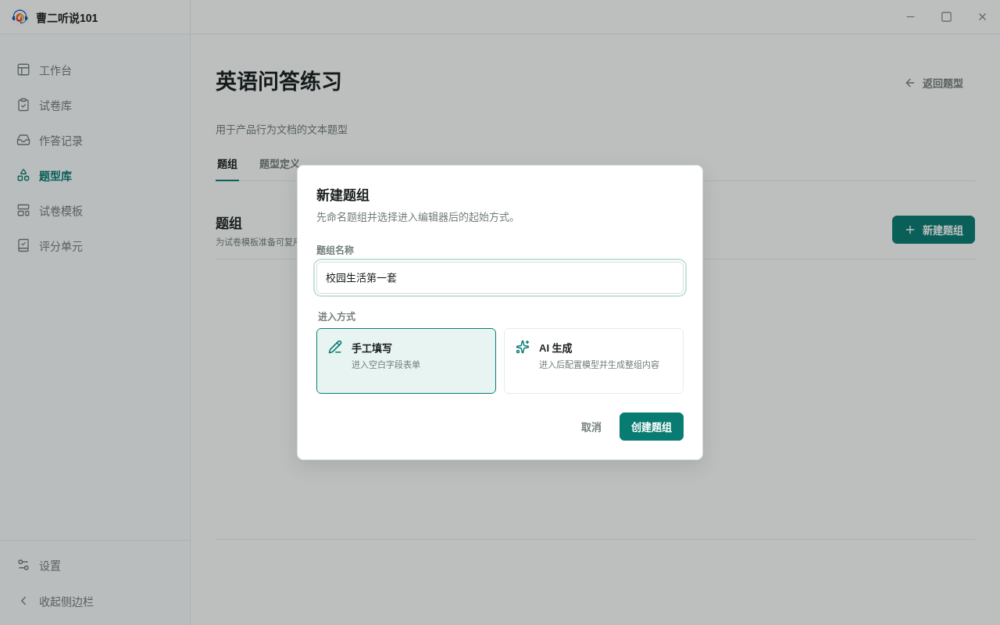
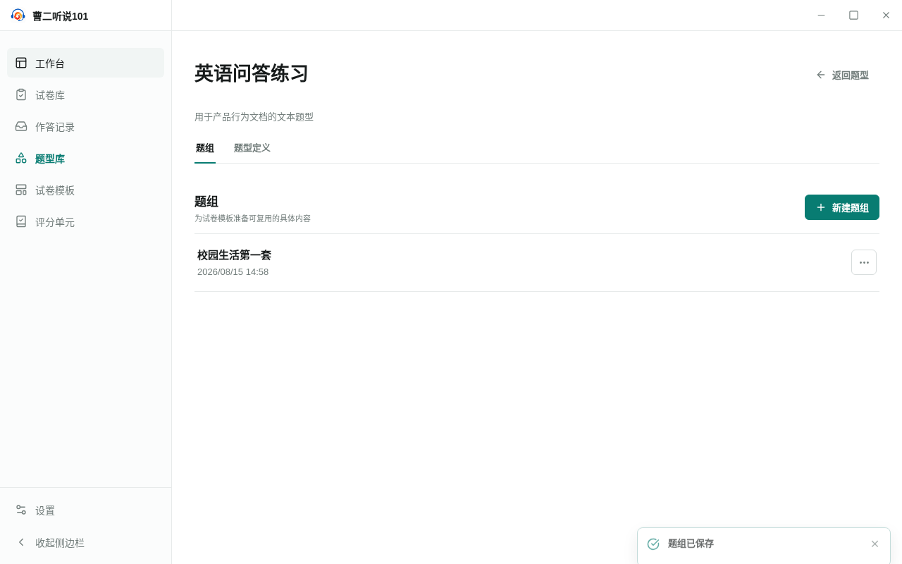
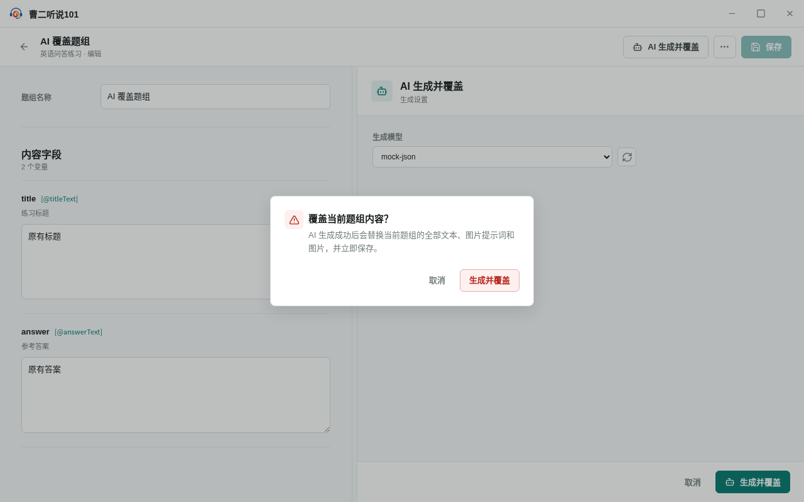
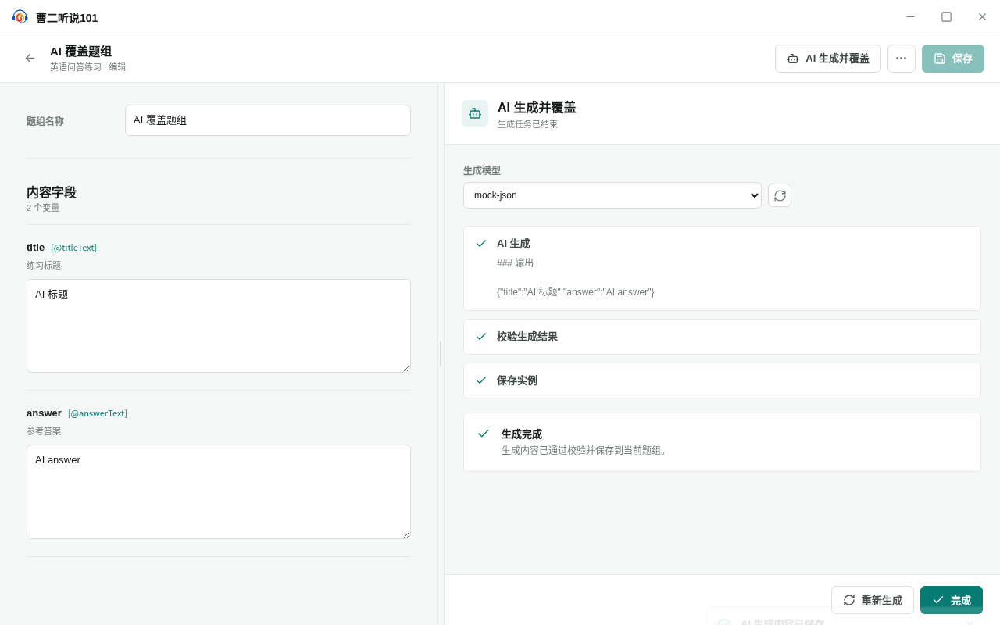
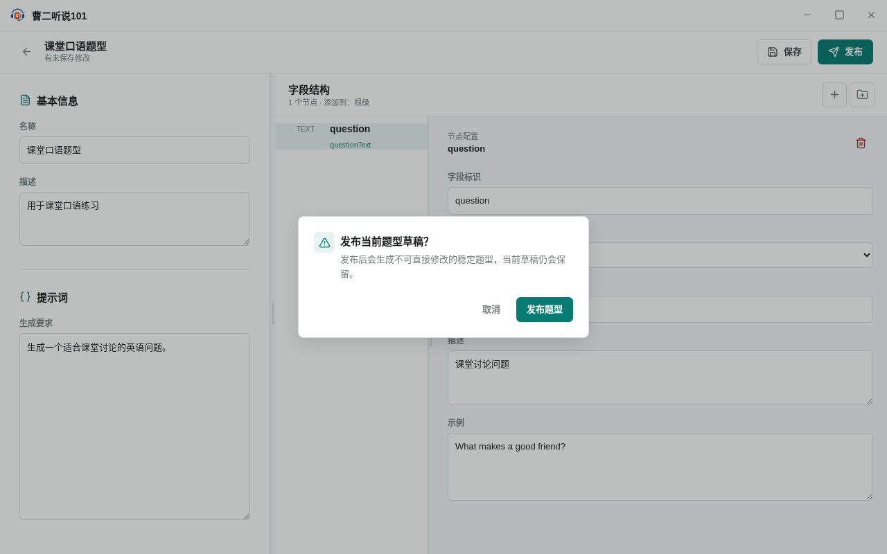
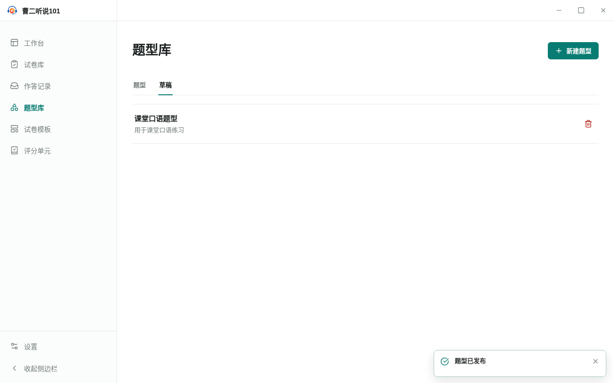

<!-- 此文件由 Playwright 产品文档测试自动生成，请勿手工编辑。 -->

# 题型库

> 生成命令：`yarn test:product-docs`。只有整套产品文档测试全部通过时才会更新本文档。

## IF-01 从题型库命名创建并保存题组

**功能区域：** 题型库 / 题组

题型详情以题组为默认工作区；用户先命名题组并选择进入方式，再填写和保存具体内容。

**前置条件：**

- 题型库中已有“英语问答练习”题型。

**用户路径：**

1. 从题型库进入题型，默认看到题组工作区
2. 填写题组名称并选择手工填写后才正式创建
3. 填写题组内容并明确保存

## IF-02 取消创建不会留下空题组

**功能区域：** 题型库 / 新建题组

打开新建题组设置不会立即写入空记录；只有确认名称和进入方式后才创建题组。

**前置条件：**

- 当前题型还没有任何题组。

**用户路径：**

1. 打开新建题组设置并填写名称
2. 取消后题组列表和本地记录都保持为空

## IF-03 未保存的题组修改受到保护

**功能区域：** 题型库 / 题组编辑

手工修改不会静默保存；离开编辑器前可以继续编辑或明确放弃本次修改。

**前置条件：**

- 已经创建一个尚未填写内容的题组。

**用户路径：**

1. 修改字段后离开会提示未保存风险
2. 取消离开会保留当前编辑状态
3. 明确放弃后返回题组列表，重新进入时不包含未保存内容

## IF-04 AI 整组生成明确覆盖并原子保存

**功能区域：** 题型库 / AI 生成题组

AI 整组生成使用明确的覆盖语义；已有内容时再次确认，成功后整组结果一次保存。

**前置条件：**

- 题组已有手工保存的内容，并配置了可用的 AI 文本模型。

**用户路径：**

1. 打开 AI 生成并覆盖面板并选择模型
2. 对已有内容执行生成前明确提示会覆盖并立即保存
3. AI 成功后整组内容被替换并已经保存

## IF-05 从草稿发布稳定题型并保留草稿

**功能区域：** 题型库 / 题型草稿

题型草稿可以不完整地保存；发布前说明稳定契约，发布成功后已发布题型和原草稿同时保留。

**前置条件：**

- 用户从题型库的“草稿”视图开始创建题型。

**用户路径：**

1. 在题型库切换到草稿视图并新建题型
2. 填写题型基本信息、生成要求和字段契约
3. 发布前明确说明将生成稳定题型并保留当前草稿
4. 发布成功后可以查看稳定题型，并能在草稿视图找到原草稿

