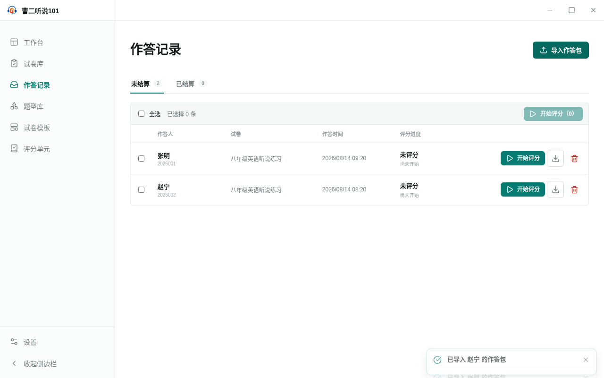
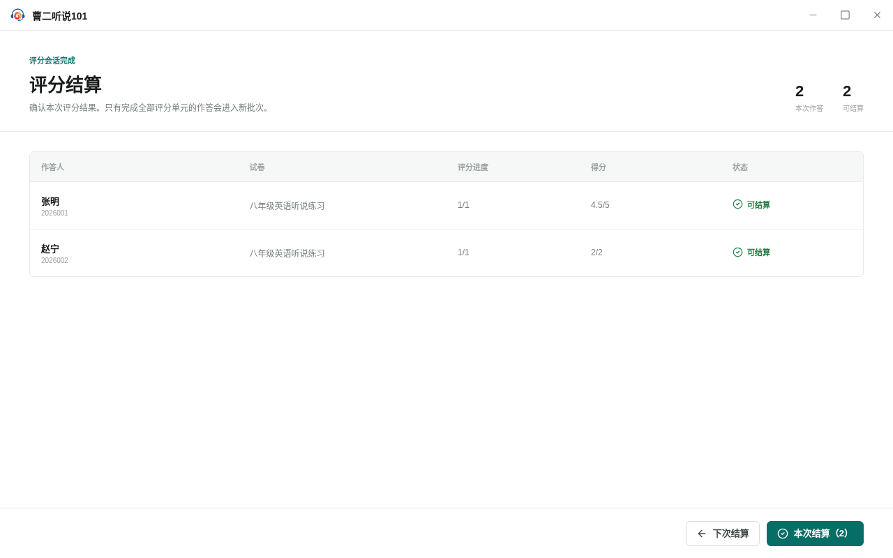
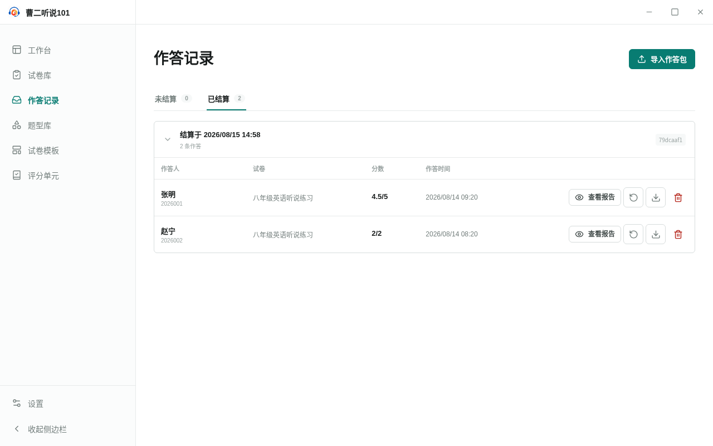

<!-- 此文件由 Playwright 产品文档测试自动生成，请勿手工编辑。 -->

# 作答记录

> 生成命令：`yarn test:product-docs`。只有整套产品文档测试全部通过时才会更新本文档。

## SR-01 批量评分作答并在确认后结算为一个批次

**功能区域：** 作答记录 / 评分结算

作答记录分为未结算和已结算。用户可以批量评分、暂缓结算并保留进度，也可以将全部评分完成的作答原子结算为一个批次。

**前置条件：**

- 本地有一份客观题作答包和一份需要人工评分的朗读作答包。

**用户路径：**

1. 从作答记录独立入口导入两份作答包
2. 勾选多条记录后按顺序进入一次评分会话
3. 评分会话结束后进入沉浸式结算页
4. 选择下次结算会保留评分并返回未结算列表
5. 再次进入结算并将两份作答原子结算为一个批次
6. 重新评分会删除原结果并把原始作答移回未评分列表

