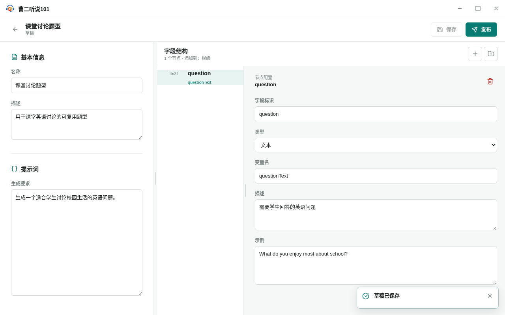
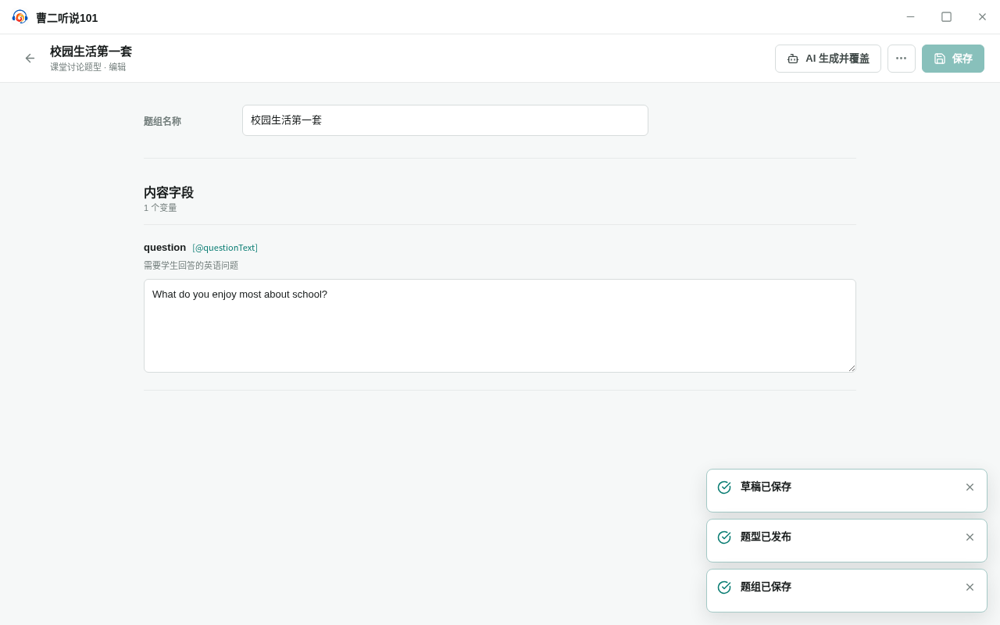

<!-- 此文件由 Playwright 产品文档测试自动生成，请勿手工编辑。 -->

# PJ-01 从题型草稿发布稳定题型并创建可复用题组

**归属：** 从零准备题型内容 / 题型内容准备

## 旅程目标

从全新的应用数据目录开始，通过界面定义并发布题型，再用刚发布的题型创建、保存和重新打开一套具体题组。

## 前置条件

- 没有预先创建的用户题型、题型草稿或题组。

## 用户路径

1. 从题型库草稿视图新建题型
2. 填写题型说明、生成要求和字段契约并保存草稿

   

   _结果证据：题型说明、生成要求和字段契约已经保存为草稿_

3. 确认发布稳定题型并进入题组工作区

   

   _决策证据：发布前确认稳定题型与原草稿的关系_

4. 使用刚发布的题型命名创建手工填写题组
5. 填写题组内容，保存后从题型详情重新进入

   

   _结果证据：刚发布的题型保存了一套可重新打开的具体题组_

6. 返回题型库确认发布后的原草稿仍然保留

## 旅程保证

- 题型草稿、稳定题型和题组都由同一条用户界面路径依次产生。
- 后续题组使用本次旅程刚发布的题型，不以测试夹具替换中间产物。
- 题组内容保存后可以重新进入，发布题型后原草稿仍然保留。

## 可执行规格

源测试：[create-interface-and-instance.spec.ts](../../../../../tests/product-docs/journeys/content-preparation/create-interface-and-instance.spec.ts)。
