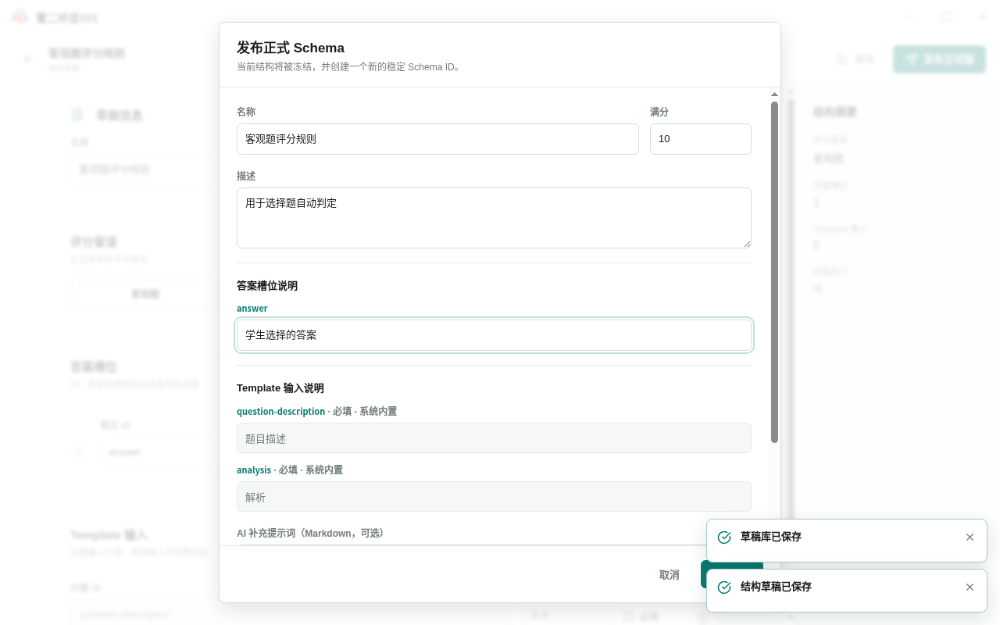
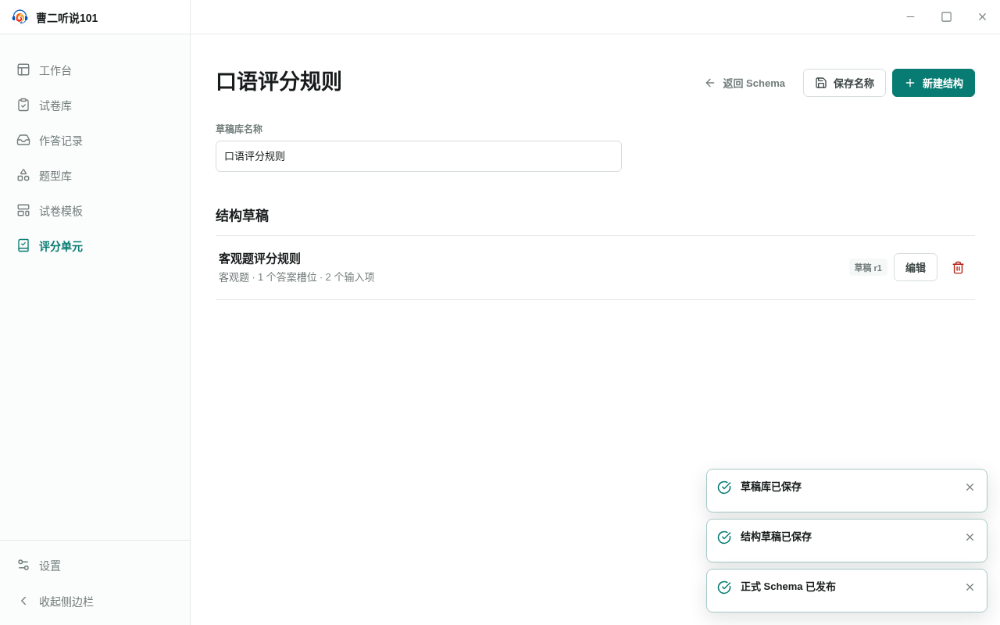

<!-- 此文件由 Playwright 产品文档测试自动生成，请勿手工编辑。 -->

# GS-01 从结构草稿填写评分资料并发布稳定评分单元

**归属：** 评分单元 / 评分单元发布

## 行为意图

评分单元先以可保存的结构草稿存在，发布时补齐面向用户的名称、说明和答案解释，生成稳定契约并保留原草稿。

## 前置条件

- 评分单元库为空，用户需要创建第一个评分单元。

## 用户路径

1. 进入评分单元并新建结构草稿库
2. 命名结构草稿并明确评分管道
3. 补齐正式资料并确认发布冻结结构

   

   _决策证据：发布前补齐名称、描述和答案槽位说明_

4. 发布后查看正式评分单元并保留结构草稿

   

   _结果证据：正式评分单元发布后，结构草稿仍可在草稿库中找到_

## 行为保证

- 创建草稿库和结构草稿不会直接产生正式评分单元。
- 发布对话框要求补齐正式名称、描述和答案槽位说明。
- 发布成功后正式评分单元和结构草稿都保留，可以分别进入。

## 可执行规格

源测试：[publishing.spec.ts](../../../../../tests/product-docs/modules/grading-units/publishing.spec.ts)。
