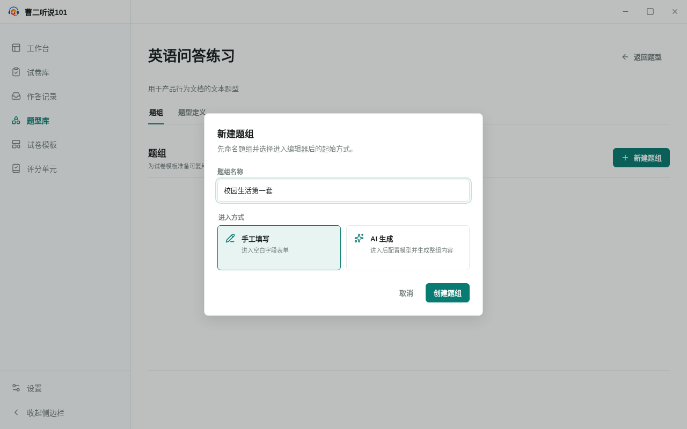

<!-- 此文件由 Playwright 产品文档测试自动生成，请勿手工编辑。 -->

# IF-01 从题型库命名创建并保存题组

**归属：** 题型库 / 题组创建

## 行为意图

题型详情以题组为默认工作区；用户先命名题组并选择进入方式，再填写和保存具体内容。

## 前置条件

- 题型库中已有“英语问答练习”题型。

## 用户路径

1. 从题型库进入题型，默认看到题组工作区
2. 填写题组名称并选择手工填写后才正式创建

   

   _决策证据：创建前先确认题组名称和进入方式_

3. 填写题组内容并明确保存

   

   _结果证据：保存后的题组出现在题型详情工作区_

## 行为保证

- 题组只有在确认名称和进入方式后才正式创建。
- 手工填写内容需要明确保存，并能从题型详情重新进入。

## 可执行规格

源测试：[behaviors.spec.ts](../../../../../tests/product-docs/modules/interface-library/behaviors.spec.ts)。
