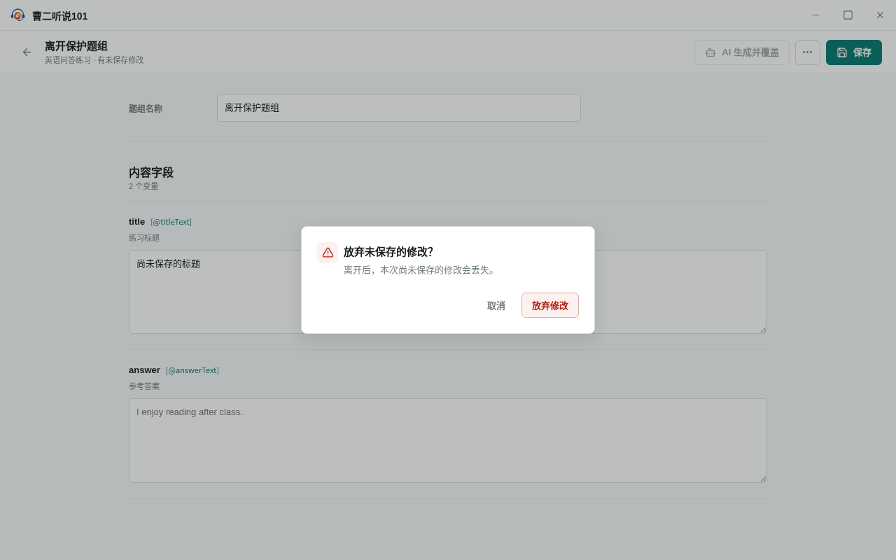

<!-- 此文件由 Playwright 产品文档测试自动生成，请勿手工编辑。 -->

# IF-03 未保存的题组修改受到保护

**归属：** 题型库 / 题组编辑

## 行为意图

手工修改不会静默保存；离开编辑器前可以继续编辑或明确放弃本次修改。

## 前置条件

- 已经创建一个尚未填写内容的题组。

## 用户路径

1. 修改字段后离开会提示未保存风险

   

   _决策证据：离开前明确提示未保存修改会被放弃_

2. 取消离开会保留当前编辑状态
3. 明确放弃后返回题组列表，重新进入时不包含未保存内容

## 行为保证

- 离开包含未保存修改的题组前必须确认。
- 取消离开保留编辑状态，放弃修改不会写入题组。

## 可执行规格

源测试：[behaviors.spec.ts](../../../../../tests/product-docs/modules/interface-library/behaviors.spec.ts)。
