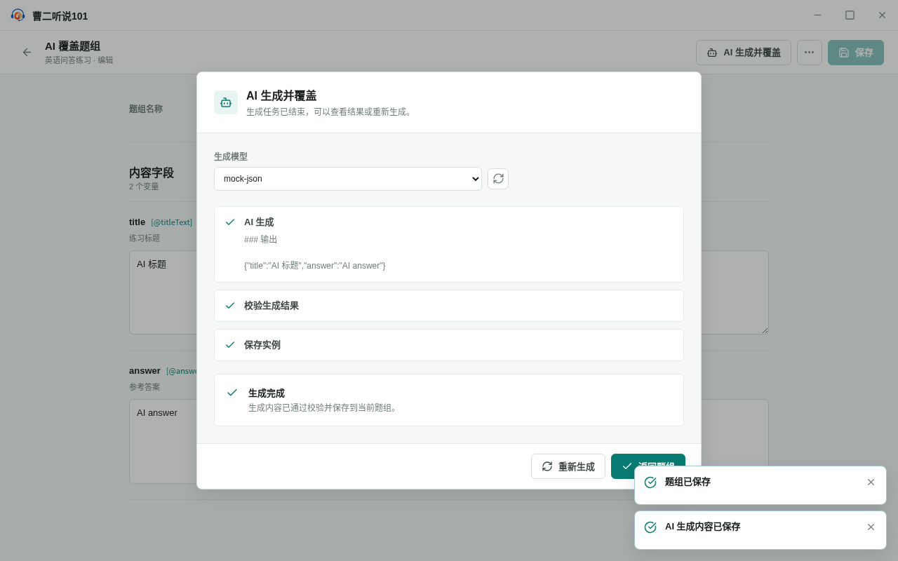

<!-- 此文件由 Playwright 产品文档测试自动生成，请勿手工编辑。 -->

# IF-04 AI 整组生成明确覆盖并原子保存

**归属：** 题型库 / AI 生成题组

## 行为意图

AI 整组生成使用明确的覆盖语义；已有内容时再次确认，成功后整组结果一次保存。

## 前置条件

- 题组已有手工保存的内容，并配置了可用的 AI 文本模型。

## 用户路径

1. 打开 AI 生成任务并选择模型
2. 对已有内容执行生成前明确提示会覆盖并立即保存

   

   _决策证据：AI 生成前确认将覆盖当前题组并立即保存_

3. AI 成功后整组内容被替换并已经保存

   

   _结果证据：AI 结果通过校验并保存到当前题组_

## 行为保证

- 已有内容时，生成前明确确认覆盖范围和立即保存语义。
- 只有生成、校验和保存全部成功后，才替换当前题组。

## 可执行规格

源测试：[behaviors.spec.ts](../../../../../tests/product-docs/modules/interface-library/behaviors.spec.ts)。
