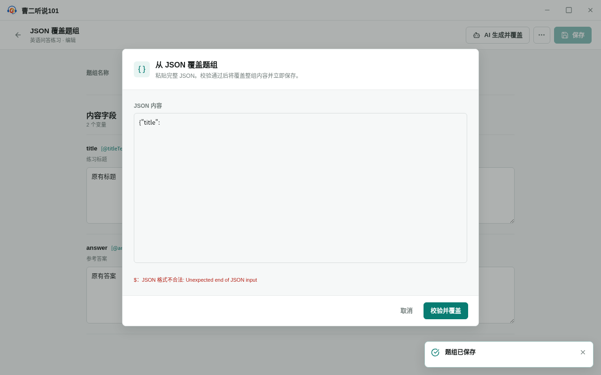
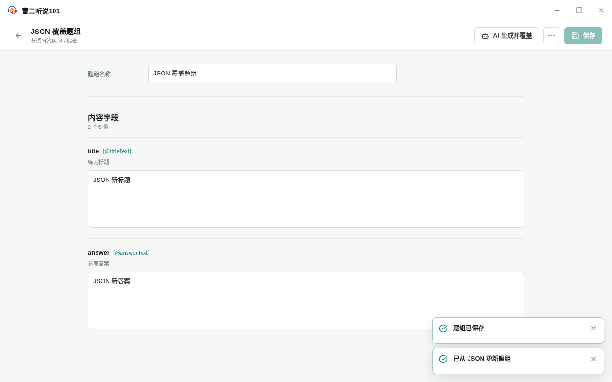

<!-- 此文件由 Playwright 产品文档测试自动生成，请勿手工编辑。 -->

# IF-06 JSON 作为临时导入对话框完成覆盖

**归属：** 题型库 / 题组导入

## 行为意图

JSON 是一次性导入命令；校验失败时保留临时输入，取消时清空，校验成功后原子保存并返回题组。

## 前置条件

- 题组已有手工保存的内容。

## 用户路径

1. 打开临时导入对话框，明确覆盖和立即保存语义
2. JSON 校验失败时保留输入和错误，原题组内容保持不变

   

   _异常证据：非法 JSON 保留在导入对话框中，原题组内容不变_

3. 取消会丢弃本次临时输入和校验错误
4. 合法 JSON 经确认后原子保存，关闭对话框并返回题组

   

   _结果证据：JSON 内容已替换当前题组并完成保存_

## 行为保证

- 校验失败时保留临时输入和错误，原题组保持不变。
- 取消导入会清空临时状态。
- 合法 JSON 经确认后原子保存并关闭对话框。

## 可执行规格

源测试：[behaviors.spec.ts](../../../../../tests/product-docs/modules/interface-library/behaviors.spec.ts)。
