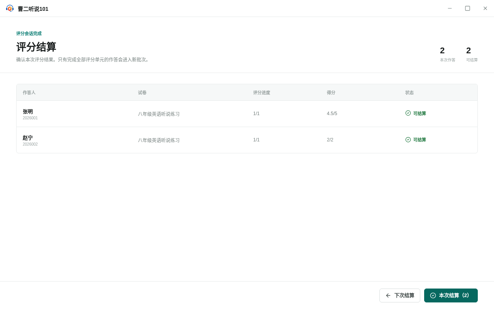
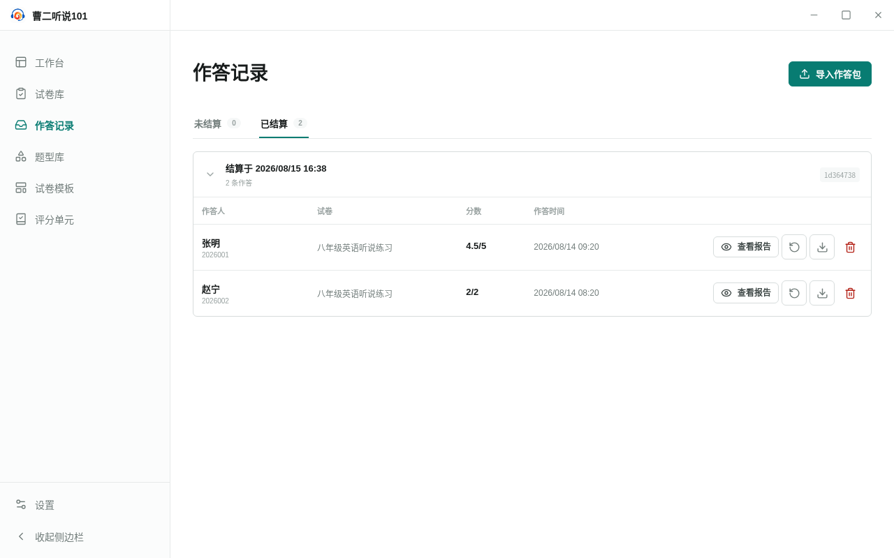

<!-- 此文件由 Playwright 产品文档测试自动生成，请勿手工编辑。 -->

# SR-01 批量评分作答并在确认后结算为一个批次

**归属：** 作答记录 / 评分结算

## 行为意图

作答记录分为未结算和已结算。用户可以批量评分、暂缓结算并保留进度，也可以将全部评分完成的作答原子结算为一个批次。

## 前置条件

- 本地有一份客观题作答包和一份需要人工评分的朗读作答包。

## 用户路径

1. 从作答记录独立入口导入两份作答包

   

   _结果证据：导入后的作答统一进入未结算列表_

2. 勾选多条记录后按顺序进入一次评分会话
3. 评分会话结束后进入沉浸式结算页

   

   _决策证据：结算页列出本次会话中可以结算的全部作答_

4. 选择下次结算会保留评分并返回未结算列表
5. 再次进入结算并将两份作答原子结算为一个批次

   

   _结果证据：两份作答作为同一个批次进入已结算视图_

6. 重新评分会删除原结果并把原始作答移回未评分列表

## 行为保证

- 批量评分按照一次会话推进，并在结束后进入独立结算页。
- 下次结算会保留评分进度，本次结算会原子创建一个批次。
- 重新评分只重置目标作答，不改写原始作答内容。

## 可执行规格

源测试：[settlement.spec.ts](../../../../../tests/product-docs/modules/submission-records/settlement.spec.ts)。
