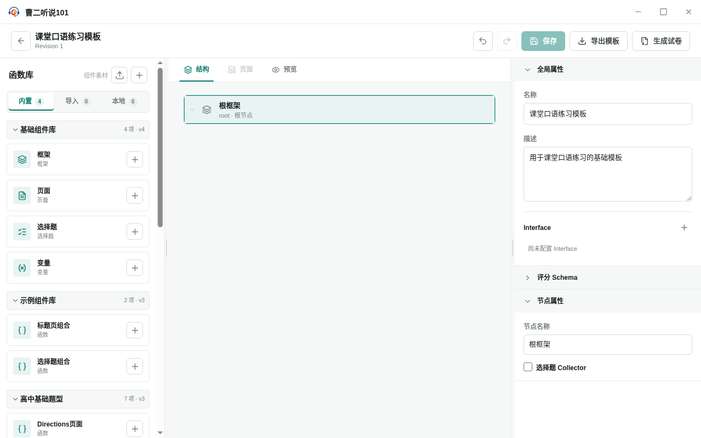

<!-- 此文件由产品操作测试自动生成，请勿手工编辑。 -->

# 创建、编辑并保存可复用的试卷模板

**所属内容：** 试卷模板 / 模板创建

## 什么时候使用

试卷模板先保存为可继续维护的制卷规则，用户明确填写名称和说明后保存，之后才能进入生成试卷流程。

## 前置条件

- 试卷模板库中没有需要继续编辑的本地模板。

## 操作步骤

1. 进入“试卷模板”，选择“新建模板”，填写模板名称和说明。

   完成后：模板编辑器显示填写后的基本信息，并等待保存。

2. 选择“保存”。

   完成后：模板显示新的修订版本，保存按钮变为不可用。

   

   _完成后：模板保存后显示稳定版本并关闭保存按钮_

3. 返回模板库，再次打开刚刚保存的模板。

   完成后：模板名称和说明保持不变，可以继续编辑或进入生成流程。

## 完成后

- 新模板从默认名称开始，但只有明确保存后才成为可复用版本。
- 模板名称和说明保存后从模板列表重新加载仍然存在。
- 模板编辑器同时提供保存和生成入口，生成依据最后一次成功保存的内容。
