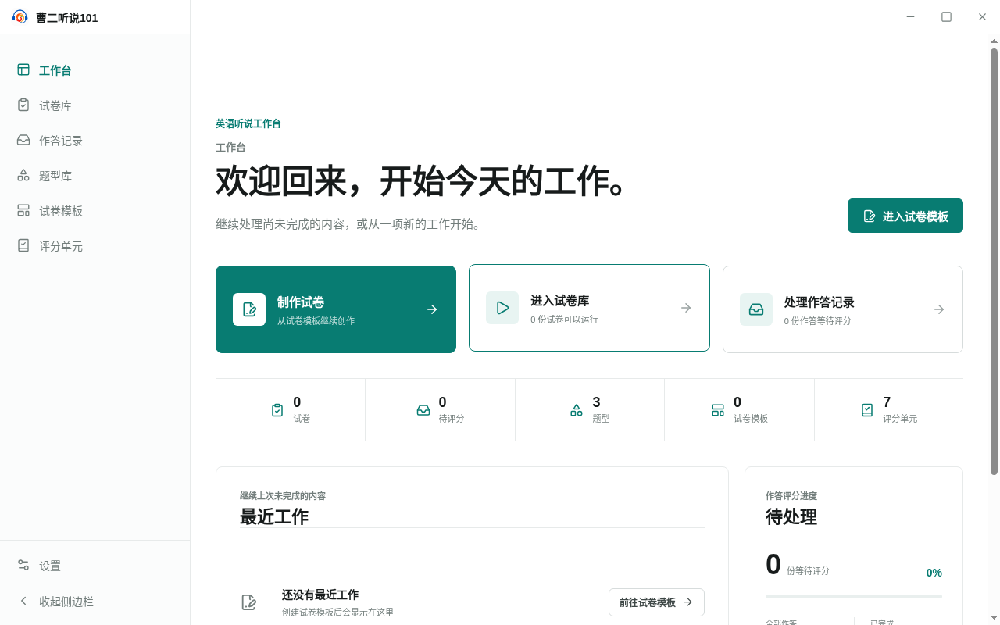

<!-- 此文件由 Playwright 产品文档测试自动生成，请勿手工编辑。 -->

# WB-01 工作台呈现产品封面、当前状态和快捷入口

**归属：** 工作台与导航 / 工作台概览

## 行为意图

工作台是应用首页和产品封面，汇总当前工作状态并提供快捷入口，但不承载其他模块的独占业务能力。

## 前置条件

- 使用全新的应用数据目录启动 LS101。

## 用户路径

1. 启动应用后首先看到曹二听说 101 工作台封面
2. 工作台展示试卷、待评分、题型、模板和评分单元状态
3. 工作台提供制卷、运行和处理作答记录的快捷入口
4. 工作台预留最近工作和待处理状态区域

   

   _结果证据：工作台首页同时呈现状态、快捷入口和后续工作区域_

## 行为保证

- 启动应用后首先进入工作台。
- 工作台同时呈现产品状态、快捷入口、最近工作和待处理区域。

## 可执行规格

源测试：[navigation.spec.ts](../../../../../tests/product-docs/modules/workbench/navigation.spec.ts)。
