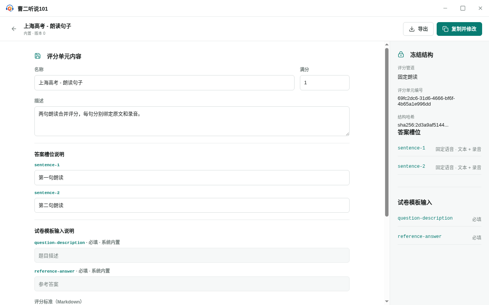

<!--
status: implemented
product-version: 0.4.1
audience: both
owner: schema-editor
-->

# 评分单元定义 · UI-GS-02

- 路由：`/schemas/new`（新建）、`/schemas/new?copy=<schemaId>`（复制并修改）、`/schemas/:schemaId`（编辑）
- 入口：评分单元库 → `新建评分单元`；内置行 → `复制并修改`；我的评分单元行标题或 `编辑`
- 对象：评分单元的结构与数据

同一界面承担新建、复制与编辑，按地址区分：

- 路径末段为 `new` 时为新建：默认评分管道「客观题」，含一个文本答案槽位 `answer`，名称 `未命名评分单元`，满分 `10`。
- 路径末段为 `new` 且带 `copy` 查询参数时为复制：读取来源评分单元，沿用其结构与数据，名称改为 `<来源名称>（副本）`。来源不存在时退化为新建的默认结构；来源读取失败时进入 `评分单元不存在`。
- 其余路径末段为已保存评分单元的标识，按编辑加载。

## 布局

专注式布局，不显示一级导航。

1. 页头工具条：左侧是 `返回评分单元列表` 图标按钮、评分单元名称与状态副标题；右侧是主次操作。
2. 主栏 `aria-label="正式评分单元数据"`：顶部固定标题 `评分单元内容`，随后是数据字段。
3. 新建与复制时，标题与数据字段之间插入 `评分结构` 编辑区（评分管道、答案槽位、试卷模板输入）。
4. 摘要栏（右栏）`aria-label` 为 `评分结构摘要`（新建、复制）或 `冻结结构`（编辑）：只读展示评分管道、答案槽位与 试卷模板输入；编辑已保存评分单元时额外展示 `评分单元编号` 与 `结构哈希`。
5. 未找到评分单元时，主栏被文本 `评分单元不存在` 替换。

编辑已保存评分单元时不渲染任何结构编辑控件，结构只在右栏以只读摘要出现；数据字段继续可编辑（内置评分单元除外）。

## 控件清单

| 名称                            | 类型                         | 默认 / 加载 / 禁用 / 错误                                                           | 触发结果                                                                                             | 快捷键 |
| ------------------------------- | ---------------------------- | ----------------------------------------------------------------------------------- | ---------------------------------------------------------------------------------------------------- | ------ |
| 返回评分单元列表                | 图标按钮                     | 始终可用；有未保存修改时先打开确认框                                                | 无未保存修改时导航 `/schemas`，否则打开 `放弃未保存的修改？`                                         | 无     |
| 删除评分单元                    | 图标按钮（危险）             | 仅已保存的非内置评分单元显示；保存中或导出中禁用                                    | 打开 `删除评分单元“<名称>”？`                                                                        | 无     |
| 导出                            | 次按钮                       | 已保存且无未保存修改时可用；导出中显示 `正在导出` 并禁用                            | 打开系统保存对话框，写出 `<名称>-r<修订号>.lsschema`；成功后提示 `评分单元已导出`                    | 无     |
| 复制并修改                      | 主按钮                       | 仅内置评分单元显示；保存中或导出中禁用                                              | 导航 `/schemas/new?copy=<schemaId>`                                                                  | 无     |
| 保存                            | 主按钮                       | 仅编辑已保存评分单元时显示；无未保存修改、保存中或导出中禁用；保存中显示 `正在保存` | 校验并保存数据，成功后提示 `评分单元已保存`                                                          | 无     |
| 添加到我的评分单元              | 主按钮                       | 仅新建与复制时显示；保存中或导出中禁用                                              | 校验结构、名称、分值与评分说明后创建，成功后提示 `已添加到我的评分单元` 并跳转 `/schemas/<schemaId>` | 无     |
| 评分管道                        | 分段选择                     | 仅新建与复制时可用；默认「客观题」或来源结构的管道                                  | 切换评分管道，并重置答案槽位类型                                                                     | 无     |
| 添加槽位                        | 次按钮（小）                 | 仅新建与复制、且评分管道不是客观题时显示                                            | 追加一个语音答案槽位                                                                                 | 无     |
| 稳定编号（答案槽位）            | 文本输入                     | 仅新建与复制时可编辑                                                                | 修改答案槽位编号                                                                                     | 无     |
| 上移答案槽位                    | 图标按钮（小）               | 第一个槽位禁用                                                                      | 与前一个槽位交换顺序                                                                                 | 无     |
| 下移答案槽位                    | 图标按钮（小）               | 最后一个槽位禁用                                                                    | 与后一个槽位交换顺序                                                                                 | 无     |
| 删除答案槽位                    | 图标按钮（小，危险）         | 客观题或只剩一个槽位时禁用                                                          | 删除该答案槽位                                                                                       | 无     |
| 添加输入                        | 次按钮（小）                 | 仅新建与复制时显示                                                                  | 追加一个必填文本输入项                                                                               | 无     |
| 稳定编号 / 内置编号（输入项）   | 文本输入                     | 仅新建与复制时可编辑；内置输入只读                                                  | 修改输入项编号                                                                                       | 无     |
| 类型（输入项）                  | 只读文本                     | 固定 `文本`                                                                         | 无                                                                                                   | 无     |
| 必填                            | 复选框                       | 仅新建与复制时可切换；内置输入禁用                                                  | 切换输入项必填性                                                                                     | 无     |
| 删除输入项                      | 图标按钮（小，危险）         | 内置输入禁用                                                                        | 删除该输入项                                                                                         | 无     |
| 名称                            | 文本输入                     | 内置评分单元禁用                                                                    | 更新评分单元名称（本地）                                                                             | 无     |
| 满分                            | 数字输入                     | 内置评分单元禁用；最小 `0`，步长 `0.5`                                              | 更新满分（本地）                                                                                     | 无     |
| 描述                            | 多行文本                     | 内置评分单元禁用                                                                    | 更新描述（本地）                                                                                     | 无     |
| 答案槽位说明                    | 文本输入（每个答案槽位一个） | 内置评分单元禁用                                                                    | 更新该答案槽位说明                                                                                   | 无     |
| 试卷模板输入说明               | 文本输入 / 只读文本          | 内置输入显示只读的系统内置说明；其他输入可编辑，内置评分单元禁用                    | 更新输入项说明                                                                                       | 无     |
| 评分标准（Markdown）            | 多行文本                     | 仅评分管道不是客观题时显示；内置评分单元禁用                                        | 更新评分标准                                                                                         | 无     |
| AI 补充提示词（Markdown，可选） | 多行文本                     | 内置评分单元禁用                                                                    | 更新 AI 补充提示词                                                                                   | 无     |
| 放弃修改                        | 确认按钮（危险）             | 仅 `放弃未保存的修改？` 对话框内                                                    | 丢弃未保存修改并导航 `/schemas`                                                                      | 无     |
| 删除                            | 确认按钮（危险）             | 仅 `删除评分单元“<名称>”？` 对话框内                                                | 删除该评分单元并导航 `/schemas`                                                                      | 无     |

## 文案

- 返回按钮名称：`返回评分单元列表`
- 加载中：`正在加载正式评分单元...`
- 未找到：`评分单元不存在`
- 名称占位：`未命名评分单元`
- 状态副标题：`复制并修改`、`新建评分单元`、`有未保存修改`、`内置 · 版本 <修订号>`、`正式版 · 版本 <修订号>`、`正式版`
- 主栏标题：`评分单元内容`
- 结构编辑区标题：`评分结构`；说明 `结构和评分说明一起保存，不需要单独维护草稿。`
- 评分管道选项：`客观题`、`固定朗读`、`自由口语`
- 结构小节标题：`答案槽位`、`试卷模板输入`
- 结构标题操作：`添加槽位`、`添加输入`
- 结构字段标签：`稳定编号`、`内置编号`、`类型`、`文本`、`必填`
- 结构图标按钮名称：`上移答案槽位`、`下移答案槽位`、`删除答案槽位`、`删除输入项`
- 数据字段标签：`名称`、`满分`、`描述`、`答案槽位说明`、`试卷模板输入说明`、`评分标准（Markdown）`、`AI 补充提示词（Markdown，可选）`
- 输入说明行：`<输入编号> · 必填` 或 `<输入编号> · 可选`；内置输入另加 ` · 系统内置` 并显示系统给定说明
- 摘要栏标题：`评分结构摘要`（新建、复制）、`冻结结构`（编辑）
- 摘要字段标签：`评分管道`、`评分单元编号`、`结构哈希`、`答案槽位`、`试卷模板输入`、`必填`、`可选`
- 结构哈希显示为前 18 个字符加 `...`
- 校验失败标题：`请修正以下内容`；逐条显示结构或数据校验信息
- 新建成功提示：`已添加到我的评分单元`
- 保存成功提示：`评分单元已保存`
- 导出成功提示：`评分单元已导出`；系统保存对话框标题 `导出评分单元`
- 删除成功提示：`已删除评分单元“<名称>”`
- 放弃确认框：标题 `放弃未保存的修改？`；正文 `离开后，本次尚未保存的数据修改会丢失。`；确认按钮 `放弃修改`
- 删除确认框：标题 `删除评分单元“<名称>”？`；正文 `删除后引用这个评分单元的模板将无法通过校验。`；确认按钮 `删除`
- 操作失败提示：`当前环境无法访问本地数据，请在桌面应用中打开。`、`数据已在其他窗口中更新，请刷新后重试。`、`操作失败，请重试。`

## 状态与恢复

- **加载中**：整页显示 `正在加载正式评分单元...`，不渲染页头。
- **未找到**：编辑一个不存在的评分单元时显示 `评分单元不存在`；`删除评分单元`、`导出`、`保存` 均不可用。
- **读取失败**：新建/复制时读取来源失败，或编辑读取失败，同样进入 `评分单元不存在`；页面在此状态不展示错误文本。
- **校验失败**：保存时先校验结构再校验数据；不通过就在主栏以 `请修正以下内容` 就地列出全部信息，保留本次编辑内容且不写入。
- **保存成功**：以保存结果刷新页面基线，`有未保存修改` 消失，可继续编辑。
- **新建成功**：以替换历史的方式跳到 `/schemas/<schemaId>`，进入编辑态。
- **操作失败**：保存、导出、删除失败时错误写入主栏 `role="alert"`，本次编辑内容保留。
- **修订冲突**：保存失败时提示 `数据已在其他窗口中更新，请刷新后重试。`，本次修改保留在页面上。
- **删除失败**：确认框关闭，错误写入主栏 `role="alert"`，评分单元保留。
- **未保存离开**：有未保存修改时，`返回评分单元列表` 先打开确认框；确认才丢弃修改并返回列表。
- **导出不可用**：存在未保存修改或尚未保存时 `导出` 禁用。

## 有损操作

- **删除评分单元**：不可逆，必须经 `删除评分单元“<名称>”？` 二次确认；确认文案说明引用该评分单元的模板将无法通过校验。删除不改写已生成试卷中保存的评分单元快照。
- **放弃未保存修改**：确认 `放弃未保存的修改？` 后丢弃本次数据修改并返回列表。
- **结构冻结**：新建与复制保存后结构不可再改，界面不再出现结构编辑控件；需要改结构只能新建或从内置评分单元复制。
- **覆盖保存**：保存写入当前修订并递增修订号；保存失败时不写入，页面保留本次修改。

## 术语

界面使用「评分单元」「评分管道」「答案槽位」，与 [`../glossary.md`](../glossary.md) 一致；
`Schema`、`ID` 等内部术语已不再出现；结构小节标题与输入说明使用 `试卷模板输入`、
`试卷模板输入说明`，与术语表一致。

## 产物

- 新建、复制并保存产生「我的评分单元」中的评分单元，界面留在本屏编辑态。
- 编辑保存更新当前评分单元的数据；内置评分单元只能通过 `复制并修改` 产生可编辑副本。
- `导出` 产生 `<名称>-r<修订号>.lsschema` 文件。
- `删除` 后评分单元从评分单元库消失；引用它的模板在后续校验中失败。
- `返回评分单元列表` 进入 `UI-GS-01`。

## 锚点

```yaml
anchors:
  visual: VR-GS-02（tests/visual/schemas/UI-GS-02.spec.ts）
  visual-states: [default]
  behavior: GS-01（tests/product-docs/modules/grading-units/publishing.spec.ts，旧套件）
```

### 视觉基线



`GS-01` 实际进入 `/schemas/new`，填写名称、描述与答案槽位说明并点击 `添加到我的评分单元`，覆盖本屏的新建与保存路径。复制、编辑、导出、删除、校验失败与未保存离开没有行为锚定；视觉基线未建立。
