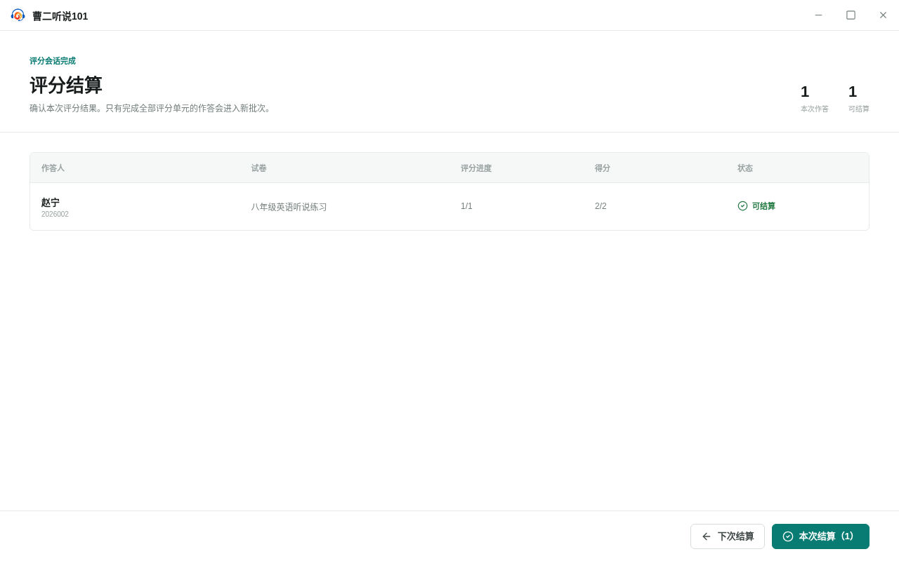

<!--
status: implemented
product-version: 0.4.1
audience: both
owner: submission-records
-->

# 评分结算 · UI-SR-03

- 路由：`/submissions/settlement`
- 入口：评分工作区（UI-SR-02）完成本次会话的全部人工或 AI 评分后自动进入
- 对象：本次评分会话中的作答记录、评分结果、结算批次

## 布局

专注式界面，不显示一级导航，分为三段：

1. 页头：左侧 eyebrow「评分会话完成」、标题「评分结算」与说明「确认本次评分结果。只有完成全部评分单元的作答会进入新批次。」；右侧摘要区（`aria-label="本次结算摘要"`）并排显示「<数量> 本次作答」与「<数量> 可结算」。
2. 内容区：结算失败时在顶部显示带告警图标的错误条；随后是加载提示或结果表格，二者互斥。
3. 底部操作条：左侧次按钮「下次结算」，右侧主按钮「本次结算（<可结算数量>）」。

结果表格列为「作答人」「试卷」「评分进度」「得分」「状态」。作答人列上行加粗姓名、下行考生号（以 `auto:` 开头时显示「考生号未填写」）；评分进度列显示 `<已完成评分单元>/<总评分单元数>`，缺少评分记录时总数为该作答的评分单元数；得分列显示 `<总分>/<满分>`，无评分时显示 `-`；状态列带图标显示「已结算」「可结算」「评分中」或「未评分」。

页面只读地列出本次会话的作答，不提供单条记录的删除、导出或重新评分入口。

## 控件清单

| 名称               | 类型   | 默认 / 加载 / 禁用 / 错误                                              | 触发结果                                                 | 快捷键 |
| ------------------ | ------ | ---------------------------------------------------------------------- | -------------------------------------------------------- | ------ |
| 下次结算           | 次按钮 | 始终可用                                                               | 不创建批次，返回未结算列表 `/submissions?view=unsettled` | 无     |
| 本次结算（<数量>） | 主按钮 | 加载中、结算进行中或没有可结算作答时禁用；结算进行中改文案「正在结算」 | 把全部可结算作答结算为一个批次，并跳转到已结算视图       | 无     |

表格内容均为只读文本，不可点击。

## 文案

- eyebrow：`评分会话完成`
- 标题：`评分结算`
- 说明：`确认本次评分结果。只有完成全部评分单元的作答会进入新批次。`
- 摘要：`<数量>` `本次作答`、`<数量>` `可结算`
- 加载中：`正在准备结算信息...`
- 表头：`作答人`、`试卷`、`评分进度`、`得分`、`状态`
- 状态：`已结算`、`可结算`、`评分中`、`未评分`
- 考生号空缺：`考生号未填写`
- 底部按钮：`下次结算`、`本次结算（<数量>）` / 结算中 `正在结算`
- 记录缺失：`本次评分会话中的部分作答记录已经不存在。`
- 结算失败时显示模块统一错误文案（见 [`UI-SR-01`](./UI-SR-01.md)），例如 `所选作答尚未完成全部评分，不能结算。`、`结算数据已经发生变化，请重新加载后再试。`

## 状态与恢复

- **加载中**：显示 `正在准备结算信息...`，底部「本次结算」禁用以避免重复提交。
- **部分记录缺失**：所选作答中有记录已不存在时，顶部显示 `本次评分会话中的部分作答记录已经不存在。`，页面只列出仍存在的记录。
- **查询失败**：顶部显示模块错误文案；页面不列出作答，也不提供页内重试入口。
- **无可结算记录**：所有作答都未完成全部评分或已结算时，`本次结算` 按钮禁用，只能「下次结算」。
- **部分可结算**：同时存在可结算与未完成评分的记录时，`本次结算（<数量>）` 只统计可结算记录；未完成记录保留评分进度并继续留在未结算列表。
- **结算失败**：本次会话与评分进度全部保留，错误写入页内，按钮恢复可用以便重试。结算整体成功或整体失败，不产生只含部分目标记录的批次。
- **结算成功**：跳转到 `/submissions?view=settled&batchId=<批次标识>`，已结算视图自动展开该批次。
- 重复传入的作答标识会被去重后只计一次。

## 有损操作

- **本次结算**：创建结算批次，把可结算作答从「未结算」移入「已结算」。本页不提供撤销入口；如需重来，须回到作答记录对单条记录执行「重新评分」，删除其评分结果、结算结果与报告。
- 结算不修改原始作答内容；若该记录原属其他批次，结算只影响本次新批次。

## 术语

`作答记录`、`评分单元`、`评分结果`、`结算批次`、`可结算`、`评分会话`，与 [`../glossary.md`](../glossary.md) 一致。界面不出现 `SubmissionSettlementBatch`、`Schema` 等内部术语。

## 产物

- 选择「本次结算」产生一个结算批次，作答进入 [`UI-SR-01`](./UI-SR-01.md) 的已结算视图并自动展开。
- 选择「下次结算」不产生对象，作答保留评分进度并回到未结算列表。

## 锚点

```yaml
anchors:
  visual: VR-UI-SR-03（tests/visual/submissions/UI-SR-03.spec.ts）
  visual-states: [default]
  behavior: SR-01（tests/product-docs/modules/submission-records/settlement.spec.ts，旧套件）
```

### 视觉基线



`visual` 锚点由 `tests/visual/submissions/UI-SR-03.spec.ts` 覆盖：导入一份只含客观题的作答，从行内「开始评分」直接进入评分结算，捕获「一条可结算作答」的默认态（页头摘要、结果表格与底部操作条）。状态为 `default`，基线已由 canonical 容器发布并提交（`tests/visual/baselines/UI-SR-03/default.png`）。

`SR-01` 覆盖本页的结算复核（步骤 `review-settlement`：列出可结算作答、`本次结算（2）` 可用、行内显示「可结算」）、「下次结算」返回未结算（步骤 `defer-settlement`）与「本次结算」创建批次并跳转已结算视图（步骤 `settle-batch`）。
本页的加载中、部分记录缺失、查询失败、无可结算与结算失败重试等状态当前没有行为锚定。
