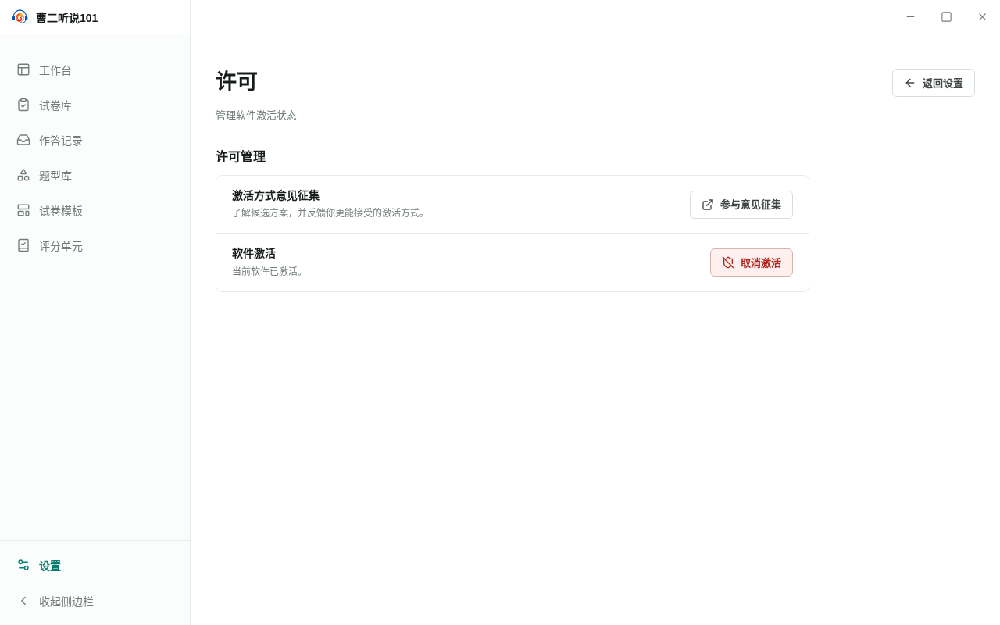

<!--
status: implemented
product-version: 0.4.1
audience: both
owner: settings
-->

# 许可 · UI-ST-03

- 路由：`/settings/license/*`
- 入口：设置总览（`UI-ST-01`）→「许可」
- 对象：软件激活状态、激活方式意见征集

## 布局

本页渲染在共享设置明细容器内：容器给出页头标题「许可」、说明「管理软件激活状态」与「返回设置」按钮；以下为页面内容。

1. 「许可管理」分组，包含两行：
   - 「激活方式意见征集」行：说明为「了解候选方案，并反馈你更能接受的激活方式。」，意见征集打开失败时该位置改为显示错误文本；右侧为「参与意见征集」按钮。
   - 「软件激活」行：说明为固定文本「当前软件已激活。」；右侧为「取消激活」危险按钮。
2. 取消激活确认框按触发叠加显示。

本页不查询激活状态，也不显示有效期或激活时间。「软件激活」说明为固定文案：设置只在本机激活有效时可达，未激活或已过期时启动进入激活界面，无法进入设置。邀请码输入不在本页，而在启动激活界面（`UI-OV-01`）。

## 控件清单

| 名称 | 类型 | 默认 / 加载 / 禁用 / 错误 | 触发结果 | 快捷键 |
| --- | --- | --- | --- | --- |
| 参与意见征集 | 按钮 | 始终可用；打开失败后仍可用，可重试 | 打开激活方式意见征集窗口 | 无 |
| 取消激活 | 危险按钮 | 始终可用 | 打开确认框「取消激活？」 | 无 |
| 取消激活并重启 | 确认框危险按钮 | 处理中显示「正在处理...」并禁用 | 删除本机激活信息并重启应用 | 无 |
| 取消 | 确认框次按钮 | 处理中禁用 | 关闭确认框并清除错误，不执行操作 | 无 |

本页无加载状态：两行静态渲染。

## 文案

- 容器页头：标题 `许可`，说明 `管理软件激活状态`，按钮 `返回设置`
- 分组标题：`许可管理`
- 行标签与说明：`激活方式意见征集`（`了解候选方案，并反馈你更能接受的激活方式。`）、`软件激活`（`当前软件已激活。`）
- 按钮：`参与意见征集`、`取消激活`、`取消激活并重启`、`取消`
- 意见征集错误：接口不可用时 `意见征集页面暂时无法打开，请重新启动软件后重试。`；打开失败时 `意见征集页面暂时无法打开，请稍后重试。`
- 取消激活错误：接口不可用时 `许可证服务不可用，请重新启动软件后重试。`；取消失败时 `取消激活失败，请稍后重试。`
- 取消激活确认框：标题 `取消激活？`；消息 `当前设备上的激活信息将被删除，软件随后重新启动。再次使用时需要输入邀请码，其他软件数据不会被删除。`
- 意见征集窗口标题：`软件激活方式意见征集`

## 状态与恢复

- **意见征集失败**：错误文本替换该行的说明显示，按钮保持可用，可再次尝试；再次点击前错误保留，点击时先清除再打开。
- **取消激活失败**：错误显示在确认框内（`role="alert"`），确认框保持打开，按钮恢复可用，可重试。
- **取消确认框**：关闭并清除错误，激活状态不变。
- **取消激活成功**：本机激活信息被删除，应用重启；确认框在处理期间保持打开，页面不显示成功状态。重启后进入激活界面，输入有效邀请码可再次使用。

## 有损操作

- **取消激活**：确认框标题 `取消激活？`，确认按钮 `取消激活并重启`，消息 `当前设备上的激活信息将被删除，软件随后重新启动。再次使用时需要输入邀请码，其他软件数据不会被删除。` 后果：删除本机激活信息并重启应用，再次使用需要重新输入邀请码。其他软件数据不受影响；重新激活后可恢复使用。

## 术语

界面使用「许可」「激活」「取消激活」「邀请码」「激活方式意见征集」，与 [`../glossary.md`](../glossary.md) 的用户可见用词要求一致。

本页未发现内部术语泄漏；错误文案与页面统一使用「许可」。

## 产物

- 参与意见征集：打开激活方式意见征集窗口（含候选方案说明与反馈入口），不改变激活状态。
- 取消激活：删除本机激活信息并重启；再次使用需在启动激活界面输入邀请码。
- 本页不产生业务对象。

## 锚点

```yaml
anchors:
  visual: VR-ST-03（tests/visual/settings/UI-ST-03.spec.ts）
  visual-states: [default]
  behavior: license.spec.ts › deactivates from settings, removes the receipt and requires activation after restart（tests/integration/license.spec.ts）
```

### 视觉基线



行为锚点由 `license.spec.ts › deactivates from settings, removes the receipt and requires activation after restart` 承担：从设置总览进入本页，打开并关闭意见征集窗口后断言回执不变，走完「取消」与「取消激活并重启」两条分支，并断言回执被删除、重启后回到启动激活界面（合格线见 [`../README.md`](../README.md) §2）。
